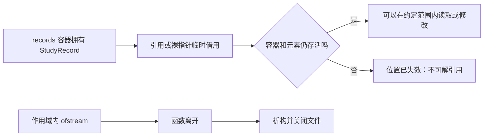

# C++ 对象、引用、指针、生命周期与 RAII

<div class="be-tutor-mount" data-tutor-lesson="cpp-core-05" aria-hidden="true"></div>

> **任务先行：** 为双语言学习进度报告器增加“更新一条记录、可能查不到记录、导出审计快照”三种能力。你会在同一个小程序里观察值复制、借用、生命周期和资源自动释放，而不是先背概念。

## 任务路线

<div class="be-task-route" role="list" aria-label="本课五步任务"><span role="listitem">1 基线</span><span role="listitem">2 引用</span><span role="listitem">3 指针</span><span role="listitem">4 生命周期</span><span role="listitem">5 RAII</span></div>

<section id="step-1" class="be-task-step" data-step-id="step-1" markdown="1">

## 第一步：运行对象与复制的基线

构建并运行现有报告器。它会创建多个 `StudyRecord` 对象，再把对象序列传给汇总、排序和筛选函数。**可观察结果：** CTest 通过，标准输出仍是既有的学习进度报告。

</section>

<section id="step-2" class="be-task-step" data-step-id="step-2" markdown="1">

## 第二步：用引用修改原来的记录

实现 `add_completed_hours(StudyRecord& record, double additional_hours)`，把 Python 起步的完成小时从 `7.5` 改为 `9.0`。**成功标准：** 调用者容器中的对象真的改变；你能说明若参数没有 `&`，改变的是一份副本。

</section>

<section id="step-3" class="be-task-step" data-step-id="step-3" markdown="1">

## 第三步：用非拥有指针表达“可能找不到”

实现按课程名查找记录的函数。找到时返回指向容器元素的指针，找不到时返回 `nullptr`；调用者必须先检查再解引用。**成功标准：** 测试同时覆盖找到和找不到，且没有把这个指针当作需要 `delete` 的所有者。

</section>

<section id="step-4" class="be-task-step" data-step-id="step-4" markdown="1">

## 第四步：分析生命周期，而不运行未定义行为

阅读一个会返回局部对象引用的反例，使用编译器诊断和作用域图说明为什么它不安全。改用按值返回或由调用者拥有的对象。**验收：** 不执行悬空引用或悬空指针，不用“本机恰好没崩溃”证明正确。

</section>

<section id="step-5" class="be-task-step" data-step-id="step-5" markdown="1">

## 第五步：用 RAII 导出审计快照并迁移验收

使用作用域内的 `std::ofstream` 写出可选审计文件；打开失败时返回 `false`，离开函数时文件自动关闭。独立新增一条记录或一个导出字段，再运行 CTest。**成功标准：** 审计文件包含标题和记录，失败路径可观察，主报告标准输出不变。

</section>

上一组课程已经让报告器可以处理多条记录、排序、筛选和汇总。本节继续使用那份成果，但只增加内部能力：对象如何在容器中存在，函数如何借用对象，何时可以使用地址，以及文件资源如何随作用域自动释放。

## 课程信息

| 项目 | 内容 |
| --- | --- |
| 适合人群 | 已完成 C++ STL 与 Python 容器/迭代课程，准备理解对象、借用和资源边界的学习者 |
| 前置知识 | C++20、`std::vector`、函数参数、`const&`、CMake、CTest |
| 可观察产出 | 可修改记录、可空查找、审计快照文件和稳定的主报告输出 |
| 环境 | C++20、CMake 3.20 及以上、仅使用标准库 |
| 阶段作品 | [双语言学习进度报告器](../../../exercises/programming-languages/study-progress-reporters/README.md) |
| 事实核查 | 2026-07-15，依据 C++ 工作草案的对象生命周期、引用、文件流与资源管理章节 |

## 学习目标

完成本节后，你应该能够：

- 把 `StudyRecord` 视作拥有状态的对象，并区分对象本身、复制品和引用。
- 根据“必定存在”与“可能不存在”选择引用或可空非拥有指针。
- 说明返回局部对象引用、保存容器可能失效位置为何危险。
- 用作用域解释对象与文件流的开始和结束，不手写 `close()` 或 `delete` 来替代所有权设计。
- 使用 `std::ofstream` 的 RAII 行为处理成功和打开失败两条路径。
- 审阅 AI 代码中的空指针解引用、悬空引用、错误所有权和未检查文件错误。

## 第一步：确认现有对象与复制边界

从阶段作品的 C++ 目录运行：

```bash
cmake -S . -B build -DCMAKE_BUILD_TYPE=Debug
cmake --build build --config Debug
ctest --test-dir build --build-config Debug --output-on-failure
./build/study_report_app
```

预期先看到 `All study report tests passed.`，再看到既有报告：

```text
学习进度报告
总计划：35.0 小时
总完成：30.5 小时
总体进度：87.1%
```

`StudyRecord` 是一个对象类型；`sample_records()` 按值返回一个 `vector`，调用者拿到自己的记录序列。`sort_by_progress(std::vector<StudyRecord> records)` 也按值接收参数，所以排序的是副本，测试据此验证原始输入不变。

```cpp
struct StudyRecord {
    std::string course_name;
    double target_hours;
    double completed_hours;
    std::vector<std::string> tags;
};

std::vector<StudyRecord> sort_by_progress(std::vector<StudyRecord> records);
```

这里的“按值”不是总能避免的坏事：当函数需要修改自己的工作副本而不影响调用者时，它正好表达了需求。下一步才处理“必须修改原对象”的场景。

## 第二步：引用表示确定存在、可修改的借用

在 `include/study/study_report.hpp` 增加声明：

```cpp
void add_completed_hours(StudyRecord& record, double additional_hours);
```

在 `src/study_report.cpp` 增加实现：

```cpp
void add_completed_hours(StudyRecord& record, double additional_hours) {
    record.completed_hours += additional_hours;
}
```

`StudyRecord&` 是别名：调用这个函数不会复制记录，`record` 直接指向调用者已经拥有的对象。引用适合本节的两个条件同时成立时：对象必须存在，函数需要修改它。

在测试中主动完成修改：

```cpp
std::vector<study::StudyRecord> mutable_records{study::sample_records()};
study::add_completed_hours(mutable_records.front(), 1.5);
expect_close(
    mutable_records.front().completed_hours, 9.0,
    "reference mutation should update the original record"
);
```

如果函数签名写成 `StudyRecord record`，`completed_hours` 会在副本上增加，容器第一个元素仍是 `7.5`。不要仅凭函数内部打印的数字判断；检查调用者容器才是本任务的成功证据。

### 提示

1. 先找出需要改变的是“函数局部变量”还是“调用者已有对象”。
2. 只有后者才在参数类型后加 `&`；如果不应修改对象，则使用 `const StudyRecord&`。

## 第三步：指针表示可选的非拥有观察

按名字查找时，记录不一定存在。引用不能自然表达“没有对象”，本节使用非拥有指针：

```cpp
StudyRecord* find_record_by_name(
    std::vector<StudyRecord>& records,
    const std::string& course_name
) {
    const auto iterator{std::find_if(
        records.begin(), records.end(),
        [&course_name](const StudyRecord& record) {
            return record.course_name == course_name;
        }
    )};
    return iterator == records.end() ? nullptr : &*iterator;
}
```

这个指针只借用 `records` 中已有对象：

- 找到时，`&*iterator` 是元素地址；它不是 `new` 的返回值，调用者**绝不能** `delete`。
- 找不到时，返回 `nullptr`；调用者先判断再使用。
- 只要 `records` 被销毁，或发生会使 `vector` 重新分配的增长，过去取得的位置就可能失效。此后不要继续保存或解引用它。

安全调用方式：

```cpp
if (study::StudyRecord* record{
        study::find_record_by_name(mutable_records, "Python 起步")
    }) {
    study::add_completed_hours(*record, 0.5);
}
```

`if` 的条件把“是否存在”放在解引用之前。找不到不是异常：测试应明确断言 `find_record_by_name(records, "不存在") == nullptr`。

## 第四步：生命周期是对象可被安全使用的时间范围

不要编译或调用下面的反例：

```cpp
// 错误示例：函数结束时 local 已经销毁。
const study::StudyRecord& invalid_record() {
    study::StudyRecord local{"临时", 1.0, 1.0, {}};
    return local;
}
```

`local` 的生命周期从声明开始，在函数离开时结束。返回引用不会延长局部对象生命周期；后续读取它是未定义行为。编译器可能给出“返回局部变量引用”的警告，也可能在某些构建设置下没有阻止你。两种情况都不能把它变成正确代码。

本课的安全替代是按值返回：

```cpp
study::StudyRecord make_record() {
    return {"临时", 1.0, 1.0, {}};
}
```

这里的返回对象由调用者接收和拥有；现代 C++ 会应用返回值优化或移动，正确性不依赖你手工规避每一次复制。需要借用时，调用者必须保证被借用对象仍活着；需要长期拥有时，先明确谁拥有对象，再选择值成员、容器或智能指针，而不是把裸指针当所有权工具。



## 第五步：RAII 让文件资源跟随作用域

“RAII”指资源获取即初始化：对象构造时取得资源，对象离开作用域时由析构函数释放资源。对文件流而言，`std::ofstream` 在函数结束时会自动关闭文件；我们仍然需要检查它是否成功打开，以及写入是否成功。

在头文件加入：

```cpp
#include <filesystem>

bool write_audit_snapshot(
    const std::vector<StudyRecord>& records,
    const std::filesystem::path& output_path
);
```

实现如下：

```cpp
#include <fstream>

bool write_audit_snapshot(
    const std::vector<StudyRecord>& records,
    const std::filesystem::path& output_path
) {
    std::ofstream output{output_path};
    if (!output) {
        return false;
    }

    output << "学习审计快照\n";
    for (const StudyRecord& record : records) {
        output << record.course_name << '\t'
               << record.target_hours << '\t'
               << record.completed_hours << '\n';
    }
    return static_cast<bool>(output);
}
```

这里没有显式 `output.close()`：无论函数从正常写入、`return false` 还是未来异常路径离开，局部 `output` 都会离开作用域并析构。RAII 不是“忽略错误”，而是把资源释放交给对象生命周期，同时把打开/写入结果作为普通可测试的返回值。

在 `tests/study_report_tests.cpp` 验证成功和失败：

```cpp
const std::filesystem::path audit_path{"study_report_audit_test.txt"};
std::filesystem::remove(audit_path);
expect_true(study::write_audit_snapshot(records, audit_path), "audit snapshot should open and write a file");

std::ifstream audit_input{audit_path};
std::string audit_contents{
    (std::istreambuf_iterator<char>{audit_input}),
    std::istreambuf_iterator<char>{}
};
expect_true(audit_contents.find("学习审计快照") != std::string::npos, "audit header");
std::filesystem::remove(audit_path);

expect_true(
    !study::write_audit_snapshot(records, "/missing-directory/study-report.txt"),
    "unopenable audit path should report failure"
);
```

### 迁移验收

独立完成下面任意一项，再运行构建、CTest 和应用：

1. 在审计快照增加一列状态，并证明主报告标准输出没有变化。
2. 新增一条学习记录，使用 `find_record_by_name` 找到它后通过引用更新完成时间。
3. 为不存在的课程名增加一条清晰日志，但不得解引用 `nullptr`。

提交或学习记录中至少保留：运行命令、CTest 输出、审计文件的一行证据、失败路径说明和你选择引用/指针的理由。

## AI 协作任务

可以让 AI 为 `find_record_by_name` 或审计测试提供候选实现，但必须逐项人工审阅：

- 返回的是借用位置还是新分配的对象？谁负责释放？
- 找不到时是否明确返回 `nullptr`，调用方是否先检查？
- 是否把容器增长后可能失效的位置长期保存？
- 是否检查文件打开和写入结果？
- 是否改变了 `build_report` 的既有标准输出？

可复用提示：

```text
请为 C++20 学习进度报告器提出一个“按名称查找记录”的实现。
约束：返回值表达可能找不到；不得转移容器元素所有权；调用者不应 delete；
请给出一个找到、一个找不到和一个生命周期风险的测试建议，并说明验证命令。
```

## 常见错误与排查

| 现象 | 可能原因 | 检查与修复 |
| --- | --- | --- |
| 修改函数运行了但容器数据没变 | 参数按值复制 | 将需要修改的参数改为 `StudyRecord&`，并在调用者检查结果 |
| 解引用时崩溃或结果异常 | 没有检查 `nullptr` | 先判断指针，再使用 `*pointer` 或 `pointer->field` |
| 保存的位置随后不能用 | 容器销毁或重新分配 | 缩短借用范围；修改容器后重新查找 |
| 文件没有生成 | 路径不存在或无权限 | 检查 `std::ofstream` 状态，返回 `false` 并记录路径 |
| 主报告测试失败 | 审计功能混入标准输出 | 审计只写文件，保留 `build_report` 既有字符串契约 |

## 完成证据

- CMake 以 C++20 和严格警告完成构建，CTest 通过。
- 你能展示按引用修改调用者对象的测试证据。
- 你能展示找到和找不到记录两条指针路径，并解释为什么不 `delete`。
- 你能解释局部对象结束后为何不能返回其引用，且没有运行未定义行为。
- 审计文件成功写出，错误路径返回失败，主报告输出保持不变。

## 来源与版本

| 来源 | 用于核查 | 版本或日期 |
| --- | --- | --- |
| [C++ 工作草案：对象生命周期](https://eel.is/c++draft/basic.life) | 对象创建、销毁与生命周期边界 | C++20 教学基线，2026-07-15 核查 |
| [C++ 工作草案：引用](https://eel.is/c++draft/dcl.ref) | 引用语义和绑定规则 | 2026-07-15 核查 |
| [C++ 工作草案：文件流](https://eel.is/c++draft/fstreams) | `std::ofstream` 与文件资源 | 2026-07-15 核查 |
| [C++ Core Guidelines：资源管理](https://isocpp.github.io/CppCoreGuidelines/CppCoreGuidelines#S-resource) | RAII、所有权与资源边界 | 2026-07-15 核查 |

## 下一步

对象与资源能力已经建立到可验证的基础层。下一组课程会从 Python 数据模型、上下文管理和资源边界形成对照；在其落地前，可以回到[双语言学习进度报告器](../../../exercises/programming-languages/study-progress-reporters/README.md)复查本课的审计、借用和输出契约。
