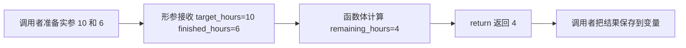

# 函数、参数、返回值和作用域

<div class="be-tutor-mount" data-tutor-lesson="python-basics-03" aria-hidden="true"></div>

本节把 `study_check.py` 重构为第一版 `study_report.py`：计算、状态和输出各有清楚职责。先让函数协作起来，再按需要阅读下方完整讲解与练习。

## 本节任务路线

<div class="be-task-route" role="list" aria-label="本课五步任务">
  <span role="listitem">1 消除重复</span><span role="listitem">2 传入参数</span><span role="listitem">3 返回结果</span><span role="listitem">4 定位作用域</span><span role="listitem">5 迁移验收</span>
</div>

<section id="step-1" class="be-task-step" data-step-id="step-1" markdown="1">

## 第一步：提取一个可调用的计算

**任务：** 新建 `study_report.py`，把“目标时间减完成时间、最小为 0”的重复逻辑写成 `calculate_remaining_hours()`，分别传入 `(10, 6)` 和 `(8, 9)`。

**即时反馈：** 两次调用得到 `4` 和 `0`；函数定义本身不会输出，调用后才会执行。

</section>

<section id="step-2" class="be-task-step" data-step-id="step-2" markdown="1">

## 第二步：让调用者提供变化数据

**任务：** 给函数加入 `target_hours`、`finished_hours` 两个参数，并用位置参数和关键字参数各调用一次。

**主动修改：** 刻意交换一次位置参数，比较结果；再改用关键字参数说明每个值属于谁。

??? tip "提示"
    写在 `def` 里的名字是形参；调用括号中的具体值是实参。

</section>

<section id="step-3" class="be-task-step" data-step-id="step-3" markdown="1">

## 第三步：让报告器使用返回值

**任务：** 新增 `build_status()`，返回“目标已完成”或“继续推进”；入口保存两个函数的返回值，再统一 `print()` 报告。

**成功标准：** 把 `return` 临时改成单独 `print()` 后，能观察到调用结果是 `None`，再恢复正确版本。

</section>

<section id="step-4" class="be-task-step" data-step-id="step-4" markdown="1">

## 第四步：故意触发作用域错误

**任务：** 在函数内部创建 `message`，然后在函数外直接 `print(message)`，记录 `NameError`；通过 `return message` 和外部变量接收修复它。

**错误证据：** 写下 traceback 指向的行和该名字在哪个函数内定义。不要用全局变量绕过问题。

</section>

<section id="step-5" class="be-task-step" data-step-id="step-5" markdown="1">

## 第五步：迁移验收

**任务：** 给 `build_status()` 增加一个默认阈值参数，例如接近目标时返回“接近目标”；用默认值与自定义关键字参数各验证一次。

**完成证据：** `study_report.py` 至少有计算、判断、输出三个职责清楚的函数，并运行未完成、完成、超额和接近目标场景。

**下一步：** 进入[字符串、列表、字典、集合和元组](04-strings-collections.md)，让报告器处理多条记录。

</section>

前两节已经能让程序接收输入、做判断并重复执行。但是代码一旦变长，一个新问题会出现：同一段逻辑可能写很多次，输入、计算和输出也容易混在一起。

本节学习用函数整理代码。目标不只是认识 `def`，而是能把一个问题拆成职责清楚、可以单独调用和验证的小块。

## 课程信息

- 课程类型：编程课。
- 所属主线：编程语言。
- 课程层级：Python 起步必修。
- 运行环境：Python 3.11 或更高版本，仅使用标准库。
- 阶段作品：学习进度报告器的第一步。
- 事实核查：2026-07-13，依据 Python 3 官方教程和语言参考。

## 前置知识

开始前应完成：

- [变量、基本类型、输入输出](01-variables-types-io.md)。
- [条件、循环、布尔逻辑](02-conditions-loops-boolean.md)。
- 能创建并运行 `.py` 文件。
- 能使用变量、`input()`、`print()`、条件和循环。
- 能记录运行命令、输入、输出和完整错误信息。

开始前先回答：上一节的学习时间判断程序中，哪些代码负责输入，哪些代码负责计算，哪些代码负责输出？如果还分不清，可以先重新运行上一节的 `study_check.py`。

## 学习目标

完成本节后，你应该能做到：

- 使用 `def` 定义函数，并在需要的位置调用它。
- 区分形参和实参。
- 使用位置参数、关键字参数和简单默认参数。
- 使用 `return` 把计算结果交还给调用者。
- 说明 `return` 和 `print()` 的区别。
- 识别局部变量的可见范围，避免依赖全局变量传递结果。
- 把输入、计算、判断和输出拆成职责清楚的函数。
- 审阅 AI 生成的函数重构，修改一个行为并验证结果。

## 学习顺序

1. 先观察重复代码带来的问题。
2. 定义并调用第一个函数。
3. 用参数接收变化的数据。
4. 用返回值交出计算结果。
5. 理解局部变量和作用域。
6. 学习默认参数、关键字参数和函数职责。
7. 完成学习进度报告器，并验证多个输入场景。

## 为什么需要函数

假设需要分别计算两名学习者还差多少小时完成目标：

```python
target_a = 10
finished_a = 6
remaining_a = target_a - finished_a
if remaining_a < 0:
    remaining_a = 0

target_b = 8
finished_b = 3
remaining_b = target_b - finished_b
if remaining_b < 0:
    remaining_b = 0
```

两段代码做的是同一件事，只是数据不同。继续复制会带来三个问题：

- 修改规则时要找到所有副本。
- 某个副本可能漏改，产生不一致结果。
- 输入、计算和输出混在一起后，很难单独检查计算是否正确。

函数把“计算剩余时间”变成一个有名字的能力：

```python
def calculate_remaining_hours(target_hours, finished_hours):
    remaining_hours = target_hours - finished_hours
    if remaining_hours < 0:
        return 0
    return remaining_hours


remaining_a = calculate_remaining_hours(10, 6)
remaining_b = calculate_remaining_hours(8, 3)
```

规则只保留一份，变化的数据通过参数传进去。

## 定义和调用函数

最小函数由函数名、括号、冒号和缩进代码组成：

```python
def show_welcome():
    print("开始今天的 Python 学习")


show_welcome()
```

运行顺序是：

1. Python 读到 `def show_welcome():`，记住这个函数。
2. 定义函数时，缩进部分不会立刻执行。
3. 读到 `show_welcome()`，程序才进入函数体。
4. 函数体执行结束后，程序回到调用位置继续向下运行。

函数名应说明动作。`calculate_progress`、`build_status` 比 `do_it`、`handle` 更容易理解。

## 参数和实参

没有参数的函数每次只能使用函数内部写死的数据。参数让调用者把不同数据传进去。

```python
def show_course(course_name):
    print("当前课程：", course_name)


show_course("Python 起步")
show_course("CS 最小核心")
```

在这段代码中：

- `course_name` 是**形参**，写在函数定义中，表示函数需要接收的数据。
- `"Python 起步"` 是**实参**，写在调用位置，是本次实际传入的值。

多个参数按定义顺序接收实参：

```python
def calculate_remaining_hours(target_hours, finished_hours):
    return target_hours - finished_hours


remaining_hours = calculate_remaining_hours(10, 6)
print(remaining_hours)
```

这里 `10` 交给 `target_hours`，`6` 交给 `finished_hours`。如果顺序反过来，结果也会改变。

## 一次函数调用发生了什么

下面的图回答一个问题：调用函数时，数据怎样进去，结果怎样回来？



实参属于调用位置，形参和函数内部变量属于本次函数调用。`return` 把结果交还给调用位置，调用者可以保存、比较或继续计算这个结果。

## 返回值

`return` 会结束当前函数，并把一个值交给调用者：

```python
def calculate_total(first, second):
    total = first + second
    return total


result = calculate_total(3, 5)
print(result)
```

输出：

```text
8
```

### `return` 和 `print()` 不一样

`print()` 只负责把内容显示出来。`return` 负责把结果交给后续代码使用。

```python
def show_total(first, second):
    print(first + second)


def calculate_total(first, second):
    return first + second


printed_result = show_total(3, 5)
returned_result = calculate_total(3, 5)

print("show_total 的结果：", printed_result)
print("calculate_total 的结果：", returned_result)
```

输出：

```text
8
show_total 的结果： None
calculate_total 的结果： 8
```

`show_total()` 确实显示了 `8`，但它没有使用 `return` 交出结果，因此调用得到 `None`。`None` 表示这里没有可用的返回值。

如果一个值还要参与判断、计算或写入文件，应该返回它，而不是只打印它。

### `return` 后面的代码不会执行

```python
def get_status(is_finished):
    if is_finished:
        return "已完成"
    return "继续推进"
    print("这一行不会执行")
```

执行到 `return` 时，函数已经结束。不要把必要逻辑写在确定无法到达的 `return` 后面。

## 位置参数、关键字参数和默认参数

### 位置参数

位置参数依赖顺序：

```python
def show_progress(finished_hours, target_hours):
    print("已完成：", finished_hours)
    print("目标：", target_hours)


show_progress(6, 10)
```

### 关键字参数

关键字参数明确写出参数名，可读性更好：

```python
show_progress(target_hours=10, finished_hours=6)
```

虽然调用顺序改变了，但参数名明确，所以 `target_hours` 仍然得到 `10`。

### 默认参数

默认参数允许调用者不传某个常用值：

```python
def build_status(progress_ratio, almost_done_ratio=0.8):
    if progress_ratio >= 1:
        return "目标已完成"
    if progress_ratio >= almost_done_ratio:
        return "接近目标"
    return "继续推进"


print(build_status(0.7))
print(build_status(0.7, almost_done_ratio=0.6))
```

输出：

```text
继续推进
接近目标
```

默认值应放在没有默认值的参数后面。当前只使用数字、字符串和布尔值作为简单默认值；可变默认参数的风险会在学习数据结构和函数进阶后处理。

## 作用域和局部变量

函数内部创建的变量通常是局部变量，只在本次函数调用中可见：

```python
def calculate_remaining_hours(target_hours, finished_hours):
    remaining_hours = target_hours - finished_hours
    return remaining_hours


result = calculate_remaining_hours(10, 6)
print(result)
print(remaining_hours)
```

最后一行会报错：

```text
NameError: name 'remaining_hours' is not defined
```

`remaining_hours` 属于函数内部。调用者能得到的是 `return` 返回的值，并把它保存为外部变量 `result`。

同名变量也不代表同一个变量：

```python
status = "外部状态"


def build_status():
    status = "函数内部状态"
    print(status)


build_status()
print(status)
```

输出：

```text
函数内部状态
外部状态
```

本节不使用 `global` 修改外部变量。更清楚的做法是通过参数传入所需数据，通过 `return` 交出结果。

## 把职责拆清楚

一个函数应尽量只承担一个容易说明的职责。下面这个函数同时接收输入、计算、判断和输出：

```python
def run_everything():
    target_hours = float(input("计划学习小时数："))
    finished_hours = float(input("已经学习小时数："))
    progress = finished_hours / target_hours * 100
    if progress >= 100:
        status = "目标已完成"
    else:
        status = "继续推进"
    print("完成比例：", progress)
    print("状态：", status)
```

它可以运行，但计算规则很难单独验证。更清楚的拆分是：

| 职责 | 函数 |
| --- | --- |
| 组织程序执行 | `main()` |
| 计算剩余时间 | `calculate_remaining_hours()` |
| 计算完成比例 | `calculate_progress()` |
| 根据比例判断状态 | `build_status()` |
| 展示报告 | `print_report()` |

看到函数名时，应该大致知道它做什么。函数需要的数据通过参数传入，计算结果通过 `return` 交出。

## 命名和最小文档字符串

函数名通常使用小写字母和下划线，并用动作开头：

- `calculate_progress`：计算进度。
- `build_status`：生成状态。
- `print_report`：输出报告。

当函数用途不能从名字完全看出时，可以在函数体第一行写文档字符串：

```python
def calculate_progress(target_hours, finished_hours):
    """计算学习完成百分比，并把结果限制在 0 到 100。"""
    if target_hours <= 0:
        return 0.0
    progress = finished_hours / target_hours * 100
    if progress > 100:
        return 100.0
    return progress
```

文档字符串说明函数承诺做什么，不需要逐行复述代码。

## 可复现实例：学习进度报告器

这是连续三节课程共同形成的阶段作品起点：

- 本节：用函数拆分一条学习记录的计算和输出。
- 下一节：用列表和字典处理多条学习记录。
- 文件课程：从 JSON 文件读取记录并输出汇总。

当前只创建一个练习文件，不新建项目目录，也不提前解锁 Python 内容分析工具。

### 环境与文件

- Python 3.11 或更高版本。
- 仅使用标准库，无需安装依赖。
- 文件名：`study_report.py`。
- 从文件所在目录运行。

### 完整代码

**文件：`study_report.py`**

```python
def calculate_remaining_hours(target_hours, finished_hours):
    """计算剩余学习时间，不返回负数。"""
    remaining_hours = target_hours - finished_hours
    if remaining_hours < 0:
        return 0.0
    return remaining_hours


def calculate_progress(target_hours, finished_hours):
    """计算完成百分比，并把结果限制在 0 到 100。"""
    if target_hours <= 0:
        return 0.0

    progress = finished_hours / target_hours * 100
    if progress > 100:
        return 100.0
    if progress < 0:
        return 0.0
    return progress


def build_status(target_hours, progress, almost_done_ratio=0.8):
    """根据目标和进度生成学习状态。"""
    if target_hours <= 0:
        return "请先设置大于 0 的学习目标"
    if progress >= 100:
        return "目标已完成"
    if progress >= almost_done_ratio * 100:
        return "接近目标"
    return "继续推进"


def print_report(target_hours, finished_hours, remaining_hours, progress, status):
    """输出格式统一的学习报告。"""
    print("学习进度报告")
    print("计划学习：", target_hours, "小时")
    print("已经学习：", finished_hours, "小时")
    print("剩余时间：", remaining_hours, "小时")
    print("完成比例：", round(progress, 1), "%")
    print("当前状态：", status)


def main():
    target_hours = float(input("计划学习小时数："))
    finished_hours = float(input("已经学习小时数："))

    remaining_hours = calculate_remaining_hours(target_hours, finished_hours)
    progress = calculate_progress(target_hours, finished_hours)
    status = build_status(target_hours, progress)

    print_report(
        target_hours,
        finished_hours,
        remaining_hours,
        progress,
        status,
    )


main()
```

### 运行命令

macOS 或 Linux：

```bash
python3 study_report.py
```

Windows：

```powershell
python study_report.py
```

### 预期结果

输入 `10` 和 `8`：

```text
计划学习小时数：10
已经学习小时数：8
学习进度报告
计划学习： 10.0 小时
已经学习： 8.0 小时
剩余时间： 2.0 小时
完成比例： 80.0 %
当前状态： 接近目标
```

### 验证矩阵

不要只运行一个输入。至少检查下面四组数据：

| 计划时间 | 完成时间 | 剩余时间 | 完成比例 | 状态 |
| --- | --- | --- | --- | --- |
| 10 | 4 | 6 | 40% | 继续推进 |
| 10 | 8 | 2 | 80% | 接近目标 |
| 10 | 12 | 0 | 100% | 目标已完成 |
| 0 | 0 | 0 | 0% | 请先设置大于 0 的学习目标 |

语法检查：

```bash
python3 -m py_compile study_report.py
```

命令没有输出并正常返回，表示 Python 能完成语法编译检查；它不代表业务结果已经正确，仍要运行验证矩阵。

### 已知失败路径

如果输入 `abc`，`float()` 会失败：

```text
ValueError: could not convert string to float: 'abc'
```

本节需要记录完整 traceback，并指出失败发生在输入转换。不要用复杂代码绕过它；异常捕获和输入重试会在后续异常与调试课程正式学习。

## AI 协作任务：审阅一次函数重构

AI 可以帮助识别重复代码并生成重构候选，但不能替你确认行为是否正确。

### 任务

把下面的重复判断交给 AI，要求它提取一个函数：

```python
progress_a = 85
if progress_a >= 100:
    print("目标已完成")
elif progress_a >= 80:
    print("接近目标")
else:
    print("继续推进")

progress_b = 60
if progress_b >= 100:
    print("目标已完成")
elif progress_b >= 80:
    print("接近目标")
else:
    print("继续推进")
```

可以使用下面的提示模板：

```text
请把这两段重复的 Python 条件判断重构成一个函数。
约束：使用参数接收进度，使用 return 返回状态，不使用全局变量，
不引入类、lambda 或第三方库。请给出调用示例和 60、85、100 三个输入的预期结果。
```

### 人工审阅要求

你必须完成：

1. 检查 AI 是否使用 `return`，而不是只在函数里 `print()`。
2. 检查 60、85、100 是否分别覆盖三个分支。
3. 把“接近目标”的阈值从 80 改为 75。
4. 重新运行 74、75、100 三个输入，记录输出。
5. 故意删掉一次 `return` 后面的值，记录错误或异常结果，再修复。

学习记录使用以下结构，不需要公开完整 AI 对话：

```text
任务和约束：
AI 产出摘要：
我接受了什么：
我拒绝或修正了什么：
我主动修改的行为：
运行输入与输出：
一次错误和排查过程：
仍未验证的内容：
```

## 核心手动检查点

这些检查不能只用“代码能运行”代替。

### 检查点 1：追踪参数和返回值

对下面的调用逐步写出每个名字对应的值：

```python
remaining = calculate_remaining_hours(10, 6)
```

必须写清：

```text
实参：
target_hours：
finished_hours：
函数内部 remaining_hours：
return 返回：
调用者 remaining：
```

### 检查点 2：解释 `print()` 和 `return`

不用运行代码，先预测：

```python
def show_value():
    print(5)


result = show_value()
print(result)
```

然后运行并解释为什么会出现两行输出，以及第二行为什么是 `None`。

### 检查点 3：预测作用域错误

先预测下面代码在哪一行失败，再运行验证：

```python
def create_message():
    message = "函数内部"
    return message


result = create_message()
print(result)
print(message)
```

### 检查点 4：拆分职责

把前面的 `run_everything()` 至少拆成两个函数，并说明每个函数只负责什么。不能只给函数换名字而保留全部逻辑。

## 微练习

### 练习 1：无参数函数

定义 `show_learning_goal()`，输出今天的学习目标。调用两次，确认函数体执行两次。

需要记录：函数定义、调用位置和两次输出。

### 练习 2：带参数函数

定义 `calculate_square(number)`，返回数字的平方。验证 `2`、`-3` 和 `0`。

需要记录：三个实参、三个返回值，以及哪个名字是形参。

### 练习 3：默认参数和关键字参数

定义：

```python
def build_greeting(name, prefix="你好"):
    return prefix + "，" + name
```

分别使用默认参数、位置参数和关键字参数调用，记录输出差异。

### 练习 4：制造作用域错误

在函数内部创建 `course_name`，尝试在函数外直接访问它。记录完整 `NameError`，再通过 `return` 修复。

### 练习 5：重构学习时间判断

把上一节的学习时间判断程序拆成至少三个函数：

- 一个函数计算剩余时间。
- 一个函数返回状态。
- 一个函数负责输出结果。

至少验证“未完成”和“已完成”两个分支。

## 常见错误与排查

| 错误 | 表现 | 排查方式 |
| --- | --- | --- |
| 定义函数后没有调用 | 程序没有输出，也没有报错 | 搜索函数名，确认括号调用真实存在 |
| `def` 后缺少冒号 | `SyntaxError` | 检查函数定义行末尾的 `:` |
| 函数体没有缩进 | `IndentationError` | 函数体统一缩进 4 个空格 |
| 参数数量不一致 | `TypeError` | 对照函数定义检查调用传了几个实参 |
| 位置参数顺序写反 | 结果不符合预期 | 改用关键字参数确认每个值的含义 |
| 只 `print()` 没有 `return` | 调用结果是 `None` | 判断后续代码是否需要这个值，需要时返回它 |
| 在函数外访问局部变量 | `NameError` | 使用 `return` 交出结果并在外部保存 |
| 在 `return` 后写必要代码 | 代码永远不执行 | 把必要逻辑移到 `return` 之前 |
| 一个函数承担所有工作 | 难以阅读和单独验证 | 按输入、计算、判断、输出拆分职责 |
| 输入非数字 | `ValueError` | 本节记录 traceback，后续异常课程处理输入重试 |

## 完成标准

完成本节需要同时满足：

- 能独立定义并调用无参数函数和带参数函数。
- 能区分形参和实参，并正确使用位置参数与关键字参数。
- 能使用一个简单默认参数，并说明默认值何时生效。
- 能解释 `return`、`print()` 和 `None` 的关系。
- 能手动追踪一次参数进入函数和返回值离开函数的过程。
- 能预测并修复一次局部变量导致的 `NameError`。
- 能把输入、计算、判断和输出拆成至少三个职责清楚的函数。
- 能运行 `study_report.py` 并完成四组验证矩阵。
- 能审阅一次 AI 函数重构，主动修改一个阈值并重新验证。
- 能记录一次错误、排查过程和修复结果。

## 来源与版本

| 来源 | 用于核查 | 版本或日期 | 状态 |
| --- | --- | --- | --- |
| [Python 官方教程：Defining Functions](https://docs.python.org/3/tutorial/controlflow.html#defining-functions) | 函数定义、参数、默认值和关键字参数 | Python 3 文档，2026-07-13核查 | 已验证 |
| [Python 语言参考：return statement](https://docs.python.org/3/reference/simple_stmts.html#the-return-statement) | `return` 行为和无返回表达式时的 `None` | Python 3 文档，2026-07-13核查 | 已验证 |
| [Python 官方教程：Scopes and Namespaces](https://docs.python.org/3/tutorial/classes.html#python-scopes-and-namespaces) | 函数局部作用域与命名空间 | Python 3 文档，2026-07-13核查 | 已验证 |

## 下一步

下一步进入[字符串、列表、字典、集合和元组](04-strings-collections.md)。学习进度报告器会从“处理一条记录”升级为“处理多条结构化记录”，但仍然沿用本节拆出的函数。
