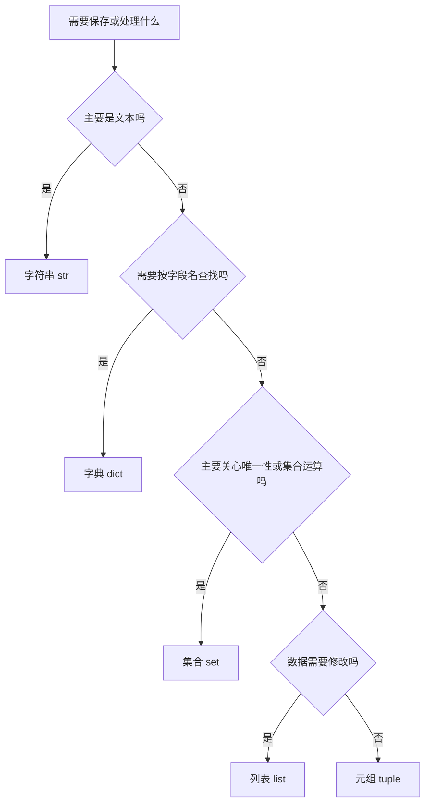

# 字符串、列表、字典、集合和元组

上一节的学习进度报告器只能处理一条记录。真实程序通常需要处理多门课程、多个文件或多次实验，因此必须知道怎样表示一组数据，以及怎样根据用途选择合适的数据结构。

本节不以背方法名为目标。你要理解五种常用结构分别解决什么问题、哪些可以修改、怎样组合它们，并能判断一个程序为什么应该使用列表、字典、集合或元组。

## 课程信息

- 课程类型：编程课。
- 所属主线：编程语言。
- 课程层级：Python 起步必修。
- 运行环境：Python 3.11 或更高版本，仅使用标准库。
- 阶段作品：把学习进度报告器升级为多条内存记录。
- 事实核查：2026-07-14，依据 Python 3 官方教程和内置类型参考。

## 前置知识

开始前应完成：

- [变量、基本类型、输入输出](01-variables-types-io.md)。
- [条件、循环、布尔逻辑](02-conditions-loops-boolean.md)。
- [函数、参数、返回值和作用域](03-functions-parameters-returns-scope.md)。
- 能用 `for` 遍历一组数据。
- 能定义函数、传入参数并使用返回值。
- 能根据错误信息找到文件、行号和错误类型。

开始前先确认：你能解释为什么一条学习记录需要课程名、目标时间、完成时间等多个字段，但多条学习记录又不能全部堆在互不相关的变量里。

## 学习目标

完成本节后，你应该能做到：

- 使用索引、切片、遍历和常用字符串方法处理文本。
- 使用列表保存有顺序且需要修改的一组数据。
- 说明列表赋值共享和列表复制的区别。
- 使用元组表示顺序固定、不希望被修改的一组值。
- 使用字典按字段名保存和读取结构化记录。
- 使用集合去重、判断成员并完成基本集合运算。
- 使用“列表中的字典”表示多条记录。
- 根据顺序、可变性、访问方式和唯一性选择数据结构。
- 审阅 AI 生成的数据处理代码，发现不必要的复杂语法或输入数据修改。

## 学习顺序

1. 先认识不同数据结构的选择依据。
2. 学习字符串的读取、清理、拆分和格式化。
3. 学习列表的增删改、排序、嵌套和复制。
4. 学习元组的固定结构和解包。
5. 学习字典的字段访问、更新和遍历。
6. 学习集合的去重与集合运算。
7. 把列表和字典组合为多条学习记录。
8. 完成学习进度报告器的多记录版本。

## 怎样选择数据结构

下面的图回答一个问题：面对一组数据时，首先应该考虑什么？



这不是绝对规则，而是起步时的判断顺序。一个程序通常会组合多种结构，例如使用列表保存多条记录，每条记录用字典表示，字典中的标签再用列表保存。

| 类型 | 有顺序 | 能否原地修改 | 允许重复 | 主要访问方式 | 常见用途 |
| --- | --- | --- | --- | --- | --- |
| 字符串 `str` | 是 | 否 | 是 | 索引、切片、文本方法 | 名称、文本、路径片段 |
| 列表 `list` | 是 | 是 | 是 | 索引、切片、遍历 | 多条记录、任务序列 |
| 元组 `tuple` | 是 | 否 | 是 | 索引、解包 | 固定结构的结果 |
| 字典 `dict` | 按插入顺序保留键 | 是 | 键不能重复，值可以 | 键 | 结构化记录、配置 |
| 集合 `set` | 不应依赖显示顺序 | 是 | 否 | 成员判断、集合运算 | 去重、标签集合 |

“可变”表示对象创建后能否在原位置改变内容。可变性会影响共享、复制和函数设计，是本节最重要的判断之一。

## 字符串：处理文本

字符串是由字符组成的不可变序列。

```python
course_name = "Python 起步"
```

### 索引

索引从 `0` 开始：

```python
text = "Python"

print(text[0])
print(text[1])
print(text[-1])
```

输出：

```text
P
y
n
```

负索引从末尾开始，`-1` 表示最后一个字符。

如果索引超出范围，会出现 `IndexError`：

```python
text = "Python"
print(text[10])
```

### 切片

切片用于取得一段新字符串：

```python
text = "Python"

print(text[0:3])
print(text[3:])
print(text[:4])
print(text[::2])
```

输出：

```text
Pyt
hon
Pyth
Pto
```

`text[start:end]` 包含 `start`，不包含 `end`。`text[::2]` 表示从头到尾每隔两个位置取一个字符。

### 遍历、长度和成员判断

```python
course_name = "Python"

print(len(course_name))
print("thon" in course_name)

for character in course_name:
    print(character)
```

`len()` 返回长度，`in` 判断某段文本是否存在，`for` 可以逐个读取字符。

### 清理、查找和替换

```python
raw_name = "  Python 起步  "
clean_name = raw_name.strip()

print(clean_name)
print(clean_name.lower())
print(clean_name.replace("起步", "基础"))
print(clean_name.count("P"))
```

常用方法：

| 方法 | 作用 | 是否修改原字符串 |
| --- | --- | --- |
| `strip()` | 删除两端空白 | 否，返回新字符串 |
| `lower()` | 转成小写 | 否，返回新字符串 |
| `upper()` | 转成大写 | 否，返回新字符串 |
| `replace(old, new)` | 替换文本 | 否，返回新字符串 |
| `count(part)` | 统计出现次数 | 不修改 |
| `find(part)` | 返回首次位置，找不到返回 `-1` | 不修改 |

字符串不可变，所以方法通常返回新字符串。必须保存返回值：

```python
name = "  Python  "
name.strip()
print(name)

name = name.strip()
print(name)
```

第一次调用没有改变 `name`，第二次把新字符串重新赋给了 `name`。

### 拆分和连接

```python
tag_text = "python,基础,工具"
tags = tag_text.split(",")

print(tags)
print(" | ".join(tags))
```

输出：

```text
['python', '基础', '工具']
python | 基础 | 工具
```

- `split()` 把字符串拆成列表。
- `join()` 把多个字符串连接成一个新字符串。

### f-string 格式化

f-string 可以把变量放进文本：

```python
course_name = "Python 起步"
progress = 80.0

message = f"{course_name} 完成比例：{progress:.1f}%"
print(message)
```

输出：

```text
Python 起步 完成比例：80.0%
```

`:.1f` 表示浮点数保留一位小数。f-string 让输出结构比多个逗号拼接更清楚。

### 为什么字符串不能原地修改

下面代码会失败：

```python
course_name = "python"
course_name[0] = "P"
```

错误类型是 `TypeError`。正确做法是构造新字符串：

```python
course_name = "python"
course_name = "P" + course_name[1:]
print(course_name)
```

本节只需要理解“修改会产生新字符串”，不展开 Python 对字符串的底层存储实现。

## 列表：保存有序且可修改的数据

列表适合保存有顺序、数量可能变化的一组值：

```python
courses = ["工程基础入门", "Python 起步", "CS 最小核心"]
```

### 读取、切片和遍历

```python
courses = ["工程基础入门", "Python 起步", "CS 最小核心"]

print(courses[0])
print(courses[-1])
print(courses[0:2])

for course in courses:
    print(course)
```

列表和字符串都支持索引、切片、`len()`、`in` 和遍历，但列表可以原地修改。

### 增加和修改

```python
courses = ["工程基础入门", "Python 起步"]

courses.append("CS 最小核心")
courses.insert(1, "Git 复习")
courses[0] = "工程基础"

print(courses)
```

常用操作：

| 操作 | 作用 |
| --- | --- |
| `append(value)` | 在末尾增加一个值 |
| `extend(values)` | 把另一组值依次加到末尾 |
| `insert(index, value)` | 在指定位置插入 |
| `items[index] = value` | 修改指定位置 |

`append()` 增加一个整体，`extend()` 增加多个元素：

```python
tags = ["python"]
tags.append(["基础", "工具"])
print(tags)

tags = ["python"]
tags.extend(["基础", "工具"])
print(tags)
```

输出：

```text
['python', ['基础', '工具']]
['python', '基础', '工具']
```

### 删除

```python
courses = ["工程基础", "临时课程", "Python 起步"]

courses.remove("临时课程")
last_course = courses.pop()

print(courses)
print(last_course)
```

- `remove(value)` 删除首次出现的指定值，找不到会报 `ValueError`。
- `pop()` 删除并返回一个值，默认处理最后一个位置。
- `del items[index]` 按位置删除。

删除前如果不确定值是否存在，可以先使用 `in` 判断。

### 排序

```python
hours = [8, 3, 10, 5]

sorted_hours = sorted(hours)
print(hours)
print(sorted_hours)

hours.sort(reverse=True)
print(hours)
```

输出：

```text
[8, 3, 10, 5]
[3, 5, 8, 10]
[10, 8, 5, 3]
```

- `sorted(values)` 返回一个新的已排序列表。
- `list.sort()` 原地修改当前列表，并返回 `None`。

按字典字段排序需要 `key` 函数，后续在掌握更多函数用法时再深入；本节不使用 `lambda`。

### 嵌套列表

列表可以包含列表：

```python
weekly_hours = [
    [1.5, 2.0, 1.0],
    [2.5, 0.5, 2.0],
]

print(weekly_hours[0])
print(weekly_hours[1][2])
```

`weekly_hours[1][2]` 先取得第二个内部列表，再取得其中第三个值。二维数组和矩阵算法会在 CS 与 AI 数学课程中正式展开。

## 列表赋值和复制

这是本节最容易产生真实错误的部分。

### 赋值不会复制列表

```python
original_tags = ["python", "基础"]
shared_tags = original_tags

shared_tags.append("工具")

print(original_tags)
print(shared_tags)
```

输出：

```text
['python', '基础', '工具']
['python', '基础', '工具']
```

`original_tags` 和 `shared_tags` 指向同一个列表。通过任意一个名字修改，另一个名字看到的内容也会变化。

### 使用复制得到独立的外层列表

```python
original_tags = ["python", "基础"]
copied_tags = original_tags.copy()

copied_tags.append("工具")

print(original_tags)
print(copied_tags)
```

输出：

```text
['python', '基础']
['python', '基础', '工具']
```

也可以使用完整切片：

```python
copied_tags = original_tags[:]
```

`copy()` 和完整切片只复制最外层。如果列表内部还有可变列表或字典，它们仍可能被共享。递归的深复制规则不属于本节，但在修改嵌套数据前必须意识到这一边界。

## 元组：保存固定顺序的数据

元组与列表一样有顺序，但元组本身不可变：

```python
summary = (30.0, 20.0, 1)

print(summary[0])
print(summary[1])
print(summary[2])
```

元组适合表示结构固定、不希望调用者随意增删的结果，例如：总计划时间、总完成时间、已完成课程数。

### 打包和解包

```python
summary = (30.0, 20.0, 1)
total_target, total_finished, completed_count = summary

print(total_target)
print(total_finished)
print(completed_count)
```

左侧变量数量必须与元组中的值数量一致，否则会出现 `ValueError`。

### 只有一个值的元组

```python
not_a_tuple = ("Python")
one_item_tuple = ("Python",)

print(type(not_a_tuple))
print(type(one_item_tuple))
```

单值元组需要逗号，括号本身不是决定因素。

### 元组不能原地修改

```python
summary = (30.0, 20.0, 1)
summary[0] = 40.0
```

这会产生 `TypeError`。如果结果需要变化，应创建一个新元组，或者从一开始就选择列表。

元组不可变指的是元组保存的引用位置不能改变；如果元组内部放入可变列表，内部列表仍然可能变化。本节不使用这种容易混淆的结构。

## 字典：按字段名保存记录

字典使用键和值保存数据：

```python
record = {
    "course": "Python 起步",
    "target_hours": 10,
    "finished_hours": 8,
}
```

字典适合表示一条有明确字段含义的记录。与 `record[0]` 相比，`record["course"]` 更容易看出数据用途。

### 读取

```python
print(record["course"])
print(record["target_hours"])
```

使用不存在的键会产生 `KeyError`：

```python
print(record["teacher"])
```

如果字段允许不存在，可以使用 `get()`：

```python
print(record.get("teacher"))
print(record.get("teacher", "未填写"))
```

输出：

```text
None
未填写
```

必填字段使用方括号能更早暴露数据错误；可选字段可以使用 `get()` 和明确默认值。不要为了避免报错而把所有字段都改成 `get()`。

### 增加、修改和删除

```python
record["status"] = "接近目标"
record["finished_hours"] = 9
removed_status = record.pop("status")

print(record)
print(removed_status)
```

同一个键再次赋值会更新原来的值，不会保留两个同名键。

### 判断和遍历

```python
if "course" in record:
    print("课程字段存在")

for key in record:
    print(key)

for key, value in record.items():
    print(key, value)
```

- `in` 默认判断键是否存在。
- `keys()` 提供所有键。
- `values()` 提供所有值。
- `items()` 提供键值对，适合同时遍历键和值。

字典按插入顺序保留键，但业务逻辑仍应通过键名访问字段，不应依赖“第几个键”。

### 字典键的边界

常见的字符串、数字和元组可以作为字典键。列表不能作为键，因为列表可变。起步阶段优先使用含义明确的字符串键，不展开哈希表底层实现。

## 集合：去重和集合运算

集合保存不重复的元素：

```python
tags = {"python", "基础", "python", "工具"}
print(tags)
```

集合中只会保留一个 `"python"`。不要依赖打印出来的先后顺序。

### 创建空集合

```python
empty_set = set()
empty_dict = {}

print(type(empty_set))
print(type(empty_dict))
```

`{}` 创建的是空字典，空集合必须写 `set()`。

### 增加、删除和成员判断

```python
tags = {"python", "基础"}

tags.add("工具")
tags.discard("不存在的标签")

print("python" in tags)
print("java" in tags)
```

- `add(value)` 增加元素。
- `remove(value)` 删除元素，找不到会报 `KeyError`。
- `discard(value)` 删除元素，找不到也不会报错。
- `in` 判断成员是否存在。

### 并集、交集和差集

```python
python_tags = {"python", "后端", "数据"}
web_tags = {"后端", "前端", "数据库"}

print(python_tags | web_tags)
print(python_tags & web_tags)
print(python_tags - web_tags)
```

| 运算 | 写法 | 含义 |
| --- | --- | --- |
| 并集 | `a | b` | 两边出现过的全部元素 |
| 交集 | `a & b` | 两边共同存在的元素 |
| 差集 | `a - b` | 只在左边存在的元素 |

如果需要稳定展示集合结果，先使用 `sorted()` 转成有序列表：

```python
print(sorted(python_tags | web_tags))
```

集合适合成员判断和去重，不适合保存必须按输入顺序展示的数据。

## 组合结构：列表中的字典

多条结构化记录通常使用列表和字典组合：

```python
records = [
    {
        "course": "Python 起步",
        "target_hours": 10,
        "finished_hours": 8,
        "tags": ["python", "基础"],
    },
    {
        "course": "工程基础入门",
        "target_hours": 8,
        "finished_hours": 9,
        "tags": ["基础", "工具"],
    },
]
```

结构关系：

- 最外层列表表示“多条记录”。
- 每个字典表示“一条课程记录”。
- 字典键表示字段名。
- `tags` 字段中的列表保留原始标签顺序，稍后可以用集合去重。

读取第二条记录的第一个标签：

```python
tag = records[1]["tags"][0]
print(tag)
```

更新第一条记录的完成时间：

```python
records[0]["finished_hours"] = 9
```

访问嵌套结构时从外向内读：先取得第几条记录，再按键取得字段，最后按索引取得列表元素。

## 可选阅读：简单列表推导式

下面两段代码结果相同：

```python
course_names = []
for record in records:
    course_names.append(record["course"])
```

```python
course_names = [record["course"] for record in records]
```

第二种叫列表推导式，适合简单转换。它不是本节验收要求。如果一行同时出现多个条件、多个循环或看不懂的函数调用，应先改回普通循环，保证自己能够解释每一步。

## 可复现实例：多记录学习进度报告器

本节把上一节的阶段作品从“一条输入记录”升级为“多条内存记录”。下一节会继续把硬编码数据移到 JSON 文件。

### 环境与文件

- Python 3.11 或更高版本。
- 仅使用标准库，无需安装依赖。
- 文件名：`study_records.py`。
- 从文件所在目录运行。

### 完整代码

**文件：`study_records.py`**

```python
def calculate_progress(record):
    """计算单条记录的完成百分比，并限制在 0 到 100。"""
    target_hours = record["target_hours"]
    finished_hours = record["finished_hours"]

    if target_hours <= 0:
        return 0.0

    progress = finished_hours / target_hours * 100
    if progress > 100:
        return 100.0
    if progress < 0:
        return 0.0
    return progress


def build_status(target_hours, progress):
    """根据目标和进度返回学习状态。"""
    if target_hours <= 0:
        return "目标无效"
    if progress >= 100:
        return "目标已完成"
    if progress >= 80:
        return "接近目标"
    return "继续推进"


def normalize_tags(tags):
    """清理标签文本并返回去重集合。"""
    unique_tags = set()

    for tag in tags:
        clean_tag = tag.strip().lower()
        if clean_tag:
            unique_tags.add(clean_tag)

    return unique_tags


def summarize_records(records):
    """汇总多条学习记录，不修改输入列表和字典。"""
    total_target = 0.0
    total_finished = 0.0
    completed_courses = []
    unique_tags = set()
    report_rows = []

    for record in records:
        course_name = record["course"].strip()
        target_hours = record["target_hours"]
        finished_hours = record["finished_hours"]
        progress = calculate_progress(record)
        status = build_status(target_hours, progress)

        total_target = total_target + target_hours
        total_finished = total_finished + finished_hours

        if progress >= 100:
            completed_courses.append(course_name)

        for tag in normalize_tags(record["tags"]):
            unique_tags.add(tag)

        report_rows.append(
            {
                "course": course_name,
                "progress": progress,
                "status": status,
            }
        )

    summary = (total_target, total_finished, len(completed_courses))
    sorted_tags = sorted(unique_tags)

    return report_rows, summary, completed_courses, sorted_tags


def print_report(report_rows, summary, completed_courses, sorted_tags):
    """输出课程明细和汇总结果。"""
    total_target, total_finished, completed_count = summary

    print("学习进度报告")
    for row in report_rows:
        print(
            f"- {row['course']}：{row['progress']:.1f}%｜{row['status']}"
        )

    print(f"总计划时间：{total_target:.1f} 小时")
    print(f"总完成时间：{total_finished:.1f} 小时")
    print(f"已完成课程数：{completed_count}")
    print("已完成课程：", completed_courses)
    print("唯一标签：", sorted_tags)


def main():
    records = [
        {
            "course": "  Python 起步  ",
            "target_hours": 10,
            "finished_hours": 8,
            "tags": ["Python", "基础", "Python"],
        },
        {
            "course": "工程基础入门",
            "target_hours": 8,
            "finished_hours": 9,
            "tags": ["基础", "工具"],
        },
        {
            "course": "CS 最小核心",
            "target_hours": 12,
            "finished_hours": 3,
            "tags": ["CS", "算法"],
        },
    ]

    report_rows, summary, completed_courses, sorted_tags = summarize_records(
        records
    )
    print_report(report_rows, summary, completed_courses, sorted_tags)


main()
```

### 结构如何对应五种类型

| 类型 | 示例中的用途 |
| --- | --- |
| 字符串 | 课程名、状态、标签和格式化输出 |
| 列表 | 多条原始记录、报告行、已完成课程和排序后标签 |
| 字典 | 每条课程记录和每条报告结果 |
| 集合 | 清理并汇总不重复标签 |
| 元组 | 固定返回总计划、总完成和已完成数量 |

### 运行命令

macOS 或 Linux：

```bash
python3 study_records.py
```

Windows：

```powershell
python study_records.py
```

### 预期输出

```text
学习进度报告
- Python 起步：80.0%｜接近目标
- 工程基础入门：100.0%｜目标已完成
- CS 最小核心：25.0%｜继续推进
总计划时间：30.0 小时
总完成时间：20.0 小时
已完成课程数：1
已完成课程： ['工程基础入门']
唯一标签： ['cs', 'python', '基础', '工具', '算法']
```

标签先使用集合去重，再使用 `sorted()` 转成列表，所以输出顺序稳定。原始 `records` 中的标签列表没有被修改。

### 验证场景

| 场景 | 输入变化 | 应观察到的结果 |
| --- | --- | --- |
| 正常多记录 | 使用完整示例 | 三条明细和汇总与预期输出一致 |
| 重复标签 | 同一标签出现多次 | 唯一标签中只出现一次 |
| 超额完成 | 完成时间大于目标时间 | 单课进度限制为100%，状态为目标已完成 |
| 空记录 | `records = []` | 明细为空，汇总为 `(0.0, 0.0, 0)`，列表为空 |
| 缺少必填键 | 删除一条记录的 `target_hours` | 出现 `KeyError: 'target_hours'` |

语法检查：

```bash
python3 -m py_compile study_records.py
```

命令正常返回只能证明语法可编译，不能证明容器选择、汇总结果和输入数据保护正确。

### 已知失败路径

如果记录缺少 `target_hours`，访问必填字段时会失败：

```text
KeyError: 'target_hours'
```

本节需要根据 traceback 找到失败的字典访问，并说明它是数据不完整，不要把所有访问都改成静默返回 `None`。数据校验、异常捕获和恢复策略会在后续异常课程展开。

如果直接打印集合，不同运行环境下展示顺序可能不同。需要稳定报告时，先把集合传给 `sorted()`。

## AI 协作任务：从单记录升级为多记录

AI 可以生成容器操作和汇总代码，但它经常使用学习者尚未理解的复杂推导式、修改输入数据，或者依赖集合的显示顺序。

### 任务

把上一节的一条学习记录交给 AI，要求升级为多记录汇总：

```text
请把单条学习进度记录升级为多条记录汇总。
约束：使用列表保存多条字典记录；使用普通 for 循环；
不得使用 lambda、复杂推导式、类或第三方库；不得修改输入记录；
使用集合去重标签，但输出前必须排序；
请给出正常、空列表和重复标签三个验证场景。
```

### 人工审阅要求

1. 检查外层是否是列表，每条记录是否是字段含义明确的字典。
2. 检查函数是否修改了输入列表或原始字典。
3. 检查集合结果是否经过排序后再展示。
4. 检查空列表是否仍能返回清楚的零值结果。
5. 如果 AI 使用当前无法解释的推导式或 `lambda`，要求改写为普通循环和命名函数。
6. 主动把“接近目标”阈值从80%改为75%，重新验证74%、75%和100%。

学习记录：

```text
任务和数据约束：
AI 选择了哪些数据结构：
我同意或调整了哪些选择：
是否发现输入数据被修改：
我要求改写的复杂语法：
我主动修改的汇总规则：
验证输入与输出：
一次错误和排查过程：
仍未验证的边界：
```

## 核心手动检查点

### 检查点 1：预测共享列表

运行前先预测两个变量的最终内容：

```python
first = ["python"]
second = first
second.append("基础")

print(first)
print(second)
```

然后使用 `copy()` 修改代码，使 `second` 的变化不影响 `first`。

### 检查点 2：解释不可变

分别解释为什么下面两行不能工作，以及应该怎样得到新值：

```python
text = "python"
text[0] = "P"

summary = (10, 8)
summary[0] = 12
```

### 检查点 3：选择数据结构

为下面场景选择结构并说明理由：

- 按输入顺序保存待办任务，并允许增加和删除。
- 保存一条用户资料，需要按姓名、年龄等字段访问。
- 保存不重复的课程标签并判断交集。
- 返回经纬度两个固定值。
- 保存一段需要清理和查找的文本。

答案不能只写类型名，必须提到顺序、可变性、访问方式或唯一性中的至少一个依据。

### 检查点 4：追踪嵌套访问

手动写出下面每一步得到的类型和值：

```python
records[1]
records[1]["tags"]
records[1]["tags"][0]
```

然后把第二条记录的第一个标签改为 `"工程工具"`，确认修改位置正确。

### 检查点 5：集合顺序

解释为什么集合适合去重，却不适合直接承担稳定展示顺序。使用 `sorted()` 生成一个可重复比较的列表结果。

## 微练习

### 练习 1：清理标签字符串

输入字符串：

```text
  Python, 基础,工具,Python  
```

使用 `strip()`、`split()` 和循环得到清理后的标签列表，再使用 `join()` 输出为 `Python | 基础 | 工具 | Python`。

记录每一步的数据类型和值。

### 练习 2：列表共享和复制

创建原始课程列表，分别使用直接赋值和 `copy()` 创建两个变量。向两个变量追加不同课程，记录原始列表如何变化并解释原因。

### 练习 3：元组解包

创建 `(12.0, 8.5, 2)`，分别解包为计划时间、完成时间和课程数。故意使用两个变量接收三个值，记录 `ValueError` 后修复。

### 练习 4：更新课程字典

建立包含课程名、目标时间和完成时间的字典：

- 新增 `status`。
- 更新完成时间。
- 使用 `get()` 读取可选的 `note` 字段并提供默认值。
- 遍历并输出全部键值对。

### 练习 5：标签集合

建立 Python 和 Web 两组标签，输出并集、交集和两个方向的差集。所有展示结果先使用 `sorted()`。

### 练习 6：汇总多条记录

创建至少三条课程字典并放进列表，编写函数统计：

- 总目标时间。
- 总完成时间。
- 完成比例达到100%的课程名。
- 所有不重复标签。

至少验证正常记录、重复标签和空列表。

## 常见错误与排查

| 错误 | 表现 | 排查方式 |
| --- | --- | --- |
| 索引超出范围 | `IndexError` | 先检查 `len()`，确认索引从0开始 |
| 试图修改字符串或元组 | `TypeError` | 构造新值，或确认是否应该使用列表 |
| 调用字符串方法但没有保存结果 | 内容看起来没变化 | 记住字符串方法通常返回新字符串 |
| 混淆 `append()` 和 `extend()` | 列表中出现意外的嵌套列表 | 判断要增加一个整体还是多个元素 |
| 把 `sort()` 的返回值赋给变量 | 变量变成 `None` | 使用原列表，或改用 `sorted()` |
| 直接赋值后修改列表 | 原列表也被修改 | 需要独立外层列表时使用 `copy()` |
| 元组解包数量不一致 | `ValueError` | 让左侧变量数与右侧值数一致 |
| 字典缺少必填键 | `KeyError` | 核对数据结构；可选字段才使用 `get()` |
| 以为 `in` 判断字典值 | 判断结果不符合预期 | `in` 默认判断字典键 |
| 使用 `{}` 创建空集合 | 得到的是字典 | 空集合使用 `set()` |
| 依赖集合显示顺序 | 输出顺序不稳定 | 展示前使用 `sorted()` 转成列表 |
| 修改嵌套复制中的内部对象 | 原数据内部也变化 | `copy()` 只复制外层，先检查嵌套共享关系 |

## 完成标准

完成本节需要同时满足：

- 能使用索引、切片、遍历和至少五种字符串操作完成文本清理。
- 能解释字符串不可变，并正确保存字符串方法返回的新值。
- 能对列表完成读取、增加、删除、修改和排序。
- 能预测直接赋值造成的列表共享，并使用 `copy()` 修复外层共享。
- 能创建、读取和解包元组，并说明它与列表的选择差异。
- 能使用字典表示一条记录，读取必填字段和可选字段并遍历键值对。
- 能使用集合完成去重、成员判断、并集、交集和差集。
- 能使用列表中的字典表示和更新多条记录。
- 能为至少五个场景选择数据结构并说明依据。
- 能运行 `study_records.py`，验证正常、重复、超额、空列表和缺失键场景。
- 能审阅一次 AI 多记录重构，确认输入未被修改并主动调整一项汇总规则。
- 能记录一次容器相关错误、排查过程和修复结果。

## 来源与版本

| 来源 | 用于核查 | 版本或日期 | 状态 |
| --- | --- | --- | --- |
| [Python 官方教程：Strings](https://docs.python.org/3/tutorial/introduction.html#strings) | 字符串索引、切片和不可变性 | Python 3 文档，2026-07-14核查 | 已验证 |
| [Python 官方教程：Data Structures](https://docs.python.org/3/tutorial/datastructures.html) | 列表、元组、集合、字典和遍历 | Python 3 文档，2026-07-14核查 | 已验证 |
| [Python 内置类型：Sequence Types](https://docs.python.org/3/library/stdtypes.html#sequence-types-list-tuple-range) | 可变与不可变序列的共同操作 | Python 3 文档，2026-07-14核查 | 已验证 |
| [Python 内置类型：Set Types](https://docs.python.org/3/library/stdtypes.html#set-types-set-frozenset) | 集合成员和集合运算 | Python 3 文档，2026-07-14核查 | 已验证 |
| [Python 内置类型：Mapping Types](https://docs.python.org/3/library/stdtypes.html#mapping-types-dict) | 字典键值访问和顺序行为 | Python 3 文档，2026-07-14核查 | 已验证 |

## 下一步

下一步进入[文件、路径、JSON 和简单目录操作](05-files-json-paths.md)。学习进度报告器会把本节硬编码在程序中的列表与字典移到 JSON 文件，实现“数据和代码分离”。
