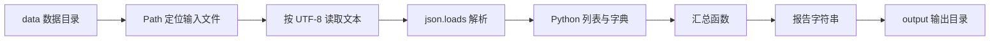

# 文件、路径、JSON 和简单目录操作

上一节的学习进度报告器已经能处理多条记录，但数据仍然写死在 Python 代码中。每次调整课程时间或标签都要修改程序，这会把“数据变化”和“程序变化”混在一起。

本节把课程记录移到 JSON 文件：程序先定位文件，再读取 UTF-8 文本，把 JSON 文本解析成 Python 数据结构，最后生成一份单独的文本报告。你将第一次完成“输入文件只读、处理逻辑独立、结果写到输出目录”的小型数据处理闭环。

## 课程信息

- 课程类型：编程课。
- 所属主线：编程语言。
- 课程层级：Python 起步必修。
- 运行环境：Python 3.11 或更高版本，仅使用标准库。
- 阶段作品：让学习进度报告器读取外部 JSON，并生成文本报告。
- 事实核查：2026-07-14，依据 Python 3 官方教程、`pathlib` 和 `json` 文档。

## 前置知识

开始前应完成：

- [函数、参数、返回值和作用域](03-functions-parameters-returns-scope.md)。
- [字符串、列表、字典、集合和元组](04-strings-collections.md)。
- 能使用字典表示一条记录，使用列表保存多条记录。
- 能在终端进入指定目录并运行 Python 文件。
- 能根据 traceback 找到错误类型和出错行。

开始前先确认：你能解释为什么课程记录属于数据，而汇总进度、生成状态和输出报告属于程序逻辑。

## 学习目标

完成本节后，你应该能做到：

- 区分当前工作目录、相对路径、绝对路径和项目根目录。
- 使用 `pathlib.Path` 组合路径，并判断路径代表文件还是目录。
- 明确指定 UTF-8 编码读取和写入文本。
- 说明 JSON 文本与 Python 数据结构之间的对应关系。
- 使用 `json.loads()` 解析文本，使用 `json.dumps()` 生成 JSON 文本。
- 使用 `glob()` 扫描当前目录中的指定类型文件。
- 说明 `rglob()` 会递归进入子目录，并在使用前限制扫描根目录和文件模式。
- 区分文件定位、文本读取、JSON 解析和字段访问四个失败位置。
- 审阅 AI 生成的文件代码，检查路径假设、编码、扫描范围和覆盖输入的风险。

## 学习顺序

1. 先理解程序从哪个目录解释相对路径。
2. 使用 `Path` 表示和组合路径。
3. 读取与写入 UTF-8 文本。
4. 理解 JSON 语法和类型映射。
5. 把 JSON 文本解析为列表和字典。
6. 使用 `glob()` 扫描受限目录。
7. 完成从 JSON 输入到文本报告的阶段作品。
8. 制造缺失文件、坏 JSON 和缺少字段三类失败，判断故障层次。

## 数据怎样流过程序

下面的图回答一个问题：磁盘上的 JSON 文件怎样变成最终报告？



每条箭头都是一个可以单独验证的边界。文件不存在时，程序还没有读到文本；JSON 语法错误时，文本已经读到，但还没有得到 Python 数据；字段缺失时，解析已经成功，问题出在数据结构不符合程序约定。

## 当前工作目录和路径

### 当前工作目录

当前工作目录是你执行命令时所在的目录。相对路径从这里开始解释，而不是自动从 `.py` 文件所在位置开始。

假设目录结构是：

```text
python-learning/
├── data/
│   └── study_records.json
└── study_records_from_json.py
```

先进入 `python-learning/`：

```bash
cd python-learning
python3 study_records_from_json.py
```

此时 `data/study_records.json` 会从 `python-learning/` 下查找。如果你站在它的父目录运行：

```bash
python3 python-learning/study_records_from_json.py
```

程序的当前工作目录仍然是父目录，`data/study_records.json` 很可能找不到。本课程统一要求从示例根目录运行；使用 `__file__` 定位脚本目录会在模块与项目结构课程中学习。

用 Python 观察当前工作目录：

```python
from pathlib import Path

print(Path.cwd())
```

不要把输出中的个人绝对路径写进公开代码或文档。学习记录可以写“当前目录是示例根目录”，不需要公开用户名和磁盘位置。

### 相对路径和绝对路径

```python
from pathlib import Path

relative_path = Path("data") / "study_records.json"
absolute_path = relative_path.resolve()

print(relative_path)
print(relative_path.is_absolute())
print(absolute_path.is_absolute())
```

相对路径便于在不同计算机上复现；绝对路径说明文件在当前机器上的完整位置。不要把某台机器的绝对路径硬编码为公开示例。

### 项目根目录

项目根目录不是 Python 的特殊语法，而是团队约定的执行起点。它通常包含入口程序、数据目录、配置或说明文件。

本节约定：

```text
python-learning/                 # 示例根目录
├── data/                        # 只读输入
├── output/                      # 程序生成的输出
└── study_records_from_json.py   # 程序入口
```

所有命令都从 `python-learning/` 执行。明确执行起点，可以避免“代码一样，换个目录就找不到文件”的混乱。

## 使用 Path 表示路径

`Path` 会根据当前操作系统使用合适的路径规则。组合子路径时使用 `/`，不需要手动拼接 `/` 或 `\\`。

```python
from pathlib import Path

data_dir = Path("data")
input_path = data_dir / "study_records.json"

print(input_path.name)
print(input_path.suffix)
print(input_path.parent)
```

预期含义：

| 表达式 | 结果 | 含义 |
| --- | --- | --- |
| `input_path.name` | `study_records.json` | 最后一段文件名 |
| `input_path.suffix` | `.json` | 文件扩展名 |
| `input_path.parent` | `data` | 父路径 |

### 判断路径状态

```python
print(input_path.exists())
print(input_path.is_file())
print(data_dir.is_dir())
```

- `exists()` 判断路径是否存在。
- `is_file()` 判断现有路径是否是普通文件。
- `is_dir()` 判断现有路径是否是目录。

这些检查可以帮助定位问题，但不能替代后续异常处理。路径可能在检查后发生变化，权限也可能阻止读取；本节先观察失败，后续再设计恢复策略。

## 读取和写入 UTF-8 文本

### 读取文本

```python
from pathlib import Path

input_path = Path("data") / "study_records.json"
text = input_path.read_text(encoding="utf-8")

print(type(text))
print(len(text))
```

`read_text()` 返回字符串。明确写出 `encoding="utf-8"`，可以减少不同操作系统默认编码造成的差异。

如果文件不存在，读取时会出现 `FileNotFoundError`。如果路径实际是目录，可能出现 `IsADirectoryError`。如果字节不能按指定编码解码，可能出现 `UnicodeDecodeError`。

### 写入文本

输出应写到专用目录，不覆盖输入文件：

```python
from pathlib import Path

output_dir = Path("output")
output_dir.mkdir(parents=True, exist_ok=True)

report_path = output_dir / "study_report.txt"
report_path.write_text("学习进度报告\n", encoding="utf-8")
```

- `parents=True` 允许在需要时一并创建缺少的父目录。
- `exist_ok=True` 表示目录已经存在时不把它当成错误。
- `write_text()` 默认覆盖同名文件，所以路径必须明确指向允许生成的输出文件。

本节的安全边界是：读取 `data/`，只向 `output/` 写入生成结果。不要让 AI 把输入路径和输出路径设成同一个文件。

## JSON 是文本格式

JSON 是一种文本数据格式，不是 Python 代码。下面是一份合法 JSON：

```json
{
  "version": 1,
  "records": [
    {
      "course": "Python 起步",
      "target_hours": 10,
      "finished_hours": 8,
      "active": true,
      "note": null
    }
  ]
}
```

JSON 与 Python 写法相似，但不能混用：

| JSON | 解析后的 Python | 注意 |
| --- | --- | --- |
| 对象 `{}` | 字典 `dict` | JSON 对象的键是字符串 |
| 数组 `[]` | 列表 `list` | 保留元素顺序 |
| 字符串 | `str` | JSON 字符串和键使用双引号 |
| 整数 | `int` | 例如 `10` |
| 小数 | `float` | 例如 `8.5` |
| `true` / `false` | `True` / `False` | 大小写不同 |
| `null` | `None` | 名称不同 |

常见的无效 JSON：

```text
{'course': 'Python'}       # 使用了单引号
{"course": "Python",}     # 最后多了逗号
{"active": True}          # 使用了 Python 的 True
```

标准 JSON 不支持注释。需要说明字段时，把说明写进课程文档，或者增加含义明确的数据字段。

## 从 JSON 文本得到 Python 数据

### 使用 json.loads 解析字符串

```python
import json

text = '{"course": "Python", "hours": 3}'
record = json.loads(text)

print(type(record))
print(record["course"])
```

`loads` 中的 `s` 可以帮助记忆：它接收一个 JSON 字符串。解析成功后，才能使用字典和列表操作读取字段。

如果文本不是合法 JSON，会出现 `json.JSONDecodeError`。这和文件不存在不是同一类问题：出现解析错误，通常说明文件已经读取成功，但内容语法不合法。

### 使用 json.dumps 生成字符串

```python
import json

summary = {
    "course_count": 3,
    "completed": 1,
    "tags": ["python", "基础"],
}

text = json.dumps(summary, ensure_ascii=False, indent=2)
print(text)
```

- `ensure_ascii=False` 让中文直接显示，而不是转成 Unicode 转义序列。
- `indent=2` 生成便于阅读的缩进。
- `dumps()` 返回字符串，不会自动写入文件。

如果需要保存，再使用 `write_text()`：

```python
from pathlib import Path

output_path = Path("output") / "summary.json"
output_path.parent.mkdir(parents=True, exist_ok=True)
output_path.write_text(text + "\n", encoding="utf-8")
```

## 扫描受限目录

### glob 扫描当前目录层级

```python
from pathlib import Path

data_dir = Path("data")

for path in sorted(data_dir.glob("*.json")):
    if path.is_file():
        print(path.name)
```

`glob("*.json")` 只匹配 `data/` 当前层级中的 JSON 路径。使用 `sorted()` 后，输出顺序稳定，便于测试和比较。

### rglob 递归扫描

```python
for path in sorted(data_dir.rglob("*.json")):
    if path.is_file():
        print(path)
```

`rglob()` 会进入所有匹配的子目录。它不是“更高级所以总该使用”的版本：扫描范围越大，运行越慢，也越容易读到缓存、生成文件、私人资料或本来不属于任务的目录。

递归前至少回答：

1. 扫描根目录是否明确且足够小？
2. 文件模式是否限定为真正需要的类型？
3. 是否会进入输出目录、隐藏目录或私人素材目录？
4. 程序只读取文件，还是会修改扫描到的内容？

本节完整示例使用 `glob("*.json")`，不递归扫描。Python 内容分析工具进入正式项目后，再设计排除规则和递归边界。

## 四个不同的失败位置

| 层次 | 操作 | 典型错误 | 说明 |
| --- | --- | --- | --- |
| 路径定位 | 找到输入路径 | 路径指向错误位置 | 常见原因是当前工作目录不对 |
| 文本读取 | `read_text()` | `FileNotFoundError`、`UnicodeDecodeError` | 还没有得到可解析的 JSON 文本 |
| JSON 解析 | `json.loads()` | `JSONDecodeError` | 文件已读到，但 JSON 语法错误 |
| 字段访问 | `document["records"]` | `KeyError` | JSON 合法，但数据结构不符合程序约定 |

看到错误时，不要立即让 AI 加一层宽泛的 `try/except`。先根据 traceback 判断失败发生在哪一步，再决定应该修路径、编码、JSON 语法还是数据字段。

## 可复现实例：从 JSON 生成学习报告

### 目录结构

在自己的练习目录中建立：

```text
python-learning/
├── data/
│   └── study_records.json
└── study_records_from_json.py
```

`output/` 不需要提前创建，程序会在成功处理数据后创建它。

### JSON 输入

**文件：`data/study_records.json`**

```json
{
  "version": 1,
  "records": [
    {
      "course": "  Python 起步  ",
      "target_hours": 10,
      "finished_hours": 8,
      "tags": ["Python", "基础", "Python"]
    },
    {
      "course": "工程基础入门",
      "target_hours": 8,
      "finished_hours": 9,
      "tags": ["基础", "工具"]
    },
    {
      "course": "CS 最小核心",
      "target_hours": 12,
      "finished_hours": 3,
      "tags": ["CS", "算法"]
    }
  ]
}
```

### 完整程序

**文件：`study_records_from_json.py`**

```python
import json
from pathlib import Path


DATA_DIR = Path("data")
INPUT_PATH = DATA_DIR / "study_records.json"
OUTPUT_DIR = Path("output")
OUTPUT_PATH = OUTPUT_DIR / "study_report.txt"


def find_json_files(directory):
    """返回目录当前层级中排序后的 JSON 文件。"""
    json_files = []

    for path in sorted(directory.glob("*.json")):
        if path.is_file():
            json_files.append(path)

    return json_files


def load_records(path):
    """读取 JSON 文本，并返回 records 列表。"""
    text = path.read_text(encoding="utf-8")
    document = json.loads(text)
    return document["records"]


def calculate_progress(record):
    """计算单条记录的完成百分比，并限制在 0 到 100。"""
    target_hours = record["target_hours"]
    finished_hours = record["finished_hours"]

    if target_hours <= 0:
        return 0.0

    progress = finished_hours / target_hours * 100
    if progress > 100:
        return 100.0
    if progress < 0:
        return 0.0
    return progress


def build_status(target_hours, progress):
    """根据目标和进度返回学习状态。"""
    if target_hours <= 0:
        return "目标无效"
    if progress >= 100:
        return "目标已完成"
    if progress >= 80:
        return "接近目标"
    return "继续推进"


def normalize_tags(tags):
    """清理标签文本并返回去重集合。"""
    unique_tags = set()

    for tag in tags:
        clean_tag = tag.strip().lower()
        if clean_tag:
            unique_tags.add(clean_tag)

    return unique_tags


def summarize_records(records):
    """汇总多条学习记录，不修改输入列表和字典。"""
    total_target = 0.0
    total_finished = 0.0
    completed_courses = []
    unique_tags = set()
    report_rows = []

    for record in records:
        course_name = record["course"].strip()
        target_hours = record["target_hours"]
        finished_hours = record["finished_hours"]
        progress = calculate_progress(record)
        status = build_status(target_hours, progress)

        total_target = total_target + target_hours
        total_finished = total_finished + finished_hours

        if progress >= 100:
            completed_courses.append(course_name)

        for tag in normalize_tags(record["tags"]):
            unique_tags.add(tag)

        report_rows.append(
            {
                "course": course_name,
                "progress": progress,
                "status": status,
            }
        )

    summary = (total_target, total_finished, len(completed_courses))
    sorted_tags = sorted(unique_tags)

    return report_rows, summary, completed_courses, sorted_tags


def build_report(json_files, report_rows, summary, completed_courses, sorted_tags):
    """生成可以打印和写入文件的完整报告字符串。"""
    total_target, total_finished, completed_count = summary
    file_names = []
    lines = []

    for path in json_files:
        file_names.append(path.name)

    lines.append("学习进度报告")
    lines.append(f"发现 JSON 文件：{len(json_files)}")
    lines.append("数据文件：" + ", ".join(file_names))

    for row in report_rows:
        lines.append(
            f"- {row['course']}：{row['progress']:.1f}%｜{row['status']}"
        )

    lines.append(f"总计划时间：{total_target:.1f} 小时")
    lines.append(f"总完成时间：{total_finished:.1f} 小时")
    lines.append(f"已完成课程数：{completed_count}")
    lines.append("已完成课程：" + ", ".join(completed_courses))
    lines.append("唯一标签：" + ", ".join(sorted_tags))

    return "\n".join(lines)


def main():
    json_files = find_json_files(DATA_DIR)
    records = load_records(INPUT_PATH)
    report_rows, summary, completed_courses, sorted_tags = summarize_records(
        records
    )
    report = build_report(
        json_files,
        report_rows,
        summary,
        completed_courses,
        sorted_tags,
    )

    OUTPUT_DIR.mkdir(parents=True, exist_ok=True)
    OUTPUT_PATH.write_text(report + "\n", encoding="utf-8")

    print(report)
    print(f"报告已写入：{OUTPUT_PATH}")


main()
```

完整示例重复了一部分上一节函数，是为了让当前文件能够独立运行。下一节学习模块和导入后，再把这些职责拆到多个文件中。

### 运行命令

从 `python-learning/` 执行。

macOS 或 Linux：

```bash
python3 study_records_from_json.py
```

Windows：

```powershell
python study_records_from_json.py
```

### 预期终端输出

```text
学习进度报告
发现 JSON 文件：1
数据文件：study_records.json
- Python 起步：80.0%｜接近目标
- 工程基础入门：100.0%｜目标已完成
- CS 最小核心：25.0%｜继续推进
总计划时间：30.0 小时
总完成时间：20.0 小时
已完成课程数：1
已完成课程：工程基础入门
唯一标签：cs, python, 基础, 工具, 算法
报告已写入：output/study_report.txt
```

`output/study_report.txt` 的内容与上面报告主体相同，但不包含最后一行“报告已写入”。文件以换行结束。

### 验证场景

| 场景 | 输入变化 | 应观察到的结果 |
| --- | --- | --- |
| 正常数据 | 使用完整示例 | 读取三条记录，生成终端输出和文本报告 |
| 空记录 | 把 `records` 改成 `[]` | 明细为空，汇总时间和数量均为0 |
| 重复标签 | 保留示例中的重复 `Python` | 输出标签只出现一次 |
| 多个 JSON 文件 | 在 `data/` 增加另一个合法 JSON | 扫描数量增加，主输入仍只读取指定文件 |
| 中文内容 | 保留中文课程名和标签 | 终端与输出文件中的中文可读 |
| 缺失文件 | 暂时改名 `study_records.json` | `read_text()` 处出现 `FileNotFoundError` |
| 坏 JSON | 删除一个双引号或增加尾随逗号 | `json.loads()` 处出现 `JSONDecodeError` |
| 缺少必填字段 | 删除 `records` 或记录中的字段 | 字段访问处出现对应 `KeyError` |

语法检查：

```bash
python3 -m py_compile study_records_from_json.py
```

运行后还要检查：

```text
data/study_records.json      内容与运行前相同
output/study_report.txt      已创建，内容与预期一致
```

## AI 协作任务：把内存数据迁移到 JSON

AI 可以帮助生成目录结构、JSON 样例和文件读写代码，但必须给它清楚的读写边界。

### 可复用任务描述

```text
请把现有 Python 学习进度报告器从硬编码列表改为读取 JSON。
约束：Python 3.11及以上，仅使用 json 和 pathlib 等标准库；
从示例根目录运行；输入固定为 data/study_records.json；
只能读取 data/，只能写入 output/study_report.txt；不得覆盖输入；
使用 UTF-8；使用 glob("*.json")展示数据目录中的 JSON 文件；
不要使用类、第三方库、try/except、__file__或复杂路径封装；
请给出目录结构、完整代码、示例 JSON、预期输出和失败检查顺序。
```

### 人工审阅要求

1. 确认 AI 说明了命令从哪个目录执行。
2. 确认所有文本读写都显式使用 UTF-8。
3. 确认输入和输出路径不同，程序不会覆盖原始 JSON。
4. 确认扫描根目录固定为 `data/`，模式限定为 `*.json`。
5. 确认程序没有因为“方便”递归扫描整个个人目录或仓库。
6. 确认 JSON 使用双引号、`true`、`false` 和 `null`，没有混入 Python 语法。
7. 主动把报告输出目录改为 `reports/`，重新运行并确认输入不变。

学习记录：

```text
任务目标与输入输出：
当前工作目录约定：
AI 给出的路径和扫描范围：
我修正的编码或覆盖风险：
我主动修改的输出位置或字段：
运行命令和结果：
输入文件运行前后是否一致：
一次失败及其所属层次：
仍未验证的风险：
```

## 核心手动检查点

### 检查点 1：路径从哪里开始

画出以下命令执行时的当前工作目录，并分别判断 `Path("data/study_records.json")` 指向哪里：

```bash
cd python-learning
python3 study_records_from_json.py
```

```bash
cd ..
python3 python-learning/study_records_from_json.py
```

不能只回答“第二个会报错”，还要说明相对路径从当前工作目录开始解释。

### 检查点 2：追踪 JSON 类型

对完整示例手动写出下面表达式的类型和值：

```python
type(text)
type(document)
type(document["records"])
type(document["records"][0])
type(document["records"][0]["tags"])
```

### 检查点 3：判断失败层次

为以下现象标记失败层次：路径定位、文本读取、JSON解析或字段访问。

- 文件名拼错。
- JSON 最后多了逗号。
- 根对象没有 `records`。
- 文件不是 UTF-8，但使用 UTF-8 解码。

### 检查点 4：验证输入只读

运行程序前后分别读取 `data/study_records.json`，确认内容没有变化。然后找到代码中唯一写入文件的位置，说明它为什么不会覆盖输入。

### 检查点 5：限制递归扫描

解释为什么 `Path.home().rglob("*.json")` 不适合作为本节示例。答案至少应涉及扫描范围、隐私、性能和误读文件中的两项。

## 微练习

### 练习 1：判断相对路径

给出当前目录和三个相对路径，画出它们最终指向的目录树位置。再用 `Path.cwd()` 和 `resolve()`验证判断，学习记录中不要公开个人绝对路径。

### 练习 2：UTF-8 文本读写

读取一个包含中文的文本文件，把行数和字符数写入 `output/text_summary.txt`。验证原文件未变化，输出文件可以正常显示中文。

### 练习 3：JSON 类型映射

建立包含字符串、数字、布尔值、`null`、数组和对象的 JSON。解析后逐项打印 Python 类型，记录 JSON 名称与 Python 类型的对应关系。

### 练习 4：修改数据重新生成报告

只修改 `study_records.json` 中一条记录的完成时间，不改 Python 文件。重新运行并确认报告变化，解释这如何体现数据与程序逻辑分离。

### 练习 5：扫描 JSON 文件

在 `data/` 中增加两个 JSON 文件和一个文本文件。使用 `glob("*.json")` 输出排序后的文件名，确认文本文件不会进入结果。

### 练习 6：定位两种失败

先让输入路径指向不存在的文件，记录 `FileNotFoundError`；修复路径后再制造坏 JSON，记录 `JSONDecodeError`。比较两次 traceback 的出错函数和失败阶段。

## 常见错误与排查

| 现象 | 常见原因 | 检查方法 | 当前课程中的修复 |
| --- | --- | --- | --- |
| `FileNotFoundError` | 当前工作目录或文件名不对 | 打印 `Path.cwd()`，核对目录树和输入路径 | 从示例根目录运行，修正相对路径 |
| `IsADirectoryError` | 把目录当文件读取 | 使用 `is_file()` 和 `is_dir()` 判断 | 指向具体文件 |
| `UnicodeDecodeError` | 文件编码与读取编码不一致 | 核对文件实际编码 | 将练习数据保存为UTF-8，并显式指定编码 |
| `JSONDecodeError` | 单引号、尾随逗号或括号不匹配 | 查看错误行列，使用最小 JSON 复现 | 修正 JSON 语法 |
| `KeyError: 'records'` | JSON 根对象缺少约定字段 | 打印并检查根对象的键 | 补齐数据结构，不要静默忽略必填字段 |
| 输出中文变成转义序列 | `json.dumps()` 使用默认设置 | 检查序列化参数 | 使用 `ensure_ascii=False` |
| 在父目录运行后找不到 `data/` | 相对路径按当前工作目录解释 | 比较命令位置和 `Path.cwd()` | 进入示例根目录后运行 |
| 输入文件被覆盖 | 输入路径和输出路径相同 | 对比两个常量和运行前后内容 | 输出限定到 `output/` |
| 扫描到不相关文件 | 根目录过大或使用递归模式 | 打印扫描根目录和匹配模式 | 使用明确的 `data/` 和 `*.json` |

本节不使用 `try/except` 隐藏这些错误。先读懂 traceback 并修正原因；异常捕获、错误消息和恢复策略会在后续课程中系统学习。

## 完成标准

完成本节需要同时满足：

- 能解释当前工作目录、相对路径、绝对路径和示例根目录的区别。
- 能使用 `Path` 组合路径，并使用 `exists()`、`is_file()` 和 `is_dir()` 检查状态。
- 能明确使用 UTF-8 读取和写入文本。
- 能说出 JSON 与 Python 常用类型的对应关系。
- 能使用 `json.loads()` 解析文本，使用 `json.dumps()` 生成可读中文 JSON。
- 能使用 `glob("*.json")` 获得排序后的文件列表。
- 能说明何时才应该使用 `rglob()`，以及递归前需要限制什么。
- 能运行完整示例，从 JSON 读取三条记录并生成文本报告。
- 能验证空记录、重复标签、多个 JSON 文件和中文内容。
- 能制造并区分 `FileNotFoundError`、`JSONDecodeError` 和 `KeyError`。
- 能证明输入 JSON 在程序运行前后没有变化。
- 能审阅一次 AI 文件重构，修正至少一个路径、编码、扫描或覆盖风险。
- 能主动修改一个输出路径或报告字段，并重新运行验证。

## 来源与版本

| 来源 | 用于核查 | 版本或日期 | 状态 |
| --- | --- | --- | --- |
| [Python 官方教程：Reading and Writing Files](https://docs.python.org/3/tutorial/inputoutput.html#reading-and-writing-files) | 文本文件读取、写入和编码 | Python 3 文档，2026-07-14核查 | 已验证 |
| [Python 标准库：pathlib](https://docs.python.org/3/library/pathlib.html) | 路径组合、查询、扫描、目录和文本操作 | Python 3 文档，2026-07-14核查 | 已验证 |
| [Python 标准库：json](https://docs.python.org/3/library/json.html) | JSON解析、序列化、类型映射和错误 | Python 3 文档，2026-07-14核查 | 已验证 |

## 下一步

下一步进入[模块、导入和虚拟环境](06-modules-imports-venv.md)。学习进度报告器会把当前单文件中的读取、汇总和报告职责拆分到多个模块，并建立可重复的运行环境；异常处理和自动化测试仍在之后单独学习。
