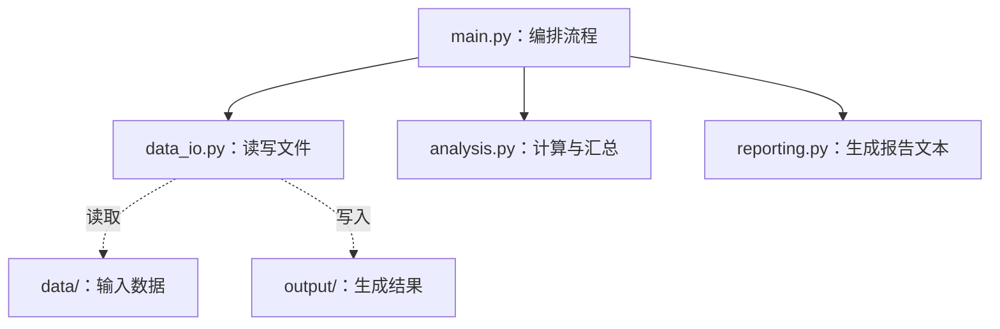

# 模块、导入和虚拟环境

上一节的学习进度报告器已经能读取 JSON 并生成报告，但读取、计算、排版和启动流程仍然挤在一个文件里。程序继续增长后，修改一个功能时很难判断会影响哪里，也很难单独验证某一部分。

本节把程序拆成职责明确的 Python 模块，并为它创建独立虚拟环境。目标不是追求文件数量，而是让代码关系可解释、运行环境可确认、重构前后行为可比较。

## 课程信息

- 课程类型：编程课。
- 所属主线：编程语言。
- 课程层级：Python 起步必修。
- 运行环境：Python 3.11 或更高版本，仅使用标准库。
- 阶段作品：把单文件学习进度报告器重构为多模块程序，并在虚拟环境中运行。
- 事实核查：2026-07-14，依据 Python 3 模块、`__main__`、`venv` 和 pip 官方文档。

## 前置知识

开始前应完成：

- [函数、参数、返回值和作用域](03-functions-parameters-returns-scope.md)。
- [字符串、列表、字典、集合和元组](04-strings-collections.md)。
- [文件、路径、JSON 和简单目录操作](05-files-json-paths.md)。
- 能从示例根目录运行 Python 文件。
- 能解释输入文件、处理函数和输出文件各自的职责。
- 能使用 Git 检查哪些文件会进入仓库。

开始前先确认：你能在上一节单文件程序中指出读取数据、计算进度、生成报告和启动流程分别位于哪里。

## 学习目标

完成本节后，你应该能做到：

- 说明一个 `.py` 文件怎样成为可导入模块。
- 使用 `import module` 和 `from module import name` 调用其他模块的能力。
- 区分标准库模块、本地模块和第三方依赖。
- 解释导入模块时顶层语句会执行，并避免产生意外副作用。
- 使用 `if __name__ == "__main__":` 保护程序入口。
- 根据职责拆分模块，并保持单向导入关系。
- 识别模块命名遮蔽和简单循环导入问题。
- 创建、激活、验证和退出 `.venv` 虚拟环境。
- 使用 `sys.executable` 和 `python -m pip` 确认当前解释器与 pip 属于同一环境。
- 使用 `.gitignore` 排除虚拟环境、缓存和生成输出。
- 审阅 AI 的多模块重构，验证重构前后业务输出一致。

## 学习顺序

1. 理解模块解决的维护问题。
2. 学习两种常用导入方式。
3. 区分标准库、本地模块和第三方依赖。
4. 观察导入时执行的代码，建立主入口保护。
5. 设计模块职责和单向依赖。
6. 识别命名遮蔽与循环导入。
7. 创建并验证虚拟环境。
8. 在虚拟环境中运行多模块学习进度报告器。
9. 比较重构前后的输出，并验证单独导入没有副作用。

## 模块怎样协作

下面的图回答一个问题：多文件程序中，谁可以依赖谁？



箭头保持从入口指向能力模块。`analysis.py` 不需要知道报告写到哪里，`reporting.py` 不需要读取 JSON，三个业务模块也不应反向导入 `main.py`。这让每个模块都能被单独导入和检查。

## 什么是模块

Python 模块通常是一个包含定义和语句的 `.py` 文件。文件名去掉 `.py` 后，就是常见的模块名。

```text
analysis.py  -> 模块名 analysis
data_io.py   -> 模块名 data_io
reporting.py -> 模块名 reporting
```

模块可以保存函数、变量和其他定义。另一个文件通过导入使用这些能力，不需要复制代码。

### 为什么拆分模块

适合拆分的信号包括：

- 一个文件同时负责读取、计算、展示和启动。
- 一组函数可以用一句职责说明归类。
- 修改报告格式时，不希望碰到数据读取代码。
- 希望单独导入计算函数进行检查。
- 相同能力需要被多个入口复用。

不要为了“工程化”把每个函数放进一个文件。模块应围绕职责形成边界，而不是追求文件越多越好。

## 两种常用导入方式

### 导入模块

```python
import analysis

progress = analysis.calculate_progress(
    {"target_hours": 10, "finished_hours": 8}
)
```

这种写法保留模块名前缀，读代码时能直接看出函数来自哪里。多个模块可能存在同名函数时，这种方式尤其清楚。

### 从模块导入指定名称

```python
from analysis import calculate_progress

progress = calculate_progress(
    {"target_hours": 10, "finished_hours": 8}
)
```

这种写法较短，适合导入少量、来源明确且不会重名的函数。

| 写法 | 调用方式 | 优点 | 风险 |
| --- | --- | --- | --- |
| `import analysis` | `analysis.calculate_progress()` | 来源清楚，不易重名 | 调用稍长 |
| `from analysis import calculate_progress` | `calculate_progress()` | 简洁 | 导入多时来源可能不清楚 |

不要在正式程序中使用：

```python
from analysis import *
```

它会把一组不明显的名称放进当前模块，可能覆盖已有名称，也让读者难以判断函数来源。

### 必要时使用别名

别名用于解决名称过长或冲突，不用于制造只有自己看得懂的缩写：

```python
import reporting as report_tools

text = report_tools.build_report([], [], (0.0, 0.0, 0), [], [])
```

如果原模块名已经清楚且不长，就不需要别名。

## 三种代码来源

| 类型 | 示例 | 从哪里来 | 当前课程是否安装 |
| --- | --- | --- | --- |
| 标准库模块 | `json`、`pathlib`、`sys` | 随 Python 提供 | 不需要安装 |
| 本地模块 | `analysis`、`data_io` | 当前示例中的 `.py` 文件 | 自己创建 |
| 第三方依赖 | `requests`、`pytest` | Python 之外的项目 | 本节不安装 |

看到 `ModuleNotFoundError` 时，先判断缺失的是哪一类：

- 本地模块：检查文件名、当前目录和导入名称。
- 标准库：检查是否被同名本地文件遮蔽，或模块是否适用于当前 Python 版本。
- 第三方依赖：检查当前解释器和虚拟环境，再决定是否安装。

不要看到缺失模块就立即执行网上找到的安装命令。先确认项目是否真的需要它，以及命令会安装到哪个 Python 环境。

## 导入会执行模块顶层代码

假设 `welcome.py` 内容是：

```python
print("welcome 模块正在加载")


def build_message(name):
    return f"你好，{name}"
```

另一个文件只写：

```python
import welcome
```

第一次导入时，顶层的 `print()` 会执行。函数内部代码只有在函数被调用时才执行，但模块顶层语句会在加载模块时运行。

因此，下面这些行为通常不应在业务模块导入时自动发生：

- 读取大文件。
- 创建输出目录。
- 写入报告。
- 发送网络请求。
- 启动主流程。

模块顶层可以保留导入、常量和函数定义。真正的业务动作由入口显式调用。

## __name__ 和主入口保护

每个模块都有 `__name__`。直接运行文件时，它的值是 `"__main__"`；被其他文件导入时，它通常是模块名。

```python
def main():
    print("程序开始运行")


if __name__ == "__main__":
    main()
```

执行文件：

```bash
python3 main.py
```

条件成立，`main()` 被调用。

导入文件：

```bash
python3 -c "import main"
```

条件不成立，只加载定义，不启动主流程。

主入口保护不是让所有模块都必须有 `main()`。本节只有入口文件负责启动；`analysis.py`、`data_io.py` 和 `reporting.py` 只提供函数。

## Python 在哪里找模块

起步阶段可以先记住：运行 `main.py` 时，Python 会在包含入口脚本的目录、标准库位置和当前环境的依赖位置等搜索模块。

本节把所有本地模块放在同一示例根目录：

```text
python-learning/
├── main.py
├── analysis.py
├── data_io.py
└── reporting.py
```

从该目录运行 `python main.py`，导入关系最直观。本节不修改 `sys.path`，不设置 `PYTHONPATH`，也不使用包内相对导入；这些做法会在程序规模真正需要时再学习。

## 模块命名遮蔽

本地文件可能遮蔽同名标准库模块。不要把自己的文件命名为：

```text
json.py
pathlib.py
sys.py
venv.py
```

例如项目中存在 `json.py` 时：

```python
import json
```

可能导入本地文件，而不是预期的标准库模块，随后出现看似奇怪的属性错误或循环导入。

检查实际来源：

```python
import json

print(json.__file__)
```

这个命令可能打印本机绝对路径。学习记录只需判断它来自标准库还是当前项目，不公开个人路径。

如果刚改过文件名，仍有问题，可以在确认没有重要文件后清理对应的 `__pycache__/`，再重新运行。不要把缓存目录提交到 Git。

## 单向依赖和循环导入

### 单向依赖

本节采用：

```text
main -> data_io
main -> analysis
main -> reporting
```

能力模块不知道入口文件的存在。数据通过参数传入，通过返回值传出。

### 循环导入

错误示例：

```python
# analysis.py
from reporting import build_report
```

```python
# reporting.py
from analysis import summarize_records
```

加载 `analysis` 时需要加载 `reporting`，而 `reporting` 又回头等待尚未加载完成的 `analysis`，可能出现“partially initialized module”一类错误。

修复思路不是把导入随意塞进函数内部，而是重新划分职责：

- `analysis.py` 只返回结构化结果。
- `reporting.py` 只接收结果并排版。
- `main.py` 负责按顺序调用两者。

## __pycache__ 是什么

导入模块后，Python 可能创建 `__pycache__/`，保存用于加快模块加载的缓存文件。它不是源代码，也不代表多出一个需要维护的模块。

常见目录：

```text
__pycache__/
├── analysis.cpython-311.pyc
└── reporting.cpython-311.pyc
```

不同 Python 版本生成的名称可能不同。缓存可以重新生成，通常应由 `.gitignore` 排除。

## 虚拟环境解决什么问题

工程基础课程已经介绍过虚拟环境的作用。本节开始真正操作。

虚拟环境为项目提供独立的 Python 解释器入口和依赖安装位置。它主要解决：

```text
项目 A 需要依赖的一个版本
项目 B 需要同一依赖的另一个版本
全局安装容易互相影响
```

本节没有第三方依赖，仍然创建虚拟环境，是为了先学会确认“当前到底使用哪个 Python”。后续安装依赖时，这个判断会直接影响程序能否运行。

## 创建虚拟环境

先从示例根目录检查版本：

```bash
python3 --version
```

macOS 或 Linux：

```bash
python3 -m venv .venv
```

Windows PowerShell：

```powershell
python -m venv .venv
```

`-m venv` 表示让当前 Python 解释器运行标准库中的 `venv` 模块。`.venv` 是本项目约定的虚拟环境目录名。

创建后不要手动修改 `.venv/` 内部文件，也不要复制它给别人。虚拟环境通常不可移植；需要时应在目标计算机上重新创建。

## 激活、验证和退出

### macOS 或 Linux

激活：

```bash
source .venv/bin/activate
```

验证：

```bash
python --version
python -c "import sys; print(sys.executable)"
python -m pip --version
```

退出：

```bash
deactivate
```

### Windows PowerShell

激活：

```powershell
.venv\Scripts\Activate.ps1
```

验证：

```powershell
python --version
python -c "import sys; print(sys.executable)"
python -m pip --version
```

退出：

```powershell
deactivate
```

如果 PowerShell 阻止脚本执行，先记录完整错误和当前策略，不要为了激活环境随意放宽整台计算机的执行策略。可以直接使用虚拟环境解释器运行程序。

### 不激活也可以运行

激活的主要作用是临时调整当前终端寻找 `python` 和相关命令的顺序。它不是使用虚拟环境的唯一方式。

macOS 或 Linux：

```bash
.venv/bin/python main.py
```

Windows：

```powershell
.venv\Scripts\python.exe main.py
```

这种方式明确指定解释器，在自动化脚本和排错时很有用。

## 为什么使用 python -m pip

```bash
python -m pip --version
```

这条命令让当前 `python` 运行它所属环境里的 pip，比直接输入 `pip` 更容易确认安装目标。

本节只检查 pip，不安装第三方库。不要为了证明虚拟环境能用而随意安装一个包；后续课程需要依赖时，再记录包名、版本、来源和安装命令。

可以同时检查：

```bash
python -c "import sys; print(sys.executable)"
python -m pip --version
```

两条输出都应指向 `.venv` 对应环境。公开学习记录不要粘贴完整个人路径，只记录“解释器和 pip 均来自项目 `.venv`”。

## Git 忽略边界

虚拟环境、缓存和生成报告都可以重新创建，不应进入仓库。输入数据和源代码则需要保留。

**文件：`.gitignore`**

```gitignore
.venv/
__pycache__/
*.py[cod]
output/
```

检查：

```bash
git status --short --ignored
git check-ignore -v .venv/ __pycache__/ output/
```

如果当前练习目录不是 Git 仓库，先理解规则即可，不需要为了本节额外创建远程仓库。

## 可复现实例：多模块学习进度报告器

### 目录结构

```text
python-learning/
├── .gitignore
├── main.py
├── analysis.py
├── data_io.py
├── reporting.py
├── data/
│   └── study_records.json
└── output/                  # 运行后生成，不提交
```

所有命令从 `python-learning/` 执行。

### 分析模块

**文件：`analysis.py`**

```python
def calculate_progress(record):
    """计算单条记录的完成百分比，并限制在 0 到 100。"""
    target_hours = record["target_hours"]
    finished_hours = record["finished_hours"]

    if target_hours <= 0:
        return 0.0

    progress = finished_hours / target_hours * 100
    if progress > 100:
        return 100.0
    if progress < 0:
        return 0.0
    return progress


def build_status(target_hours, progress):
    """根据目标和进度返回学习状态。"""
    if target_hours <= 0:
        return "目标无效"
    if progress >= 100:
        return "目标已完成"
    if progress >= 80:
        return "接近目标"
    return "继续推进"


def normalize_tags(tags):
    """清理标签文本并返回去重集合。"""
    unique_tags = set()

    for tag in tags:
        clean_tag = tag.strip().lower()
        if clean_tag:
            unique_tags.add(clean_tag)

    return unique_tags


def summarize_records(records):
    """汇总多条学习记录，不修改输入列表和字典。"""
    total_target = 0.0
    total_finished = 0.0
    completed_courses = []
    unique_tags = set()
    report_rows = []

    for record in records:
        course_name = record["course"].strip()
        target_hours = record["target_hours"]
        finished_hours = record["finished_hours"]
        progress = calculate_progress(record)
        status = build_status(target_hours, progress)

        total_target = total_target + target_hours
        total_finished = total_finished + finished_hours

        if progress >= 100:
            completed_courses.append(course_name)

        for tag in normalize_tags(record["tags"]):
            unique_tags.add(tag)

        report_rows.append(
            {
                "course": course_name,
                "progress": progress,
                "status": status,
            }
        )

    summary = (total_target, total_finished, len(completed_courses))
    sorted_tags = sorted(unique_tags)

    return report_rows, summary, completed_courses, sorted_tags
```

### 文件读写模块

**文件：`data_io.py`**

```python
import json


def find_json_files(directory):
    """返回目录当前层级中排序后的 JSON 文件。"""
    json_files = []

    for path in sorted(directory.glob("*.json")):
        if path.is_file():
            json_files.append(path)

    return json_files


def load_records(path):
    """读取 JSON 文本，并返回 records 列表。"""
    text = path.read_text(encoding="utf-8")
    document = json.loads(text)
    return document["records"]


def write_report(path, report):
    """创建输出目录并写入 UTF-8 文本报告。"""
    path.parent.mkdir(parents=True, exist_ok=True)
    path.write_text(report + "\n", encoding="utf-8")
```

### 报告模块

**文件：`reporting.py`**

```python
def build_report(json_files, report_rows, summary, completed_courses, sorted_tags):
    """生成可以打印和写入文件的完整报告字符串。"""
    total_target, total_finished, completed_count = summary
    file_names = []
    lines = []

    for path in json_files:
        file_names.append(path.name)

    lines.append("学习进度报告")
    lines.append(f"发现 JSON 文件：{len(json_files)}")
    lines.append("数据文件：" + ", ".join(file_names))

    for row in report_rows:
        lines.append(
            f"- {row['course']}：{row['progress']:.1f}%｜{row['status']}"
        )

    lines.append(f"总计划时间：{total_target:.1f} 小时")
    lines.append(f"总完成时间：{total_finished:.1f} 小时")
    lines.append(f"已完成课程数：{completed_count}")
    lines.append("已完成课程：" + ", ".join(completed_courses))
    lines.append("唯一标签：" + ", ".join(sorted_tags))

    return "\n".join(lines)
```

### 主入口

**文件：`main.py`**

```python
from pathlib import Path

from analysis import summarize_records
from data_io import find_json_files, load_records, write_report
from reporting import build_report


DATA_DIR = Path("data")
INPUT_PATH = DATA_DIR / "study_records.json"
OUTPUT_PATH = Path("output") / "study_report.txt"


def main():
    json_files = find_json_files(DATA_DIR)
    records = load_records(INPUT_PATH)
    report_rows, summary, completed_courses, sorted_tags = summarize_records(
        records
    )
    report = build_report(
        json_files,
        report_rows,
        summary,
        completed_courses,
        sorted_tags,
    )

    write_report(OUTPUT_PATH, report)

    print(report)
    print(f"报告已写入：{OUTPUT_PATH}")


if __name__ == "__main__":
    main()
```

### JSON 输入

**文件：`data/study_records.json`**

```json
{
  "version": 1,
  "records": [
    {
      "course": "  Python 起步  ",
      "target_hours": 10,
      "finished_hours": 8,
      "tags": ["Python", "基础", "Python"]
    },
    {
      "course": "工程基础入门",
      "target_hours": 8,
      "finished_hours": 9,
      "tags": ["基础", "工具"]
    },
    {
      "course": "CS 最小核心",
      "target_hours": 12,
      "finished_hours": 3,
      "tags": ["CS", "算法"]
    }
  ]
}
```

### 创建并使用虚拟环境

macOS 或 Linux：

```bash
python3 -m venv .venv
source .venv/bin/activate
python -c "import sys; print(sys.executable)"
python -m pip --version
python main.py
deactivate
```

Windows PowerShell：

```powershell
python -m venv .venv
.venv\Scripts\Activate.ps1
python -c "import sys; print(sys.executable)"
python -m pip --version
python main.py
deactivate
```

### 预期输出

```text
学习进度报告
发现 JSON 文件：1
数据文件：study_records.json
- Python 起步：80.0%｜接近目标
- 工程基础入门：100.0%｜目标已完成
- CS 最小核心：25.0%｜继续推进
总计划时间：30.0 小时
总完成时间：20.0 小时
已完成课程数：1
已完成课程：工程基础入门
唯一标签：cs, python, 基础, 工具, 算法
报告已写入：output/study_report.txt
```

### 验证导入没有副作用

删除已有 `output/` 后执行：

```bash
python -c "import analysis, data_io, reporting, main"
```

客观结果：

- 终端没有报告输出。
- 不会创建 `output/`。
- 不会读取 JSON。

再执行：

```bash
python main.py
```

此时才会读取数据、打印报告并创建输出文件。

### 语法检查

```bash
python -m compileall -q main.py analysis.py data_io.py reporting.py
```

命令没有输出且退出码为0，表示四个模块可以编译。它不能证明模块职责合理或报告结果正确，仍要运行完整场景。

## AI 协作任务：拆分单文件程序

AI 很适合完成机械搬运和导入语句初稿，但可能过度拆分、制造循环依赖、改变函数行为或在导入时启动程序。

### 可复用任务描述

```text
请把现有单文件学习进度报告器重构为四个同目录Python模块：
main.py负责流程编排，data_io.py负责JSON和文本文件，
analysis.py负责计算汇总，reporting.py负责生成报告字符串。
约束：Python 3.11及以上，仅使用标准库；保持输入、输出和报告内容不变；
业务模块不得导入main；不得使用类、包目录、相对导入或第三方库；
只有显式运行main.py时才能读取数据、打印或写文件；
main.py必须使用if __name__ == "__main__"保护入口；
请给出完整文件、依赖图、运行命令、导入副作用检查和回归结果。
```

### 人工审阅要求

1. 检查每个模块能否用一句话说明职责。
2. 检查业务模块是否反向导入 `main`，或彼此形成循环。
3. 检查顶层是否存在读取、写入、打印或启动流程。
4. 检查函数参数、返回值和报告文本是否被 AI 悄悄修改。
5. 检查是否出现 `from module import *` 或难以解释的动态导入。
6. 单独导入四个模块，确认没有输出和文件变化。
7. 主动把 `normalize_tags()` 从 `analysis.py` 移到新建的 `text_tools.py`，修正导入后再次运行；完成后说明文件是否真的更清楚。若只增加跳转而没有形成独立职责，应撤销该拆分并记录原因。

学习记录：

```text
重构前输入、输出和运行命令：
AI建议的模块职责：
我接受、合并或撤销的拆分：
模块导入方向：
导入时是否产生副作用：
我主动移动的函数及判断：
系统Python运行结果：
虚拟环境解释器与pip检查：
重构前后输出对比：
仍未验证的风险：
```

## 核心手动检查点

### 检查点 1：追踪启动顺序

从 `python main.py` 开始，按顺序写出：

1. 哪些模块先被加载。
2. 哪些顶层内容会执行。
3. `main()` 在什么条件下调用。
4. 数据何时读取，报告何时写入。

### 检查点 2：解释主入口保护

分别预测：

```bash
python main.py
python -c "import main"
```

说明两种情况下 `main.__name__` 的差异，以及为什么第二条命令不应生成报告。

### 检查点 3：识别命名遮蔽

在临时练习目录创建 `json.py` 后运行：

```bash
python -c "import json; print(json.__file__)"
```

判断导入来源，随后删除临时文件和对应缓存。不要在当前公开仓库中制造这个错误。

### 检查点 4：修复循环导入

阅读前面的 `analysis` 与 `reporting` 循环示例，画出依赖环，再改为两个能力模块互不导入、由 `main` 组合结果。

### 检查点 5：证明解释器来自虚拟环境

激活前后分别运行：

```bash
python -c "import sys; print(sys.executable)"
python -m pip --version
```

记录两次结果属于系统环境还是项目 `.venv`，但不要公开个人绝对路径。

### 检查点 6：不激活也能运行

退出虚拟环境后，直接使用 `.venv` 中的解释器运行 `main.py`。解释为什么程序仍然使用虚拟环境，以及激活实际改变了什么。

## 微练习

### 练习 1：拆分两个模块

把一个同时包含计算和打印的脚本拆成 `math_tools.py` 与 `main.py`。要求导入工具模块时没有输出，只有运行入口时打印结果。

### 练习 2：比较导入方式

分别使用 `import analysis` 和 `from analysis import calculate_progress` 调用同一函数。记录名称来源、调用写法和重名风险。

### 练习 3：主入口保护

故意把 `main()` 调用放在条件外，观察 `python -c "import main"` 的副作用；再恢复保护并验证输出目录不再创建。

### 练习 4：模块命名冲突

在独立临时目录使用 `json.py` 制造遮蔽，记录实际导入路径和错误。修复文件名并清理缓存后重新验证。

### 练习 5：创建并验证虚拟环境

创建 `.venv`，分别记录系统解释器和虚拟环境解释器的版本、`sys.executable` 判断与 pip 归属。不安装第三方库。

### 练习 6：错误解释器排查

先在虚拟环境中运行程序，再退出环境运行。虽然本节标准库示例都能成功，但要根据 `sys.executable` 说明两次实际使用的解释器不同。

## 常见错误与排查

| 现象 | 常见原因 | 检查方法 | 当前课程中的修复 |
| --- | --- | --- | --- |
| `ModuleNotFoundError` | 文件名、运行目录或导入名不一致 | 核对目录树和导入语句 | 从示例根目录运行并修正名称 |
| `ImportError` | 导入了不存在的名称 | 检查模块中实际定义 | 修正函数名和职责归属 |
| partially initialized module | 形成循环导入 | 画出模块依赖箭头 | 让 `main` 组合能力模块 |
| 导入后自动打印或写文件 | 主流程位于模块顶层 | 执行单独导入检查 | 把动作放入函数并保护入口 |
| `json` 没有预期属性 | 本地 `json.py` 遮蔽标准库 | 查看 `json.__file__` | 重命名本地文件并清理缓存 |
| 修改模块后交互环境仍是旧行为 | 同一解释器会话已缓存模块 | 重新启动解释器 | 结束旧会话后重新运行 |
| 激活后仍使用错误 Python | 激活失败或终端状态不对 | 查看 `sys.executable` | 重新激活或直接调用 `.venv`解释器 |
| `pip` 和 `python` 不属于同一环境 | 直接调用了另一个 pip | 比较 pip 输出与解释器路径 | 使用 `python -m pip` |
| PowerShell阻止激活脚本 | 执行策略限制 | 记录完整错误 | 直接调用 `.venv\Scripts\python.exe` |
| `.venv` 出现在 Git 状态 | 忽略规则缺失或已被跟踪 | 使用 `git check-ignore` | 添加规则；已跟踪情况留到Git深化处理 |

## 完成标准

完成本节需要同时满足：

- 能解释模块、入口文件和函数之间的关系。
- 能使用两种常见导入方式，并说明各自取舍。
- 能区分标准库、本地模块和第三方依赖。
- 能解释导入时会执行模块顶层语句。
- 能使用 `if __name__ == "__main__":` 避免导入副作用。
- 能为读取、计算、报告和编排划分清楚职责。
- 能画出单向模块依赖，并识别一个循环导入。
- 能识别本地文件遮蔽标准库的问题。
- 能创建、激活、验证和退出 `.venv`。
- 能在不激活时直接使用虚拟环境解释器运行程序。
- 能使用 `sys.executable` 和 `python -m pip` 判断当前环境。
- 能运行多模块学习进度报告器，确认输出与重构前一致。
- 能证明单独导入四个模块不会打印、读写文件或创建输出目录。
- 能使用 `.gitignore` 排除虚拟环境、缓存和生成输出。
- 能审阅一次 AI 模块重构，主动调整一个职责并完成回归验证。

## 来源与版本

| 来源 | 用于核查 | 版本或日期 | 状态 |
| --- | --- | --- | --- |
| [Python 官方教程：Modules](https://docs.python.org/3/tutorial/modules.html) | 模块、导入、搜索路径、缓存和命名遮蔽 | Python 3 文档，2026-07-14核查 | 已验证 |
| [Python 标准库：`__main__`](https://docs.python.org/3/library/__main__.html) | 顶层代码环境和主入口保护 | Python 3 文档，2026-07-14核查 | 已验证 |
| [Python 标准库：venv](https://docs.python.org/3/library/venv.html) | 虚拟环境创建、激活和解释器使用 | Python 3 文档，2026-07-14核查 | 已验证 |
| [pip 官方用户指南](https://pip.pypa.io/en/stable/user_guide/#running-pip) | 使用当前解释器运行 pip | pip 文档，2026-07-14核查 | 已验证 |

## 下一步

下一步进入[异常、基本调试和最小自动化测试](07-errors-debugging-tests.md)。你会为多模块学习进度报告器增加输入校验、清楚的失败信息和自动化检查，并将连续课程成果沉淀为独立阶段作品。
