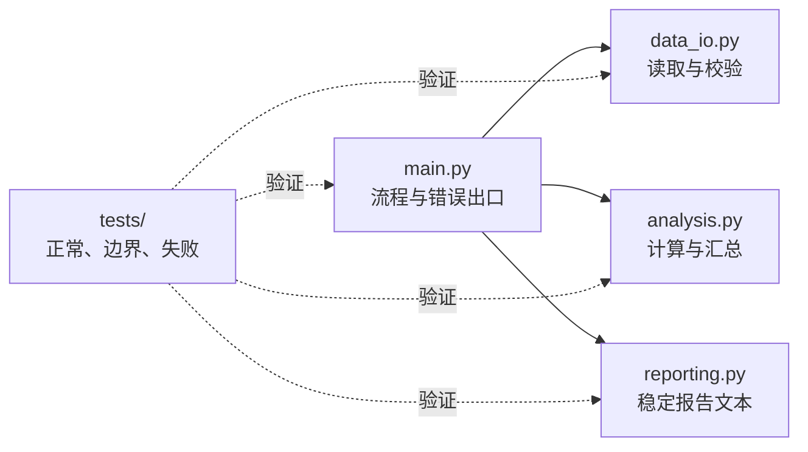

# 异常、基本调试和最小自动化测试

## 课程信息

| 项目 | 内容 |
| --- | --- |
| 适合人群 | 已能编写多模块小程序，希望程序失败时可定位、修复后可回归验证的学习者 |
| 前置知识 | [模块、导入和虚拟环境](06-modules-imports-venv.md)，以及此前的函数、数据结构、文件和 JSON |
| 学习结果 | 为输入建立边界，用 traceback 和调试工具定位问题，并用 `unittest` 固化正确行为 |
| 环境 | Python 3.11 或更高版本，仅使用标准库 |
| 阶段作品 | [学习进度报告器](../../../exercises/python-basics/study-progress-reporter/README.md) |

## 学习目标

完成本节后，你应该能够：

- 区分语法错误、运行时异常和没有报错的错误结果。
- 从 traceback 中找到调用链、文件、行号、异常类型和消息。
- 使用 `try/except/else/finally` 处理可预期失败，并主动 `raise` 非法输入。
- 避免过宽捕获，不把程序自身缺陷伪装成正常结果。
- 使用 `repr()`、`type()`、最小复现和 `breakpoint()` 检查运行状态。
- 解释为什么 `assert` 不能代替用户输入校验。
- 使用标准库 `unittest` 编写正常、边界和失败测试。
- 让测试在修复前失败、修复后通过，并执行完整回归。

## 学习顺序

1. 先识别三类“程序不对”。
2. 学会从 traceback 最后一行向上阅读。
3. 只在输入边界捕获可以解释的异常。
4. 使用小范围观察和断点缩小问题。
5. 把修复前的失败转成自动化测试。
6. 为学习进度报告器补齐校验、退出码和回归测试。

## 调试不是猜测

有效调试是一个可重复的证据闭环：


每一步都应产生证据。只因为“看起来应该能运行”而反复改代码，不是调试。

## 三类问题要分开处理

| 类型 | 例子 | 你能看到什么 | 第一动作 |
| --- | --- | --- | --- |
| 语法错误 | 括号未闭合、冒号缺失 | `SyntaxError` 和出错位置 | 先让解释器能够解析文件 |
| 运行时异常 | 文件不存在、键缺失 | traceback 与异常类型 | 阅读最后一行，再追踪调用链 |
| 错误结果 | 完成比例算成 150% | 程序正常结束但答案不对 | 构造最小输入，检查中间状态 |

下面的程序可以通过语法检查，也不会抛异常，但结果不符合我们的规则：

```python title="wrong_result.py"
def calculate_progress(target_hours, finished_hours):
    return finished_hours / target_hours


print(calculate_progress(2, 3))
```

运行：

```bash
python wrong_result.py
```

输出为 `1.5`。如果规则要求最高显示 100%，就要通过测试表达这个边界，而不是等待某次人工检查碰巧发现。

## 阅读 traceback

遇到异常时，先看最后一行：它通常给出异常类型和消息。再向上看每一层调用所在的文件、行号和函数，找到自己的代码第一次把错误数据送入下一层的位置。

```text
Traceback (most recent call last):
  File "main.py", line 12, in <module>
    print(calculate_progress(0, 2))
  File "analysis.py", line 2, in calculate_progress
    return finished_hours / target_hours
ZeroDivisionError: division by zero
```

这里的证据是：

- 异常类型：`ZeroDivisionError`。
- 直接出错位置：`analysis.py` 第 2 行。
- 调用来源：`main.py` 第 12 行。
- 真正需要决定的是：目标时间为零应该被拒绝，还是有单独业务含义。

不要只复制最后一句给 AI。完整调用链、最小输入和预期行为能显著提高排查质量。

## 捕获可解释的失败

`try` 中只放可能失败的最小操作，`except` 按异常类型处理，`else` 放成功后才执行的逻辑，`finally` 放无论成功失败都必须执行的清理动作。

```python title="read_json_example.py"
import json
from pathlib import Path


path = Path("data/study_records.json")

try:
    text = path.read_text(encoding="utf-8")
    document = json.loads(text)
except FileNotFoundError:
    print("找不到学习记录文件")
except json.JSONDecodeError as error:
    print(f"JSON 格式错误：第 {error.lineno} 行，第 {error.colno} 列")
else:
    print(f"成功读取 {len(document['records'])} 条记录")
finally:
    print("读取尝试结束")
```

`finally` 常用于释放必须关闭的外部资源。本例的 `Path.read_text()` 已自行完成文件关闭，保留 `finally` 只是为了观察执行顺序，不是每个 `try` 都必须拥有四个分支。

### 为什么不能写宽泛捕获

```python
try:
    run_program()
except Exception:
    print("运行失败")
```

这会把拼错变量名、错误参数类型等编程缺陷也包装成模糊提示，丢失最重要的 traceback。当前报告器只捕获三类已知输入失败：文件不存在、JSON 格式错误、显式校验产生的 `ValueError`。其他错误继续暴露，便于修复。

### 用 `raise` 建立数据边界

外部 JSON 即使语法正确，结构也可能不符合程序约定。校验函数应尽早拒绝不合法数据：

```python
def validate_target_hours(value, record_number):
    if isinstance(value, bool) or not isinstance(value, (int, float)):
        raise ValueError(
            f"第 {record_number} 条记录的 target_hours 必须是数字"
        )
    if value <= 0:
        raise ValueError(
            f"第 {record_number} 条记录的 target_hours 必须大于 0"
        )
```

Python 中 `bool` 是 `int` 的子类，因此这里只写 `isinstance(value, (int, float))` 会意外接受 `true`。这是需要测试固定下来的边界。

## 五种常见异常的定位方式

| 异常 | 常见原因 | 先检查什么 | 当前作品中的处理 |
| --- | --- | --- | --- |
| `FileNotFoundError` | 路径或文件名错误 | 当前路径与实际文件位置 | 转成清楚的输入提示 |
| `JSONDecodeError` | 逗号、引号或括号错误 | 错误行列附近的原文 | 报告行列位置 |
| `KeyError` | 直接读取不存在的字典键 | 数据结构和键名 | 校验阶段主动报告缺字段 |
| `TypeError` | 对错误类型执行操作 | `type()` 与调用参数 | 输入边界转成校验错误；编程缺陷保留 traceback |
| `ValueError` | 类型可用但值不合法 | 数值范围和业务约束 | 显式 `raise`，入口统一提示 |

## 基本调试工具

### 观察真实表示和类型

`print(value)` 适合给用户看，`repr(value)` 更适合检查隐藏空格、换行和转义，`type(value)` 用于确认运行时类型。

```python
course = "Python 函数\n"
print(course)
print(repr(course))
print(type(course))
```

### 先做最小复现

不要每次都运行全部数据。把失败压缩为一条记录、一个函数调用和一个明确预期：

```python
from analysis import calculate_progress

result = calculate_progress(2, 3)
print(repr(result), type(result))
```

### 使用 `breakpoint()`

在想观察的位置加入：

```python
breakpoint()
```

运行程序后会进入 Python 调试器。起步阶段先掌握：

| 命令 | 用途 |
| --- | --- |
| `p expression` | 查看表达式 |
| `n` | 执行当前函数下一行 |
| `s` | 进入当前行调用的函数 |
| `c` | 继续运行到下一个断点 |
| `q` | 退出调试器 |

断点用于观察，不是修复。完成排查后删除临时断点，并用测试保留证据。

## `assert` 不是用户输入校验

```python
assert target_hours > 0, "target_hours 必须大于 0"
```

断言适合表达开发者认为程序内部必然成立的条件，但 Python 在优化模式下可能移除断言。用户输入、权限和安全边界必须使用普通条件判断并显式抛出异常。

## 使用 `unittest` 固化行为

一个测试通常遵循 Arrange-Act-Assert：准备输入、执行行为、检查结果。

```python title="tests/test_analysis.py"
import unittest

from analysis import calculate_progress


class AnalysisTests(unittest.TestCase):
    def test_progress_is_capped_for_over_completion(self):
        # Arrange
        target_hours = 2
        finished_hours = 3

        # Act
        result = calculate_progress(target_hours, finished_hours)

        # Assert
        self.assertEqual(result, 1.0)


if __name__ == "__main__":
    unittest.main()
```

运行单个文件：

```bash
python -m unittest tests/test_analysis.py -v
```

发现并运行全部测试：

```bash
python -m unittest discover -s tests -v
```

测试名称应说明场景和预期，不要写成 `test_1`。每次修复缺陷时，先用测试稳定复现失败，再实施最小修复，最后运行全部测试检查回归。

## 临时目录隔离文件测试

测试不应写入真实学习数据。标准库 `tempfile.TemporaryDirectory` 会提供独立目录，并在离开上下文后清理：

```python title="tests/test_input_readonly.py"
import json
import tempfile
import unittest
from pathlib import Path

from data_io import load_records


class InputReadOnlyTests(unittest.TestCase):
    def test_input_file_is_not_modified(self):
        with tempfile.TemporaryDirectory() as directory:
            path = Path(directory) / "records.json"
            path.write_text(
                json.dumps(
                    {
                        "records": [
                            {
                                "course": "异常与测试",
                                "target_hours": 4,
                                "finished_hours": 2,
                                "tags": ["Python"],
                            }
                        ]
                    },
                    ensure_ascii=False,
                ),
                encoding="utf-8",
            )
            before = path.read_bytes()

            load_records(path)

            self.assertEqual(path.read_bytes(), before)


if __name__ == "__main__":
    unittest.main()
```

## 阶段作品：学习进度报告器

完整实现已经沉淀到[阶段作品目录](../../../exercises/python-basics/study-progress-reporter/README.md)。它沿用上一节的四模块结构，并新增输入校验、错误出口和测试：



### 入口如何控制退出码

```python title="main.py（入口片段，完整文件见阶段作品）"
import json
import sys


def main(input_path, data_dir, output_path):
    try:
        run(input_path, data_dir, output_path)
    except FileNotFoundError as error:
        print(f"输入错误：找不到文件 {error.filename}", file=sys.stderr)
        return 1
    except json.JSONDecodeError as error:
        print(
            f"输入错误：JSON 格式无效，第 {error.lineno} 行，"
            f"第 {error.colno} 列",
            file=sys.stderr,
        )
        return 1
    except ValueError as error:
        print(f"输入错误：{error}", file=sys.stderr)
        return 1
    return 0


if __name__ == "__main__":
    raise SystemExit(main(INPUT_PATH, DATA_DIR, OUTPUT_PATH))
```

课程片段强调异常边界；可复制运行的完整 `main.py`、全部业务模块、固定 JSON 和测试均在阶段作品中，避免正文与可运行代码形成两份容易漂移的实现。

运行：

```bash
cd exercises/python-basics/study-progress-reporter
python main.py
python -m unittest discover -s tests -v
```

正常运行应打印报告、生成 `output/study_report.txt`，并返回退出码 `0`。缺失文件、坏 JSON 或非法记录应把说明写到标准错误并返回 `1`。

## AI 协作任务

把上一节的多模块代码和以下约束交给 AI：

```text
请为这个标准库 Python 程序增加输入校验和 unittest 测试。
只捕获可以向用户解释的文件、JSON 和数据校验错误；
不要使用 except Exception，不要引入第三方库，不要修改输入文件。
测试必须使用临时目录，并覆盖正常、边界和失败场景。
请逐项说明每个捕获范围和测试存在的理由。
```

你不能直接接受结果，必须完成：

1. 稳定复现一个原程序失败场景。
2. 检查 AI 是否过宽捕获或返回了伪造的成功结果。
3. 选择一个测试，先确认它会失败，再实施修复。
4. 主动增加一个 AI 未提出的边界用例。
5. 运行全部测试并审阅标准输出、标准错误和退出码。
6. 记录任务、约束、AI 建议摘要、人工修改和验证证据。

## 核心手动检查点

### 检查点 1：沿 traceback 找调用链

制造 `target_hours = 0`，记录异常最后一行、直接出错位置和调用来源。说明为什么只看“除以零”还不足以决定修复。

### 检查点 2：缩小捕获范围

解释报告器为什么捕获 `FileNotFoundError`、`JSONDecodeError` 和输入校验的 `ValueError`，却不捕获所有 `TypeError` 或 `Exception`。

### 检查点 3：区分校验和断言

分别为“JSON 中目标时间必须大于零”和“内部汇总结果应为四项元组”选择普通校验或断言，并说明理由。

### 检查点 4：让测试真正失败

在临时副本中把超额完成的期望从 `1.0` 改成 `1.25`，运行并阅读失败差异；恢复后确认全部测试通过。使用不同长度的值还能避免极短时间内旧字节码缓存干扰这次演示。

### 检查点 5：证明没有副作用

分别导入四个模块，确认没有打印、文件读写或目录创建。比较程序运行前后的输入文件字节。

## 微练习

1. 分别制造一个 `SyntaxError`、`KeyError` 和错误结果，写出各自的第一排查动作。
2. 为坏 JSON 输出错误行列，但保留原始 `JSONDecodeError` 类型给测试检查。
3. 给记录校验增加“课程名不能为空”的规则，并先写失败测试。
4. 使用 `repr()` 找出课程名末尾的隐藏换行，再修复输入。
5. 使用 `breakpoint()` 观察第一条记录进入汇总函数时的类型和值。
6. 新增“`finished_hours` 不能为负数”的测试，确认错误写入标准错误且退出码非零。
7. 使用临时目录验证报告写入，不污染仓库的 `output/`。

## 常见错误与排查

| 现象 | 常见原因 | 检查方法 | 修复方向 |
| --- | --- | --- | --- |
| 只看到“运行失败” | 捕获范围过宽 | 搜索 `except Exception` | 捕获明确异常，保留意外 traceback |
| 测试从未失败 | 测试没有触发目标行为 | 暂时破坏实现或期望 | 先观察红灯再修复 |
| 单独测试通过，整体失败 | 共享状态或文件污染 | 随机顺序、临时目录、独立运行 | 删除跨测试共享可变状态 |
| 测试依赖个人目录 | 路径硬编码 | 搜索绝对路径 | 使用 `TemporaryDirectory` |
| `assert` 没有执行 | 使用了优化模式 | 检查启动参数 | 输入校验使用普通条件和 `raise` |
| 错误信息出现在标准输出 | 没有指定输出流 | 分别捕获 stdout/stderr | 使用 `file=sys.stderr` |
| 返回 `1` 但进程仍是成功 | 没有把返回值交给系统 | 检查入口代码 | 使用 `raise SystemExit(main())` |
| 测试导入时运行程序 | 缺少主入口保护 | 单独 `import main` | 把动作放入函数并保护入口 |

## 完成标准

- 能区分语法错误、运行时异常和错误结果。
- 能完整解释一段 traceback 的调用链和最后一行。
- 能为可预期输入失败选择窄范围异常处理。
- 能说明为什么不使用宽泛捕获隐藏编程错误。
- 能用 `repr()`、`type()`、最小复现和 `breakpoint()` 检查状态。
- 能解释 `assert` 的适用边界。
- 能用 Arrange-Act-Assert 编写 `unittest` 测试。
- 能使用临时目录测试文件行为。
- 能验证正常、空数据、重复标签、超额完成和 UTF-8 中文。
- 能验证缺失文件、坏 JSON、缺字段、错误类型和非法范围。
- 能证明输入只读、导入无副作用、报告输出稳定。
- 能检查成功退出码为 `0`、输入错误退出码非零。
- 能让一个测试先失败，修复后再运行完整回归。
- 能完成并验收[学习进度报告器](../../../exercises/python-basics/study-progress-reporter/README.md)。

## 来源与版本

| 来源 | 用于核查 | 版本或日期 | 状态 |
| --- | --- | --- | --- |
| [Python 官方教程：Errors and Exceptions](https://docs.python.org/3/tutorial/errors.html) | 语法错误、异常、traceback、捕获、抛出和清理 | Python 3 文档，2026-07-14核查 | 已验证 |
| [Python 标准库：pdb](https://docs.python.org/3/library/pdb.html) | `breakpoint()` 与基础调试命令 | Python 3 文档，2026-07-14核查 | 已验证 |
| [Python 标准库：unittest](https://docs.python.org/3/library/unittest.html) | 测试用例、断言和测试发现 | Python 3 文档，2026-07-14核查 | 已验证 |
| [Python 语言参考：assert](https://docs.python.org/3/reference/simple_stmts.html#the-assert-statement) | 断言语义与优化模式边界 | Python 3 文档，2026-07-14核查 | 已验证 |

## 下一步

至此，Python 起步课程完成。默认路线继续进入 [Python / C++ 双主修](../README.md)，把 Python 推进到类型系统、工程化、并发和运行原理，同时开始 C++。

你也已经解锁 [Python 内容分析工具](../../../projects/python-content-analysis/README.md) P1.1，可以把本阶段的路径、模块、校验和测试习惯用于真实仓库素材分析。两条路线可以并行，但项目不能替代双主修课程。
