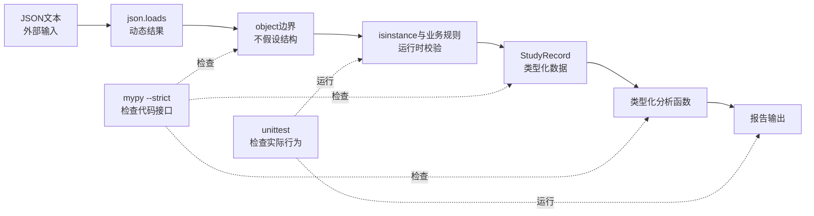

# 类型提示、接口与静态检查认知

<div class="be-tutor-mount" data-tutor-lesson="python-core-01" aria-hidden="true"></div>

> **任务先行：** 给已有学习进度报告器加上能被检查的类型契约。先让它正常运行，再让 `mypy --strict` 告诉你接口哪里不一致。

## 任务路线

<div class="be-task-route" role="list" aria-label="本课五步任务"><span role="listitem">1 运行</span><span role="listitem">2 标注</span><span role="listitem">3 校验</span><span role="listitem">4 诊断</span><span role="listitem">5 迁移</span></div>

<section id="step-1" class="be-task-step" data-step-id="step-1" markdown="1">

## 第一步：运行类型化报告器

按“安装、检查和运行”创建环境、运行报告器和测试。**可观察结果：** 正常业务输出仍成立；类型提示本身不会改变 Python 的运行行为。

</section>

<section id="step-2" class="be-task-step" data-step-id="step-2" markdown="1">

## 第二步：给一个边界补充准确契约

为一个函数的参数与返回值补类型，或为固定 JSON 记录使用既有 `TypedDict`。**成功标准：** 标注表达真实数据形状，而不是用 `Any` 绕过检查。

</section>

<section id="step-3" class="be-task-step" data-step-id="step-3" markdown="1">

## 第三步：在静态与运行时两层验证

执行 `mypy --strict` 与 unittest；从 JSON 边界以 `object` 开始，经过运行时检查后再构造 `StudyRecord`。记录两类工具各自报告什么。

</section>

<section id="step-4" class="be-task-step" data-step-id="step-4" markdown="1">

## 第四步：故意让检查器失败

复现错误参数、`TypedDict` 缺字段或错误返回类型中的一项，确认 mypy 非零退出，然后修复。**验收：** 知道注解不会自动拦截运行期错误。

</section>

<section id="step-5" class="be-task-step" data-step-id="step-5" markdown="1">

## 第五步：迁移验收与下一步

独立为报告器增加一个可选字段或类型别名，保留运行时校验与测试，并让严格检查通过。下一课将类型契约扩展为可维护函数接口和模块边界。

</section>

## 课程信息

| 项目 | 内容 |
| --- | --- |
| 适合人群 | 已完成Python起步和C++构建与类型课程，希望提高Python接口可维护性的学习者 |
| 前置知识 | 函数、容器、JSON、模块、异常、unittest，以及C++静态类型和编译诊断的基本认知 |
| 学习结果 | 能用类型提示表达接口，用mypy严格检查代码，同时保留外部数据的运行时校验和自动化测试 |
| 运行时基线 | Python 3.11及以上 |
| 检查工具 | mypy 2.2.0，`--strict`模式 |
| 实践产出 | 学习进度报告器的完整类型化副本、静态检查与运行测试证据 |

## 为什么类型提示不是“把Python改成C++”

上一节 C++ 代码在生成目标文件前就会由编译器检查类型。Python的类型提示采用不同模型：

- Python运行时仍然根据对象的实际类型执行程序。
- 函数注解通常不会自动拒绝错误参数。
- mypy在不运行程序的情况下分析代码，并报告可能违反类型契约的位置。
- 外部JSON即使“静态检查通过”，运行时仍可能缺字段、类型错误或格式损坏。
- 自动化测试仍然负责验证具体行为和边界结果。

本节的目标不是追求“所有地方都有注解”，而是让模块之间的接口更清楚，让错误尽可能在运行前暴露，同时不伪造安全感。

## 学习目标

完成本节后，你应该能够：

- 区分运行时类型、类型提示、静态检查和运行时校验。
- 为函数参数、返回值、局部变量和常用容器添加准确标注。
- 使用`X | None`表达可能缺失，而不是用模糊注释说明。
- 使用`TypeAlias`缩短复杂但重复的接口类型。
- 使用`TypedDict`描述固定键结构，理解它在运行时仍是普通字典。
- 使用`Sequence`表达只需读取、不要求调用者必须传入列表。
- 区分`object`与`Any`，控制动态类型的传播范围。
- 说明`cast()`只影响静态检查，不执行运行时转换或校验。
- 在JSON边界先校验未知对象，再构造类型化数据。
- 使用`mypy --strict`、运行程序和`unittest`形成三层证据。

## 三层检查各自负责什么

下面的图回答：**静态检查通过后，为什么仍然需要校验JSON和运行测试？**



| 检查层 | 能发现什么 | 不能证明什么 |
| --- | --- | --- |
| 类型提示与mypy | 错误参数、错误返回、缺少TypedDict字段、未标注接口 | JSON实际内容正确、算法结果正确 |
| 运行时校验 | 文件中的真实值是否符合结构和范围规则 | 所有代码路径都正确、未来修改不回归 |
| 自动化测试 | 给定场景的真实输出、异常和副作用 | 没有覆盖到的所有输入都正确 |

三层相互补充，不能相互替代。

## Python与C++类型检查对照

| 问题 | Python + mypy | C++ |
| --- | --- | --- |
| 类型主要何时检查 | 独立静态分析步骤 | 编译过程的一部分 |
| 不运行检查器会怎样 | 注解通常不阻止程序启动 | 类型错误通常阻止目标文件生成 |
| 注解是否改变值 | 通常不会 | 声明决定对象类型和部分运行行为 |
| 错误类型能否在运行时进入函数 | 可以，除非代码主动校验 | 能通过接口的值受编译期类型规则限制 |
| 外部文本或JSON | 仍需解析和运行时校验 | 同样需要解析和运行时校验 |
| 检查产物 | 诊断信息，不生成程序 | 诊断以及目标文件/可执行程序 |

共同点是：接口越准确，调用者越容易发现错误。根本差异是：mypy不是Python解释器，也不参与生成可执行机器代码。

## 最小函数类型契约

```python title="minimal_types.py"
def calculate_progress(target_hours: float, finished_hours: float) -> float:
    return min(finished_hours / target_hours, 1.0)


progress: float = calculate_progress(10.0, 7.5)
print(progress)
```

函数签名表达：两个参数应当能作为`float`使用，结果是`float`。Python中`int`通常可以用于要求`float`的静态位置，但字符串不可以：

```python
calculate_progress("10", 7.5)
```

mypy会报告参数类型不兼容。不过直接运行这行代码时，失败来自函数中的除法，而不是注解自动拦截调用。

### 注解不会自动执行校验

```python title="annotations_are_not_guards.py"
def echo_hours(hours: float) -> float:
    return hours


result = echo_hours("five")  # 运行时仍会进入函数
print(result, type(result))
```

Python解释器会打印字符串及其类型。mypy会在运行前报告错误参数。这正是“运行时行为”和“静态契约”的区别。

## 常用类型写法

### 容器

```python
course_names: list[str] = ["Python", "C++"]
hours_by_course: dict[str, float] = {"Python": 8.0, "C++": 6.0}
unique_tags: set[str] = {"语言", "工程"}
point: tuple[float, float] = (3.0, 4.0)
history: tuple[str, ...] = ("起步", "类型", "工程化")
```

`tuple[float, float]`表示恰好两个位置；`tuple[str, ...]`表示任意长度且每项都是字符串。

### 可能缺失的值

```python
def find_course(name: str) -> str | None:
    if name == "python":
        return "Python"
    return None
```

调用者必须处理`None`：

```python
course = find_course("python")
if course is not None:
    print(course.upper())
```

不要因为“实际数据里通常存在”就省略`None`。类型契约应该表达真实可能性。

### 类型别名

Python 3.11使用`TypeAlias`显式标记别名：

```python
from typing import TypeAlias

Summary: TypeAlias = tuple[
    float,
    float,
    tuple[str, ...],
    tuple[str, ...],
]
```

别名提高可读性，但不会创建新的运行时类型。Python 3.12引入的`type Summary = ...`不作为本课程基线。

## 用`TypedDict`表达固定字典结构

```python
from typing import TypedDict


class StudyRecord(TypedDict):
    course: str
    target_hours: float
    finished_hours: float
    tags: list[str]
```

静态检查器会检查已知构造位置是否缺少字段或字段类型错误：

```python
record: StudyRecord = {
    "course": "Python类型",
    "target_hours": 6.0,
    "finished_hours": 4.0,
    # 缺少 tags，mypy应报告错误
}
```

但`TypedDict`在运行时仍是普通`dict`：

```python
print(type(record))  # <class 'dict'>
```

它不会自动检查`json.loads()`返回的数据。外部数据必须先通过运行时校验。

## 使用`Sequence`表达需要的能力

如果函数只遍历记录、不增加删除元素，就不必要求调用者一定传入`list`：

```python
from collections.abc import Sequence


def total_hours(values: Sequence[float]) -> float:
    return sum(values)
```

列表和元组都能满足这个只读接口：

```python
total_hours([2.0, 3.0])
total_hours((2.0, 3.0))
```

`Sequence`不保证对象在运行时绝对不可变；它表达的是当前函数只依赖读取、索引和长度等序列能力，不应调用`append()`。

## `object`、`Any`和`cast()`

### `object`：未知，但使用前必须缩窄

```python
def normalize_name(value: object) -> str:
    if not isinstance(value, str):
        raise ValueError("name必须是字符串")
    return value.strip()
```

所有Python对象都兼容`object`，但不能在未经检查时任意调用字符串方法。`isinstance()`同时提供运行时校验，并帮助静态检查器把类型从`object`缩窄到`str`。

### `Any`：暂时退出类型检查

```python
from typing import Any


def unsafe_name(value: Any) -> str:
    return value.strip().not_a_real_method()
```

`Any`与几乎所有类型双向兼容，错误操作可能继续传播而不被报告。它适合无法类型化的动态边界，但不应成为省事的默认类型。

### `cast()`：只告诉检查器，不检查运行时

```python
from typing import cast

value: object = 42
name = cast(str, value)
print(name.upper())
```

`cast(str, value)`不会把整数转换成字符串，也不会执行`isinstance()`。这个程序仍会在运行时失败。只有已经通过其他证据确认类型、而检查器无法推导时，才考虑使用`cast()`。

同样，`# type: ignore`只是压制诊断。课程示例不使用它来获得“零错误”截图。

## 可复现实例：类型化学习进度报告器

### 环境与依赖

- Python 3.11或更高版本。
- 运行代码只使用标准库。
- 开发检查依赖固定版本`mypy==2.2.0`。
- 从示例根目录运行命令。

### 目录结构

```text
typed-reporter/
├── data/
│   └── study_records.json
├── tests/
│   └── test_typed_reporter.py
├── analysis.py
├── data_io.py
├── main.py
├── models.py
└── requirements-dev.txt
```

### 开发依赖

```text title="requirements-dev.txt"
mypy==2.2.0
```

### 数据模型

```python title="models.py"
from typing import TypeAlias, TypedDict


class StudyRecord(TypedDict):
    course: str
    target_hours: float
    finished_hours: float
    tags: list[str]


Summary: TypeAlias = tuple[
    float,
    float,
    tuple[str, ...],
    tuple[str, ...],
]
```

### 类型化分析

```python title="analysis.py"
from collections.abc import Sequence

from models import StudyRecord, Summary


def calculate_progress(target_hours: float, finished_hours: float) -> float:
    return min(finished_hours / target_hours, 1.0)


def build_status(target_hours: float, finished_hours: float) -> str:
    if finished_hours >= target_hours:
        return "已完成"
    return f"还需 {target_hours - finished_hours:g} 小时"


def normalize_tags(records: Sequence[StudyRecord]) -> tuple[str, ...]:
    tags: set[str] = set()
    for record in records:
        tags.update(record["tags"])
    return tuple(sorted(tags))


def summarize_records(records: Sequence[StudyRecord]) -> Summary:
    total_target = 0.0
    total_finished = 0.0
    course_lines: list[str] = []

    for record in records:
        target = record["target_hours"]
        finished = record["finished_hours"]
        total_target += target
        total_finished += finished
        progress = calculate_progress(target, finished)
        status = build_status(target, finished)
        course_lines.append(
            f'- {record["course"]}: {progress:.0%}，{status}'
        )

    return (
        total_target,
        total_finished,
        tuple(course_lines),
        normalize_tags(records),
    )
```

### JSON边界与运行时校验

```python title="data_io.py"
import json
from pathlib import Path

from models import StudyRecord


def _as_string_key_dict(value: object, context: str) -> dict[str, object]:
    if not isinstance(value, dict):
        raise ValueError(f"{context}必须是对象")

    result: dict[str, object] = {}
    for key, item in value.items():
        if not isinstance(key, str):
            raise ValueError(f"{context}的键必须是字符串")
        result[key] = item
    return result


def _required(mapping: dict[str, object], field: str, context: str) -> object:
    if field not in mapping:
        raise ValueError(f"{context}缺少{field}字段")
    return mapping[field]


def _number(value: object, field: str, record_number: int) -> float:
    if isinstance(value, bool) or not isinstance(value, (int, float)):
        raise ValueError(f"第{record_number}条记录的{field}必须是数字")
    return float(value)


def _tags(value: object, record_number: int) -> list[str]:
    if not isinstance(value, list):
        raise ValueError(f"第{record_number}条记录的tags必须是列表")

    validated: list[str] = []
    for tag in value:
        if not isinstance(tag, str):
            raise ValueError(
                f"第{record_number}条记录的tags必须只包含字符串"
            )
        validated.append(tag)
    return validated


def _record(value: object, record_number: int) -> StudyRecord:
    context = f"第{record_number}条记录"
    mapping = _as_string_key_dict(value, context)

    course = _required(mapping, "course", context)
    if not isinstance(course, str) or not course.strip():
        raise ValueError(f"{context}的course必须是非空字符串")

    target = _number(
        _required(mapping, "target_hours", context),
        "target_hours",
        record_number,
    )
    finished = _number(
        _required(mapping, "finished_hours", context),
        "finished_hours",
        record_number,
    )
    tags = _tags(_required(mapping, "tags", context), record_number)

    if target <= 0.0:
        raise ValueError(f"{context}的target_hours必须大于0")
    if finished < 0.0:
        raise ValueError(f"{context}的finished_hours不能小于0")

    return StudyRecord(
        course=course,
        target_hours=target,
        finished_hours=finished,
        tags=tags,
    )


def validate_document(document: object) -> list[StudyRecord]:
    root = _as_string_key_dict(document, "JSON根结构")
    records = _required(root, "records", "JSON根结构")
    if not isinstance(records, list):
        raise ValueError("records必须是列表")

    validated: list[StudyRecord] = []
    for index, record in enumerate(records, start=1):
        validated.append(_record(record, index))
    return validated


def load_records(path: Path) -> list[StudyRecord]:
    text = path.read_text(encoding="utf-8")
    document: object = json.loads(text)
    return validate_document(document)
```

`json.loads()`的类型信息无法证明实际JSON结构。代码立刻把结果收进`object`边界，然后逐层检查并重新构造`StudyRecord`，没有使用`cast()`假装数据已经可信。

### 程序入口

```python title="main.py"
import json
import sys
from pathlib import Path
from typing import Final

from analysis import summarize_records
from data_io import load_records
from models import Summary


PROJECT_ROOT: Final = Path(__file__).resolve().parent
INPUT_PATH: Final = PROJECT_ROOT / "data" / "study_records.json"


def build_report(summary: Summary) -> str:
    total_target, total_finished, course_lines, tags = summary
    lines = [
        "学习进度报告",
        f"总计划：{total_target:g} 小时",
        f"总完成：{total_finished:g} 小时",
        "课程状态：",
    ]
    lines.extend(course_lines or ("- 暂无记录",))
    lines.append(f'唯一标签：{", ".join(tags) if tags else "无"}')
    return "\n".join(lines) + "\n"


def run(input_path: Path = INPUT_PATH) -> str:
    records = load_records(input_path)
    report = build_report(summarize_records(records))
    print(report, end="")
    return report


def main(input_path: Path = INPUT_PATH) -> int:
    try:
        run(input_path)
    except FileNotFoundError as error:
        print(f"输入错误：找不到文件 {error.filename}", file=sys.stderr)
        return 1
    except json.JSONDecodeError as error:
        print(
            f"输入错误：JSON格式无效，第{error.lineno}行，"
            f"第{error.colno}列",
            file=sys.stderr,
        )
        return 1
    except ValueError as error:
        print(f"输入错误：{error}", file=sys.stderr)
        return 1
    return 0


if __name__ == "__main__":
    raise SystemExit(main())
```

### 固定JSON样例

```json title="data/study_records.json"
{
  "records": [
    {
      "course": "Python类型",
      "target_hours": 6,
      "finished_hours": 4,
      "tags": ["Python", "类型"]
    },
    {
      "course": "C++构建",
      "target_hours": 5,
      "finished_hours": 5,
      "tags": ["C++", "类型"]
    }
  ]
}
```

### 最小回归测试

```python title="tests/test_typed_reporter.py"
import json
import tempfile
import unittest
from pathlib import Path

from analysis import summarize_records
from data_io import load_records
from main import build_report, main


class TypedReporterTests(unittest.TestCase):
    def write_document(self, directory: str, document: object) -> Path:
        path = Path(directory) / "records.json"
        path.write_text(
            json.dumps(document, ensure_ascii=False),
            encoding="utf-8",
        )
        return path

    def test_report_matches_existing_behavior(self) -> None:
        with tempfile.TemporaryDirectory() as directory:
            path = self.write_document(
                directory,
                {
                    "records": [
                        {
                            "course": "Python类型",
                            "target_hours": 6,
                            "finished_hours": 4,
                            "tags": ["Python", "类型"],
                        },
                        {
                            "course": "C++构建",
                            "target_hours": 5,
                            "finished_hours": 5,
                            "tags": ["C++", "类型"],
                        },
                    ]
                },
            )

            report = build_report(summarize_records(load_records(path)))

            self.assertEqual(
                report,
                "学习进度报告\n"
                "总计划：11 小时\n"
                "总完成：9 小时\n"
                "课程状态：\n"
                "- Python类型: 67%，还需 2 小时\n"
                "- C++构建: 100%，已完成\n"
                "唯一标签：C++, Python, 类型\n",
            )

    def test_input_is_not_modified(self) -> None:
        with tempfile.TemporaryDirectory() as directory:
            path = self.write_document(directory, {"records": []})
            before = path.read_bytes()
            load_records(path)
            self.assertEqual(path.read_bytes(), before)

    def test_bad_field_type_is_rejected_at_runtime(self) -> None:
        with tempfile.TemporaryDirectory() as directory:
            path = self.write_document(
                directory,
                {
                    "records": [
                        {
                            "course": "Python类型",
                            "target_hours": "six",
                            "finished_hours": 4,
                            "tags": ["Python"],
                        }
                    ]
                },
            )
            with self.assertRaisesRegex(ValueError, "target_hours必须是数字"):
                load_records(path)

    def test_invalid_document_returns_nonzero(self) -> None:
        with tempfile.TemporaryDirectory() as directory:
            path = self.write_document(directory, {"records": "not-a-list"})
            self.assertEqual(main(path), 1)


if __name__ == "__main__":
    unittest.main()
```

## 安装、检查和运行

创建隔离环境：

```bash
python3 -m venv .venv
```

macOS/Linux：

```bash
.venv/bin/python -m pip install -r requirements-dev.txt
.venv/bin/python -m mypy --version
.venv/bin/python -m mypy --strict .
.venv/bin/python -m unittest discover -s tests -v
.venv/bin/python main.py
```

Windows PowerShell：

```powershell
.venv\Scripts\python.exe -m pip install -r requirements-dev.txt
.venv\Scripts\python.exe -m mypy --version
.venv\Scripts\python.exe -m mypy --strict .
.venv\Scripts\python.exe -m unittest discover -s tests -v
.venv\Scripts\python.exe main.py
```

预期静态检查结果：

```text
Success: no issues found in 5 source files
```

文件数量可能因mypy版本和发现规则略有不同；验收依据是零错误和退出码`0`。

预期程序关键输出：

```text
学习进度报告
总计划：11 小时
总完成：9 小时
课程状态：
- Python类型: 67%，还需 2 小时
- C++构建: 100%，已完成
唯一标签：C++, Python, 类型
```

## 让静态检查真正失败

### 错误参数

在临时文件`type_errors.py`中加入：

```python title="type_errors.py"
from analysis import calculate_progress


calculate_progress("10", 5.0)
```

运行：

```bash
.venv/bin/python -m mypy --strict type_errors.py
```

mypy应报告第一个参数期望`float`、实际是`str`，并返回非零退出码。

### TypedDict缺字段

```python
from models import StudyRecord


record: StudyRecord = {
    "course": "Python类型",
    "target_hours": 5.0,
    "finished_hours": 2.0,
}
```

静态检查应指出缺少`tags`。这只能检查源码中可见的构造位置，不能检查运行时读取的JSON。

### 错误返回类型

```python
def progress_label(progress: float) -> str:
    return progress
```

检查器应指出函数承诺返回`str`，实际返回`float`。

修复或删除临时错误文件后，重新运行整个目录的严格检查和全部测试。

## AI协作任务

### 可复用提示模板

```text
请为这个Python 3.11多模块程序补充类型提示，并使其通过mypy --strict。
外部JSON必须从object边界开始并执行运行时校验；
使用TypedDict表达已验证记录，使用Sequence表达只读输入；
不要用Any、cast、# type: ignore或assert跳过问题；
不要改变业务输出、输入只读行为和现有异常边界。
请列出每个接口的输入、输出、是否修改数据，以及仍需运行时测试的风险。
```

### 人工审阅清单

- AI是否把`json.loads()`结果直接标成`StudyRecord`。
- 是否用`Any`让诊断消失，而不是缩小动态边界。
- 是否在没有运行证据时使用`cast()`。
- 是否用`assert`替代用户数据校验。
- 是否添加了没有语义价值的重复注解。
- 是否把只读参数错误标成必须是`list`。
- 类型化前后报告、错误信息和输入只读行为是否一致。

主动修改一项规则：允许调用者向分析函数传入元组形式的记录序列，并用mypy和测试证明`Sequence`接口有效。

## 核心手动检查点

### 检查点1：证明注解不拦截运行

运行`annotations_are_not_guards.py`，记录实际输出；再运行mypy，比较运行时与静态检查的不同结论。

### 检查点2：阅读一条完整诊断

制造字符串参数错误，指出文件、行列、错误类型、期望类型和实际类型。不要只记录“mypy失败”。

### 检查点3：追踪类型缩窄

从`document: object`开始，逐行说明`isinstance()`之后检查器知道了什么，以及业务范围检查为何仍需自己编写。

### 检查点4：识别`TypedDict`边界

分别测试源码中缺字段的`StudyRecord`和JSON中缺字段的对象。说明前者由mypy发现，后者必须由运行时校验发现。

### 检查点5：删除逃生口

让AI生成一个使用`Any`、`cast()`或`type: ignore`的修复，再把逃生口删除，使用真实校验或准确签名解决诊断。

### 检查点6：与C++对照

说明C++窄化错误、Python错误参数诊断分别发生在哪个阶段；如果跳过mypy，两者的结果有什么差异。

## 微练习

1. 为三个已有函数补齐参数和返回类型，运行严格检查。
2. 使用`str | None`表示可选课程名，并在调用位置完成缩窄。
3. 分别用`list[str]`和`tuple[str, ...]`表达可变与固定输出。
4. 构造缺少`tags`的`StudyRecord`，阅读静态诊断并修复。
5. 构造字段类型错误的JSON，证明运行时校验仍然生效。
6. 把一个`Any`参数改为`object`，补齐必要的`isinstance()`检查。
7. 证明`cast(str, 42)`不会执行字符串转换。
8. 故意返回错误类型，确认mypy失败；修复后运行全部检查和测试。

## 阶段作品线索

本节的类型化报告器只存在于课程正文，不创建新练习目录，也不修改Python起步阶段作品。它与上一节C++学习状态卡共同积累以下能力：

- 两种语言的类型契约和检查时机对照。
- 相同学习数据场景下的输入边界。
- 静态检查、运行校验和测试证据。
- 后续函数接口和多文件组织的基础。

完成C++函数组织和后续Python接口课程后，再判断是否形成双语言阶段作品。

## 常见错误与排查

| 现象 | 常见原因 | 检查方法 | 修复方向 |
| --- | --- | --- | --- |
| `No module named mypy` | 安装到了其他解释器 | 检查`sys.executable`和pip归属 | 使用当前虚拟环境的`python -m pip` |
| mypy显示版本不一致 | 未按课程固定版本安装 | 运行`python -m mypy --version` | 重新安装`requirements-dev.txt` |
| 大量`no-untyped-def` | 函数接口未标注 | 从公开模块边界开始 | 补充真实参数和返回类型 |
| 加注解后程序仍接受错误值 | 把注解误当运行时校验 | 直接运行错误调用 | 在外部边界主动校验 |
| JSON通过mypy但运行失败 | 直接信任动态数据 | 检查`json.loads()`后的路径 | 从`object`逐层验证 |
| `Any`让错误全部消失 | 类型检查被绕过 | 搜索`Any`传播路径 | 缩小边界并改用`object` |
| `cast()`后运行崩溃 | cast没有运行时转换 | 查看实际`type()` | 使用真实转换或`isinstance()` |
| `TypedDict`运行时没有校验 | 它运行时只是dict | 打印`type(record)` | 保留独立校验函数 |
| `Sequence`中不能`append` | 接口只承诺读取能力 | 检查函数职责 | 需要修改时明确复制或改接口 |
| `type`语句出现语法错误 | 使用Python 3.11运行3.12语法 | 查看Python版本 | 使用`TypeAlias`兼容写法 |
| 为通过检查添加`type: ignore` | 没有解决真实类型矛盾 | 删除ignore重新检查 | 修正签名、数据或校验逻辑 |
| mypy通过但测试失败 | 静态契约不等于行为正确 | 阅读测试差异 | 修复业务行为并回归 |

## 完成标准

- 能区分Python运行时类型、类型提示和mypy静态检查。
- 能说明Python与C++类型检查发生阶段的根本差异。
- 能为函数、容器、可选值和复杂返回结果添加准确类型。
- 能使用`TypeAlias`和`TypedDict`表达接口，不把它们误认为运行时校验器。
- 能使用`Sequence`表达只读能力边界。
- 能解释`object`、`Any`和`cast()`的不同风险。
- 能从`object`开始校验JSON，并构造真正的`StudyRecord`。
- 能使完整示例通过`mypy --strict`且零错误。
- 能故意制造参数、缺字段和返回类型错误，并确认检查器非零退出。
- 能通过unittest验证正常报告、输入只读和运行时错误字段。
- 能证明类型化前后正常业务结果保持一致。
- 能审阅AI标注，删除至少一个不必要的类型逃生口。
- 能说明为什么静态检查、运行时校验和测试必须同时保留。

## 来源与版本

| 来源 | 用于核查 | 版本或日期 | 状态 |
| --- | --- | --- | --- |
| [Python 3.11 `typing`](https://docs.python.org/3.11/library/typing.html) | TypeAlias、TypedDict、Any、object和容器类型 | Python 3.11文档，2026-07-14核查 | 已验证 |
| [Python类型系统规范](https://typing.python.org/en/latest/spec/type-system.html) | 类型提示目标、动态类型与运行时检查边界 | 2026-07-14核查 | 已验证 |
| [mypy入门](https://mypy.readthedocs.io/en/stable/getting_started.html) | 安装、运行和渐进类型检查 | mypy 2.2文档，2026-07-14核查 | 已验证 |
| [mypy命令行](https://mypy.readthedocs.io/en/stable/command_line.html) | `--strict`与退出行为 | mypy 2.2文档，2026-07-14核查 | 已验证 |
| [mypy类型缩窄](https://mypy.readthedocs.io/en/stable/type_narrowing.html) | `isinstance()`后的类型缩窄 | mypy 2.2文档，2026-07-14核查 | 已验证 |
| [mypy TypedDict](https://mypy.readthedocs.io/en/stable/typed_dict.html) | 固定字典结构和字段检查 | mypy 2.2文档，2026-07-14核查 | 已验证 |
| [mypy 2.2.0 PyPI](https://pypi.org/project/mypy/2.2.0/) | 固定工具版本和Python 3.11兼容性 | 2026-07-14核查 | 已验证 |

## 下一步

第一组“构建与类型”配对完成。下一节回到 C++，学习[函数、声明与程序组织](../cpp-core/02-functions-declarations-program-organization.md)：区分声明和定义，理解参数、返回值、作用域与重载，并把单文件学习状态卡拆成职责清楚的函数，为后续头文件、源文件和CMake做准备。
