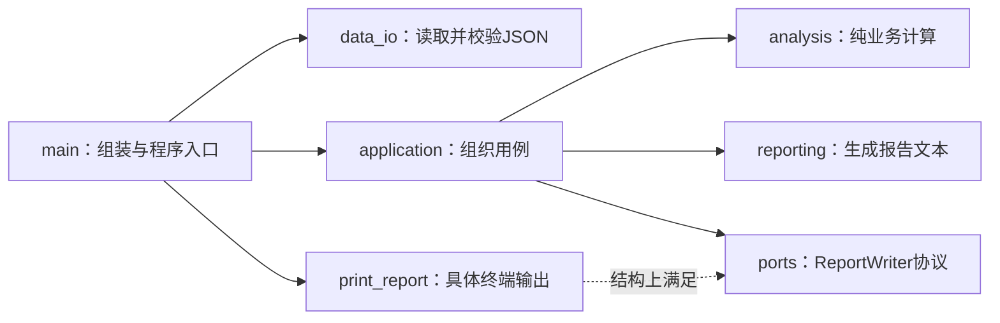

# 可维护函数接口、协议与模块边界

## 课程信息

| 项目 | 内容 |
| --- | --- |
| 适合人群 | 已完成 Python 类型提示和 C++ 函数组织，希望让多模块程序更容易替换与测试的学习者 |
| 前置知识 | Python函数、模块、类型提示、`TypedDict`、`Sequence`、mypy、unittest，以及C++声明和函数职责 |
| 学习结果 | 能设计表达真实约束的函数签名，使用可调用协议隔离输出，并保持模块公开接口与依赖方向清楚 |
| 运行时基线 | Python 3.11及以上 |
| 检查工具 | mypy 2.2.0，`--strict`模式 |
| 实践产出 | 可替换输出的多模块学习报告器、静态检查、自动化测试和一次依赖审阅记录 |

## 为什么类型标注还不够

上一节已经能写出带类型的函数，但“类型正确”不等于“接口容易维护”。下面这些函数都能添加类型提示，却仍可能制造问题：

- 两个相邻的`float`参数含义相似，调用时容易颠倒。
- 默认列表被多次调用共享，结果依赖历史调用顺序。
- 分析函数直接打印，测试必须捕获终端输出。
- 业务模块导入`main.py`中的具体函数，形成反向依赖。
- 其他模块开始使用本来只供内部实现的辅助函数。

本节把接口看成一份协作契约：调用者需要知道提供什么、能够得到什么、哪些参数必须说出名字，以及实现可以替换到什么程度。

## 前置检查

确认当前解释器与检查器：

```bash
python --version
python -m mypy --version
```

如果当前环境还没有固定版本的mypy，在课程临时目录创建虚拟环境后安装：

```bash
python -m venv .venv
.venv/bin/python -m pip install mypy==2.2.0
```

Windows PowerShell使用：

```powershell
python -m venv .venv
.venv\Scripts\python.exe -m pip install mypy==2.2.0
```

开始前还应能解释：

- 类型提示为什么不会自动校验JSON。
- C++声明如何把参数与返回类型暴露给调用者。
- 为什么业务计算函数不应该偷偷读取终端。

缺少前两项时回看[类型提示、接口与静态检查认知](01-type-hints-interfaces-static-checking.md)；缺少最后一项时回看C++[函数、声明与程序组织](../cpp-core/02-functions-declarations-program-organization.md)。

## 学习目标

完成本节后，你应该能够：

- 区分位置参数、位置或关键字参数和仅限关键字参数。
- 用参数名称与`*`减少含义相近参数的误用。
- 解释默认值何时求值，并修复可变默认参数共享状态。
- 根据函数所需能力选择`Sequence`等抽象输入，而不是机械要求`list`。
- 用返回值交付结果，不依赖输出参数或可变全局状态。
- 区分简单`Callable`和有名称、可扩展的回调`Protocol`。
- 让普通函数在不继承协议的情况下满足结构化接口。
- 使用下划线和`__all__`表达模块公开边界，同时说明它们不是权限控制。
- 画出入口、应用、业务和具体输出之间的单向依赖。
- 使用内存输出替换终端输出，而不修改业务流程。

## 先看依赖方向

下面的图回答一个问题：**谁应该知道具体输出到哪里？**



读图时注意箭头方向：

- `main`知道具体输入和输出，负责把它们组装起来。
- `application`只依赖`ReportWriter`协议，不导入`main`里的`print_report`。
- `analysis`和`reporting`不知道终端、文件或测试内存列表。
- 测试可以传入另一个满足协议的函数，核心模块无需修改。

这不是框架式“依赖注入”。它只是把一个函数作为参数传入另一个函数。

## 让函数签名表达调用意图

### 三种参数种类

```python
def example(
    source: str,
    /,
    title: str,
    *,
    limit: float = 1.0,
) -> str:
    return f"{source}: {title} ({limit})"
```

| 位置 | 调用规则 | 适用情况 |
| --- | --- | --- |
| `/`之前 | 只能按位置传入 | 参数名称不属于公开契约，或回调只关心位置 |
| `/`和`*`之间 | 可按位置或关键字传入 | 普通常用参数 |
| `*`之后 | 只能按关键字传入 | 布尔开关、比例、标题等需要在调用点说明含义的选项 |

本节重点使用仅限关键字参数：

```python
summary = summarize_records(records, progress_limit=1.0)
```

对应签名：

```python
def summarize_records(
    records: Sequence[StudyRecord],
    *,
    progress_limit: float = 1.0,
) -> StudySummary:
    ...
```

`*`阻止下面这种不够清楚的调用：

```python
summarize_records(records, 1.0)
```

这里的目标不是让签名更复杂，而是让调用位置能直接看出`1.0`代表进度显示上限。

### Python签名与C++声明对照

| 问题 | Python函数签名 | C++函数声明 |
| --- | --- | --- |
| 参数名称是否影响调用 | 关键字参数会使用名称 | 普通调用主要按参数位置与类型 |
| 默认参数 | 运行时函数对象保存默认值 | 默认实参通常写在可见声明中 |
| 类型约束 | 注解由mypy等工具检查 | 编译器参与检查和重载决议 |
| 调用方式约束 | `/`与`*`区分位置和关键字 | 课程当前按位置传参 |
| 实现能否在后面 | 函数定义执行后名称才可用 | 可先声明、后定义 |

两门语言都需要稳定接口，但检查阶段、参数规则和运行模型不同，不能只做语法替换。

## 默认参数只求值一次

下面的函数有隐藏状态：

```python title="mutable_default_problem.py"
def remember_course(
    course: str,
    history: list[str] = [],
) -> list[str]:
    history.append(course)
    return history


print(remember_course("Python"))
print(remember_course("C++"))
```

第二次输出不是新的单项列表，而会包含第一次调用的内容。默认列表在函数定义执行时创建一次，后续省略该参数的调用共享同一个对象。

需要“每次调用创建新列表”时，使用`None`作为哨兵：

```python title="mutable_default_fixed.py"
def remember_course(
    course: str,
    history: list[str] | None = None,
) -> list[str]:
    current_history = [] if history is None else history
    current_history.append(course)
    return current_history


print(remember_course("Python"))
print(remember_course("C++"))
```

可变默认值不是永远禁止。有意实现缓存时可能需要共享状态，但这必须是清楚、可测试的设计。本节不使用默认参数保存缓存。

## 输入类型表达需要的能力

如果函数只遍历记录，不追加、删除或排序原集合，参数不必要求`list`：

```python
from collections.abc import Sequence


def total_hours(values: Sequence[float]) -> float:
    return sum(values)
```

调用者可以提供列表或元组：

```python
total_hours([1.0, 2.0])
total_hours((1.0, 2.0))
```

这叫“按所需能力设计接口”：函数承诺读取一个有顺序、可取长度的数据序列，没有承诺要修改它。

不要盲目选择最抽象的类型。如果函数确实要原地追加，就应该明确要求可变容器，或者更稳妥地复制后返回新结果。

## 返回值优先暴露数据流

不推荐使用隐藏全局状态：

```python
latest_report = ""


def build_latest_report() -> None:
    global latest_report
    latest_report = "学习报告"
```

调用者看不到真实输出，测试还会受到执行顺序影响。优先返回结果：

```python
def build_report() -> str:
    return "学习报告"
```

如果还需要输出到终端或文件，再把结果交给独立输出接口。返回值让核心数据流可见，也更容易测试。

## `Callable`与可调用`Protocol`

### 简单回调使用`Callable`

```python
from collections.abc import Callable


def deliver(report: str, writer: Callable[[str], None]) -> None:
    writer(report)
```

`Callable[[str], None]`适合表达“接收一个字符串且不返回结果”的简单调用能力。

### 为接口命名时使用回调协议

```python
from typing import Protocol


class ReportWriter(Protocol):
    def __call__(self, report: str, /) -> None:
        ...
```

普通函数只要签名兼容，就能满足协议：

```python
def print_report(report: str, /) -> None:
    print(report)


writer: ReportWriter = print_report
```

`print_report`没有继承`ReportWriter`。mypy按照成员结构检查它是否具有兼容的`__call__`能力，这就是结构化子类型。

协议中的`report`被声明为位置专用参数。这样具体函数可以使用自己的参数名，而不会因为名称不同破坏回调兼容性。

### 选择对照

| 需求 | `Callable` | 可调用`Protocol` |
| --- | --- | --- |
| 单一简单签名 | 足够直接 | 可以但略重 |
| 需要给业务角色命名 | 类型本身不说明角色 | `ReportWriter`能表达用途 |
| 复杂参数种类或重载 | 表达能力有限 | 可以精确声明`__call__` |
| 要求显式继承 | 不需要 | 也不需要 |
| 自动运行时校验 | 不提供 | 默认也不提供 |

本节使用`Protocol`，因为“报告输出端口”是稳定的业务角色。不要为每个普通函数都创建协议。

## 模块公开接口不是权限系统

模块中的下划线名称表达“内部实现”约定：

```python
def _calculate_progress(...) -> float:
    ...
```

`__all__`可以列出模块希望公开的名称：

```python
__all__ = ["summarize_records"]
```

| 机制 | 主要作用 | 不能保证什么 |
| --- | --- | --- |
| 前导下划线 | 告诉读者和工具这是非公开实现 | 不能阻止显式访问 |
| `__all__` | 定义`from module import *`的公开名称集合，记录公共API | 不能阻止`from module import _name` |
| 操作系统权限、认证授权 | 控制真实资源访问 | 不是本节模块命名约定 |

课程代码不使用`import *`。`__all__`在这里主要承担“公共接口清单”和审阅提示，不能把它描述成安全边界。

## 完整示例：可替换输出的学习报告器

### 目录结构

```text
typed-study-reporter/
├── data/
│   └── study_records.json
├── tests/
│   ├── test_analysis.py
│   ├── test_application.py
│   └── test_data_io.py
├── analysis.py
├── application.py
├── data_io.py
├── main.py
├── models.py
├── ports.py
├── reporting.py
└── requirements-dev.txt
```

所有命令从`typed-study-reporter/`目录执行。示例运行时只使用标准库；mypy是开发检查依赖。

### 开发依赖

```text title="requirements-dev.txt"
mypy==2.2.0
```

### 数据模型

```python title="models.py"
from typing import TypedDict

__all__ = ["StudyRecord", "StudySummary"]


class StudyRecord(TypedDict):
    course: str
    target_hours: float
    finished_hours: float
    tags: list[str]


class StudySummary(TypedDict):
    target_hours: float
    finished_hours: float
    progress: float
    completed_courses: int
    course_count: int
    tags: tuple[str, ...]
```

### 输出协议

```python title="ports.py"
from typing import Protocol

__all__ = ["ReportWriter"]


class ReportWriter(Protocol):
    def __call__(self, report: str, /) -> None:
        ...
```

协议只描述应用层需要的一个能力：接收完整报告。它不知道输出端是终端、文件还是测试内存。

### 业务分析

```python title="analysis.py"
from collections.abc import Sequence

from models import StudyRecord, StudySummary

__all__ = ["summarize_records"]


def _calculate_progress(
    target_hours: float,
    finished_hours: float,
    *,
    progress_limit: float,
) -> float:
    if target_hours == 0.0:
        return 0.0
    return min(finished_hours / target_hours, progress_limit)


def summarize_records(
    records: Sequence[StudyRecord],
    *,
    progress_limit: float = 1.0,
) -> StudySummary:
    if progress_limit <= 0.0:
        raise ValueError("progress_limit must be greater than zero")

    target_hours = sum(record["target_hours"] for record in records)
    finished_hours = sum(record["finished_hours"] for record in records)
    completed_courses = sum(
        record["finished_hours"] >= record["target_hours"]
        for record in records
    )
    tags = tuple(sorted({tag for record in records for tag in record["tags"]}))

    return {
        "target_hours": target_hours,
        "finished_hours": finished_hours,
        "progress": _calculate_progress(
            target_hours,
            finished_hours,
            progress_limit=progress_limit,
        ),
        "completed_courses": completed_courses,
        "course_count": len(records),
        "tags": tags,
    }
```

`_calculate_progress`是内部实现。其他模块只调用公开的`summarize_records`，避免把拆分细节变成跨模块依赖。

### 报告生成

```python title="reporting.py"
from models import StudySummary

__all__ = ["build_report"]


def build_report(
    summary: StudySummary,
    *,
    title: str = "学习进度报告",
) -> str:
    return "\n".join(
        (
            title,
            f"课程数量：{summary['course_count']}",
            f"已完成课程：{summary['completed_courses']}",
            f"计划时间：{summary['target_hours']:.1f} 小时",
            f"完成时间：{summary['finished_hours']:.1f} 小时",
            f"总进度：{summary['progress'] * 100.0:.1f}%",
            f"标签：{', '.join(summary['tags']) or '无'}",
        )
    )
```

生成函数只返回字符串，不自行打印或写文件。

### 应用流程

```python title="application.py"
from collections.abc import Sequence

from analysis import summarize_records
from models import StudyRecord
from ports import ReportWriter
from reporting import build_report

__all__ = ["run_report"]


def run_report(
    records: Sequence[StudyRecord],
    *,
    writer: ReportWriter,
    title: str = "学习进度报告",
) -> str:
    summary = summarize_records(records, progress_limit=1.0)
    report = build_report(summary, title=title)
    writer(report)
    return report
```

`writer`必须按关键字传入。应用流程依赖协议而不是具体`print()`，同时返回报告，方便调用者继续使用结果。

### JSON读取与运行时校验

```python title="data_io.py"
import json
from pathlib import Path

from models import StudyRecord

__all__ = ["load_records"]


def _require_number(value: object, field: str) -> float:
    if isinstance(value, bool) or not isinstance(value, (int, float)):
        raise ValueError(f"{field} must be a number")
    return float(value)


def _require_tags(value: object) -> list[str]:
    if not isinstance(value, list) or not all(
        isinstance(item, str) for item in value
    ):
        raise ValueError("tags must be a list of strings")
    return list(value)


def _validate_record(value: object, index: int) -> StudyRecord:
    if not isinstance(value, dict):
        raise ValueError(f"records[{index}] must be an object")

    course = value.get("course")
    if not isinstance(course, str) or not course.strip():
        raise ValueError(f"records[{index}].course must be a non-empty string")

    target_hours = _require_number(
        value.get("target_hours"),
        f"records[{index}].target_hours",
    )
    finished_hours = _require_number(
        value.get("finished_hours"),
        f"records[{index}].finished_hours",
    )
    if target_hours <= 0.0:
        raise ValueError(f"records[{index}].target_hours must be greater than zero")
    if finished_hours < 0.0:
        raise ValueError(f"records[{index}].finished_hours cannot be negative")

    return {
        "course": course.strip(),
        "target_hours": target_hours,
        "finished_hours": finished_hours,
        "tags": _require_tags(value.get("tags")),
    }


def load_records(path: Path) -> list[StudyRecord]:
    document: object = json.loads(path.read_text(encoding="utf-8"))
    if not isinstance(document, dict):
        raise ValueError("JSON root must be an object")

    raw_records = document.get("records")
    if not isinstance(raw_records, list):
        raise ValueError("records must be a list")

    return [
        _validate_record(record, index)
        for index, record in enumerate(raw_records)
    ]
```

协议不能证明外部JSON可信，因此校验仍从`object`开始。类型接口和运行时边界承担不同职责。

### 程序入口与具体输出

```python title="main.py"
import json
import sys
from pathlib import Path

from application import run_report
from data_io import load_records


def print_report(report: str, /) -> None:
    print(report)


def main() -> int:
    data_path = Path("data/study_records.json")
    try:
        records = load_records(data_path)
        run_report(records, writer=print_report)
    except (OSError, json.JSONDecodeError, ValueError) as error:
        print(f"无法生成报告：{error}", file=sys.stderr)
        return 1
    return 0


if __name__ == "__main__":
    raise SystemExit(main())
```

只有入口模块知道具体终端输出函数。`application.py`不会反向导入`main.py`。

### 固定JSON样例

```json title="data/study_records.json"
{
  "records": [
    {
      "course": "Python 类型提示",
      "target_hours": 8,
      "finished_hours": 8,
      "tags": ["Python", "类型"]
    },
    {
      "course": "C++ 函数组织",
      "target_hours": 10,
      "finished_hours": 7.5,
      "tags": ["C++", "函数", "类型"]
    }
  ]
}
```

### 分析测试

```python title="tests/test_analysis.py"
import unittest

from analysis import summarize_records
from models import StudyRecord


class SummarizeRecordsTests(unittest.TestCase):
    def test_accepts_tuple_and_summarizes_records(self) -> None:
        records: tuple[StudyRecord, ...] = (
            {
                "course": "Python",
                "target_hours": 8.0,
                "finished_hours": 8.0,
                "tags": ["类型", "Python"],
            },
            {
                "course": "C++",
                "target_hours": 10.0,
                "finished_hours": 12.0,
                "tags": ["类型", "C++"],
            },
        )

        summary = summarize_records(records, progress_limit=1.0)

        self.assertEqual(summary["course_count"], 2)
        self.assertEqual(summary["completed_courses"], 2)
        self.assertEqual(summary["progress"], 1.0)
        self.assertEqual(summary["tags"], ("C++", "Python", "类型"))

    def test_empty_records_have_zero_progress(self) -> None:
        summary = summarize_records((), progress_limit=1.0)

        self.assertEqual(summary["course_count"], 0)
        self.assertEqual(summary["progress"], 0.0)

    def test_rejects_invalid_progress_limit(self) -> None:
        with self.assertRaisesRegex(ValueError, "progress_limit"):
            summarize_records((), progress_limit=0.0)


if __name__ == "__main__":
    unittest.main()
```

元组能够通过，证明分析函数只依赖`Sequence`提供的读取能力。

### 可替换输出测试

```python title="tests/test_application.py"
import unittest

from application import run_report
from models import StudyRecord


class RunReportTests(unittest.TestCase):
    def test_uses_in_memory_writer(self) -> None:
        records: list[StudyRecord] = [
            {
                "course": "Python",
                "target_hours": 4.0,
                "finished_hours": 2.0,
                "tags": ["接口"],
            }
        ]
        written_reports: list[str] = []

        def remember(report: str, /) -> None:
            written_reports.append(report)

        report = run_report(
            records,
            writer=remember,
            title="接口学习报告",
        )

        self.assertEqual(written_reports, [report])
        self.assertIn("接口学习报告", report)
        self.assertIn("总进度：50.0%", report)


if __name__ == "__main__":
    unittest.main()
```

测试没有修改`application.py`，只是传入另一个普通函数。mypy会检查`remember`是否满足`ReportWriter`。

### 数据边界测试

```python title="tests/test_data_io.py"
import tempfile
import unittest
from pathlib import Path

from data_io import load_records


class LoadRecordsTests(unittest.TestCase):
    def test_loads_valid_utf8_json(self) -> None:
        content = """{
          "records": [
            {
              "course": "接口设计",
              "target_hours": 4,
              "finished_hours": 2,
              "tags": ["Python"]
            }
          ]
        }"""
        with tempfile.TemporaryDirectory() as directory:
            path = Path(directory) / "records.json"
            path.write_text(content, encoding="utf-8")

            records = load_records(path)

        self.assertEqual(records[0]["course"], "接口设计")
        self.assertEqual(records[0]["target_hours"], 4.0)

    def test_rejects_boolean_as_number(self) -> None:
        content = """{
          "records": [
            {
              "course": "接口设计",
              "target_hours": true,
              "finished_hours": 2,
              "tags": []
            }
          ]
        }"""
        with tempfile.TemporaryDirectory() as directory:
            path = Path(directory) / "records.json"
            path.write_text(content, encoding="utf-8")

            with self.assertRaisesRegex(ValueError, "target_hours"):
                load_records(path)


if __name__ == "__main__":
    unittest.main()
```

## 安装、检查和运行

创建隔离环境并安装开发工具：

```bash
python -m venv .venv
.venv/bin/python -m pip install -r requirements-dev.txt
```

Windows PowerShell：

```powershell
python -m venv .venv
.venv\Scripts\python.exe -m pip install -r requirements-dev.txt
```

严格检查全部模块与测试：

```bash
.venv/bin/python -m mypy --strict .
```

预期关键输出：

```text
Success: no issues found in 10 source files
```

运行测试：

```bash
.venv/bin/python -m unittest discover -s tests -v
```

预期为6个测试全部通过。实际输出会列出每个测试名并以`OK`结束。

运行程序：

```bash
.venv/bin/python main.py
```

预期关键输出：

```text
学习进度报告
课程数量：2
已完成课程：1
计划时间：18.0 小时
完成时间：15.5 小时
总进度：86.1%
标签：C++, Python, 函数, 类型
```

检查导入副作用。这里临时禁止解释器写入字节码缓存，避免把正常的`__pycache__`与业务模块副作用混在一起：

```bash
PYTHONDONTWRITEBYTECODE=1 .venv/bin/python -c \
  "import analysis, application, data_io, main, models, ports, reporting"
```

命令应安静结束，不打印报告、不读取JSON，也不创建业务输出。正常运行Python时，解释器可能创建`__pycache__`；它是可再生字节码缓存，不代表模块启动了主流程。

## 让接口检查真正失败

### 位置参数违反签名

```python title="bad_keyword_only.py"
from analysis import summarize_records

summarize_records((), 1.0)
```

mypy应报告位置参数过多；直接运行也会抛出`TypeError`。修复为`progress_limit=1.0`。

### 回调不满足协议

```python title="bad_writer.py"
from application import run_report


def wrong_writer(report: bytes, /) -> int:
    return len(report)


run_report((), writer=wrong_writer)
```

参数和返回类型都不符合`ReportWriter`，严格检查应失败。不要用`cast()`伪装兼容，应修正函数签名或另写适配函数。

### 循环导入

如果`application.py`为了获得`print_report`而导入`main.py`，同时`main.py`又导入`application.py`，模块初始化顺序会形成环。修复方式是保持具体输出在入口层，并通过`writer`参数传入，而不是把导入语句藏进函数内部绕过设计问题。

### 显式访问内部名称

即使`analysis.__all__`只包含`summarize_records`，下面的代码仍可能运行：

```python
from analysis import _calculate_progress
```

这证明`__all__`不是访问控制。正确修复是让其他模块依赖公开函数；真正敏感资源使用权限、认证和隔离机制保护。

## AI协作任务

### 可复用提示模板

```text
请使用Python 3.11和mypy严格模式重构一个多模块学习报告器。
要求：
1. 用仅限关键字参数表达progress_limit、writer和title；
2. 业务分析接收Sequence，不修改输入；
3. 使用可调用Protocol命名ReportWriter，普通函数无需继承即可满足；
4. main负责注入具体终端输出，application不得导入main；
5. 公开模块使用__all__列出公共接口，内部辅助函数使用前导下划线；
6. 保持JSON运行时校验、mypy严格检查和unittest；
7. 不使用Any、cast、type: ignore、依赖注入框架或第三方运行库。
请给出完整文件、依赖图、测试、失败样例和验证命令。
```

### 人工审阅清单

- 是否使用`[]`或`{}`作为默认参数并在函数中修改。
- 含义相近的选项是否被设计成难读的位置参数。
- 参数类型是否要求了函数并不需要的修改能力。
- 是否用`Any`、`cast()`或`# type: ignore`掩盖协议不匹配。
- 协议是否只保留应用层真正使用的调用能力。
- `application`是否反向导入`main`或某个具体输出实现。
- 其他模块是否直接使用下划线内部函数。
- 更换为内存输出后，业务结果与终端输出是否一致。

主动修改：新增一个`write_uppercase(report: str, /) -> None`输出函数，将其注入`run_report`。不得修改`analysis.py`、`reporting.py`和`application.py`，并重新运行mypy与测试。

## 核心手动检查点

### 检查点1：复现默认值共享

运行`mutable_default_problem.py`两次调用，记录两个结果和对象身份。修复后证明省略`history`的两次调用不再共享列表。

### 检查点2：强制说明参数含义

尝试把`progress_limit`按位置传入，分别记录mypy诊断和运行时`TypeError`。改为关键字后重新检查。

### 检查点3：追踪依赖方向

从`main.main()`开始，依次写出数据读取、应用流程、分析、报告生成和输出函数。确认没有任何业务模块反向导入入口。

### 检查点4：证明结构化兼容

不要让`remember()`继承`ReportWriter`。直接传入测试，说明mypy依据哪个`__call__`签名判断它兼容。

### 检查点5：制造协议错误

运行`bad_writer.py`的严格检查，从诊断中指出期望参数、实际参数和返回类型差异，再用真实兼容函数修复。

### 检查点6：验证公开约定边界

查看`analysis.__all__`，再显式导入`_calculate_progress`。解释为什么“可以访问”不等于“应该跨模块依赖”，也不等于安全漏洞已经被阻止。

### 检查点7：替换输出端

分别注入终端输出和内存输出，确认生成的报告字符串相同。说明为什么替换输出不需要修改应用和分析逻辑。

## 微练习

1. 把两个含义相近的可选位置参数改成仅限关键字参数。
2. 复现可变默认列表共享，并使用`None`修复。
3. 把只遍历列表的函数参数从`list[T]`收窄为所需的`Sequence[T]`能力。
4. 把依赖全局报告变量的函数改成返回字符串。
5. 使用`Callable[[str], None]`表达简单输出，再改为有名称的`ReportWriter`协议。
6. 让两个参数名不同但位置专用的普通函数通过同一回调协议检查。
7. 为一个模块补充`__all__`，证明显式内部导入仍可发生。
8. 制造`application -> main -> application`循环，再通过参数注入恢复单向依赖。
9. 使用内存输出测试报告，不捕获`stdout`。

## 阶段作品线索

双主修目前累计完成四节配对内容：

- C++已经建立构建、静态类型和单文件函数接口。
- Python已经建立类型边界、多模块接口与可替换输出。

本轮仍不新建阶段作品。Python已经进入多模块，而C++仍是单文件；现在沉淀会得到结构不对称、很快又要迁移的产物。下一节完成C++头文件、源文件和最小CMake工程后，再评估双语言阶段作品，使两边都能展示接口、实现、构建和测试证据。

## 常见错误与排查

| 现象 | 常见原因 | 检查方法 | 修复方向 |
| --- | --- | --- | --- |
| 第二次调用出现旧数据 | 修改了可变默认参数 | 打印对象身份并重复调用 | 使用`None`并在函数内创建新对象 |
| 位置调用难以阅读 | 多个同类型选项没有名称 | 查看调用点能否解释每个值 | 使用仅限关键字参数 |
| 元组被mypy拒绝 | 参数不必要地写成`list` | 检查函数是否真的修改输入 | 改为`Sequence`等所需能力 |
| 协议实现被拒绝 | 参数名称、种类或返回类型不兼容 | 对照`__call__`与实际函数 | 使用位置专用参数或修正真实签名 |
| mypy通过但运行输入失败 | 把协议或注解当运行时校验 | 检查JSON进入系统的位置 | 保留从`object`开始的运行校验 |
| 导入模块就打印报告 | 顶层执行了主流程 | 单独运行`python -c "import ..."` | 把执行放入`main()`保护 |
| partially initialized module | 模块互相导入形成初始化环 | 画出导入方向 | 上移协议、通过参数传入具体实现 |
| 内部函数成为外部依赖 | 调用者忽略下划线和公开入口 | 搜索跨模块导入 | 改用公开函数并补充测试 |
| `__all__`未阻止显式导入 | 把导出约定误当权限 | 运行显式导入实验 | 使用真正安全机制保护敏感资源 |
| 为通过检查使用`Any` | 接口矛盾被绕过 | 搜索动态类型传播路径 | 修正协议、签名或运行时校验 |
| 测试必须捕获终端 | 业务函数直接打印 | 查看输出副作用位置 | 注入输出函数或返回结果 |

## 完成标准

- 能解释三种参数种类及`/`和`*`的作用。
- 能为含义相近的选项设计仅限关键字参数。
- 能复现并修复可变默认参数共享状态。
- 能根据读取或修改能力选择合适的参数类型。
- 能使用返回值替代输出参数和隐藏全局状态。
- 能区分简单`Callable`和可调用`Protocol`的适用范围。
- 能让普通函数不继承协议也通过结构化检查。
- 能制造并解释一个协议签名不匹配错误。
- 能说明下划线与`__all__`是公开约定而不是安全边界。
- 能画出示例的单向依赖，且业务模块不反向导入`main`。
- 能使用内存输出测试应用流程，不修改核心模块。
- 完整示例能通过mypy严格检查和6个unittest。
- 所有模块单独导入时不打印、不读取业务数据、不创建业务输出；检查时能够区分解释器字节码缓存。
- 能审阅AI接口设计，拒绝至少一个隐藏状态、过宽协议或反向依赖。

## 来源与版本

| 来源 | 用于核查 | 版本或日期 | 状态 |
| --- | --- | --- | --- |
| [Python 3.11函数定义教程](https://docs.python.org/3.11/tutorial/controlflow.html#more-on-defining-functions) | 默认参数、关键字参数、`/`与`*` | Python 3.11.15，2026-07-14核查 | 已核查 |
| [Python 3.11 import语句参考](https://docs.python.org/3.11/reference/simple_stmts.html#the-import-statement) | `__all__`和公开名称语义 | Python 3.11.15，2026-07-14核查 | 已核查 |
| [Python类型系统规范：Protocols](https://typing.python.org/en/latest/spec/protocol.html) | 结构化类型和协议规则 | 2026-07-14核查 | 已核查 |
| [PEP 544](https://peps.python.org/pep-0544/) | Protocol设计目标与运行时边界 | Final，2026-07-14核查 | 已核查 |
| [mypy Protocol文档](https://mypy.readthedocs.io/en/stable/protocols.html) | 回调协议、参数名称和种类兼容 | mypy 2.2文档，2026-07-14核查 | 已核查 |
| [mypy内置类型](https://mypy.readthedocs.io/en/stable/builtin_types.html) | `Sequence`只读能力口径 | mypy 2.2文档，2026-07-14核查 | 已核查 |

## 下一步

双主修第二组“函数与程序组织”配对完成。下一节回到C++学习[头文件、源文件与最小CMake工程](../cpp-core/03-headers-sources-cmake.md)：把稳定的函数声明放入头文件、实现放入源文件，建立多翻译单元、包含保护和可重复构建的最小工程。
