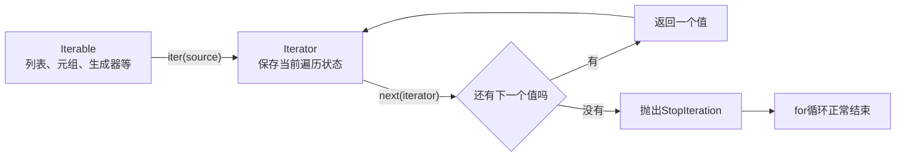
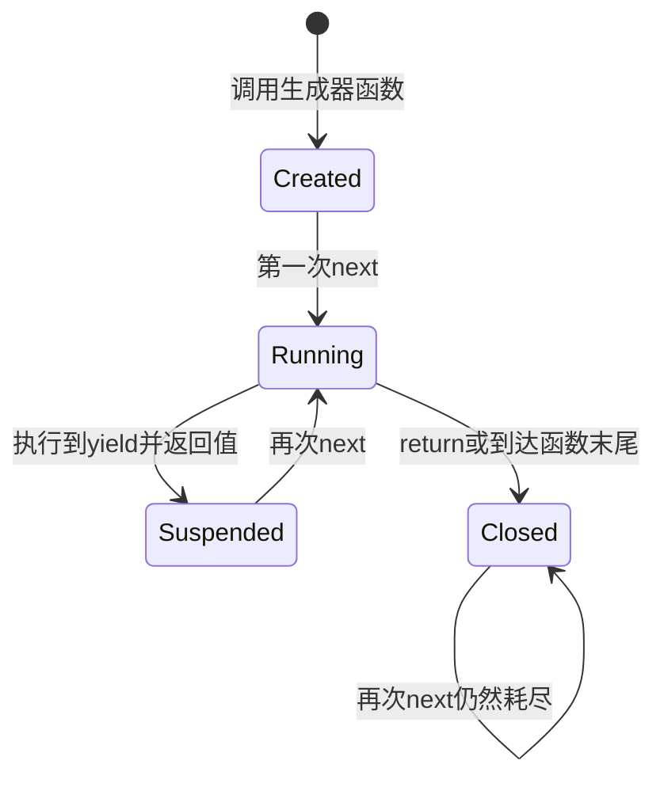

# Python 容器协议、迭代器与生成器

C++课程使用迭代器表示容器范围中的位置；Python也有迭代器，但它更强调“按需取得下一个值”的协议。列表可以反复遍历，生成器通常只能向前消费一次。如果没有看清这个区别，程序很容易第一次计算正确、第二次却得到空结果。

本节把双语言学习进度报告器的Python实现升级为惰性筛选和进度行生成器，同时保持报告文本与C++版本完全一致。

## 课程信息

| 项目 | 内容 |
| --- | --- |
| 适合人群 | 已完成Python类型、接口课程和C++ STL课程，需要理解Python遍历协议与惰性数据流的学习者 |
| 前置知识 | 列表、元组、函数、模块、类型提示、`Sequence`、mypy、unittest和C++迭代器基本认知 |
| 学习结果 | 能区分可迭代对象与迭代器，设计正确的`Iterable`/`Iterator`接口，并使用生成器建立有界惰性管道 |
| 运行环境 | Python 3.11及以上，仅使用标准库 |
| 检查工具 | mypy 2.2.0严格模式、标准库unittest |
| 阶段作品 | [双语言学习进度报告器](../../../exercises/programming-languages/study-progress-reporters/README.md)Python实现演进 |
| 事实核查 | 2026-07-15，依据Python 3.11官方文档 |

## 学习目标

完成本节后，你应该能够：

- 区分容器、可迭代对象、迭代器和生成器。
- 使用`iter()`取得迭代器，使用`next()`推进一个值。
- 解释`StopIteration`如何表示耗尽，以及`for`循环如何处理它。
- 证明列表可以重新取得迭代器，而同一个迭代器通常只能消费一次。
- 编写包含`yield`的生成器函数，说明函数调用与函数体执行的时机不同。
- 比较列表推导式与生成器表达式的急切和惰性行为。
- 为只需一次遍历的函数选择`Iterable`，为返回惰性结果的函数标注`Iterator`。
- 识别需要多次分析的边界，并显式物化一次输入。
- 使用`enumerate`、`zip`、`map`、`filter`和`islice`处理迭代数据。
- 为无限生成器设置有限消费边界。
- 审阅AI生成的迭代管道，发现重复消费、隐藏物化和无限执行风险。

## 可迭代协议怎样工作

下面的图回答一个问题：**`for`循环如何不断取得值，并知道何时停止？**



最小实验：

```python
courses = ["Python", "C++"]
iterator = iter(courses)

print(next(iterator))
print(next(iterator))
print(next(iterator, "没有更多课程"))
```

输出：

```text
Python
C++
没有更多课程
```

不提供默认值时，第三次`next(iterator)`会抛出`StopIteration`。这不是异常的业务失败，而是迭代协议表示“已经耗尽”的方式。

`for`循环可以近似理解为：

```python
iterator = iter(courses)

while True:
    try:
        course = next(iterator)
    except StopIteration:
        break
    print(course)
```

正常业务代码优先直接使用`for`，不需要反复手写这个循环。手动`next()`用于理解协议、精确控制消费步数或实现特定接口。

## Iterable、Iterator与容器

| 对象 | 能传给`iter()` | 能传给`next()` | 能否通常重新遍历 | 是否保存当前消费状态 |
| --- | --- | --- | --- | --- |
| `list`、`tuple`、`str` | 是 | 否 | 是，每次取得新迭代器 | 容器自身不保存该次遍历位置 |
| `list_iterator`等迭代器 | 是 | 是 | 否，同一对象继续向前 | 是 |
| 生成器对象 | 是 | 是 | 否，通常单次消费 | 是 |

```python
values = [10, 20]
first_iterator = iter(values)
second_iterator = iter(values)

print(first_iterator is second_iterator)
print(iter(first_iterator) is first_iterator)
```

输出：

```text
False
True
```

列表每次`iter(values)`通常返回新的迭代器；对迭代器再次调用`iter()`返回它自己。

### 单次消费

```python
iterator = iter([1, 2, 3])

print(list(iterator))
print(list(iterator))
```

输出：

```text
[1, 2, 3]
[]
```

第一次`list()`已经消费全部值，第二次不会自动倒回开头。需要重新遍历时，应重新创建迭代器，或在明确边界把输入物化为列表。

## 生成器函数与暂停状态

函数体中出现`yield`后，调用函数会创建生成器对象，不会立刻执行函数体到结尾。

```python
def trace_courses() -> Iterator[str]:
    print("开始执行")
    yield "Python"
    print("继续执行")
    yield "C++"
    print("结束执行")
```

下面的图回答一个问题：**生成器什么时候执行，局部状态保存在哪里？**



```python
generator = trace_courses()
print("已经创建")
print(next(generator))
print(next(generator))
```

“开始执行”只会在第一次`next()`时出现。每次`yield`返回一个值并暂停，局部变量和执行位置保留到下一次恢复。

生成器耗尽后不会自动重启。需要再运行一遍时，应再次调用生成器函数创建新对象。

## 列表推导式与生成器表达式

```python
eager = [value * 2 for value in range(4)]
lazy = (value * 2 for value in range(4))
```

- 列表推导式立即计算并保存所有结果。
- 生成器表达式创建按需计算的迭代器。
- `list(lazy)`会把剩余结果全部物化，并耗尽`lazy`。

惰性不自动代表更快。少量数据需要多次读取时，列表更直接；大量数据只需要顺序处理一次时，生成器可以避免同时保存全部中间结果。真实性能仍应测量。

## 类型签名表达消费方式

从`collections.abc`导入运行时接口和类型：

```python
from collections.abc import Iterable, Iterator, Sequence
```

| 类型 | 调用者提供的能力 | 适合的函数 |
| --- | --- | --- |
| `Iterable[T]` | 至少能取得一次迭代器并遍历 | 单次累计、筛选、转换 |
| `Iterator[T]` | 可以直接`next()`，通常单次消费 | 生成器返回值、显式消费状态 |
| `Sequence[T]` | 有长度、索引和稳定顺序 | 需要索引、切片或多次读取 |

只遍历一次的汇总函数不应机械要求列表：

```python
def total(values: Iterable[float]) -> float:
    result = 0.0
    for value in values:
        result += value
    return result
```

返回惰性结果时使用`Iterator`：

```python
def positive(values: Iterable[int]) -> Iterator[int]:
    for value in values:
        if value > 0:
            yield value
```

如果函数需要`len()`、索引或切片，就应使用`Sequence`或在入口显式转换，而不是标注`Iterable`后偷偷假设它能反复读取。

## 重复消费是接口问题

下面的函数对列表有效，对生成器错误：

```python
def broken_summary(values: Iterable[float]) -> tuple[float, int]:
    total = sum(values)
    count = sum(1 for _ in values)
    return total, count
```

当`values`是迭代器时，第一次`sum()`已经耗尽它，第二次计数得到`0`。

可以在一次循环中同时计算：

```python
def one_pass_summary(values: Iterable[float]) -> tuple[float, int]:
    total = 0.0
    count = 0
    for value in values:
        total += value
        count += 1
    return total, count
```

如果后续确实需要排序、汇总和筛选等多次遍历，在明确边界物化一次：

```python
snapshot = list(values)
summary = one_pass_summary(snapshot)
sorted_values = sorted(snapshot)
```

物化不是失败，而是一项需要写清楚的资源决定。不要在多个深层函数里各自偷偷`list()`。

## 常用迭代工具

### `enumerate`与`zip`

```python
names = ["Python", "C++"]
hours = [10.0, 12.0]

for index, (name, hour) in enumerate(zip(names, hours), start=1):
    print(index, name, hour)
```

`zip`默认在最短输入耗尽时停止。输入长度必须一致时，使用`zip(names, hours, strict=True)`；长度不同时它会抛出`ValueError`，避免数据被静默截断。

### `map`与`filter`

Python 3中的`map`和`filter`返回迭代器：

```python
values = [1, 2, 3, 4]
doubled = map(lambda value: value * 2, values)
even = filter(lambda value: value % 2 == 0, values)
```

简单转换常用生成器表达式更直观：

```python
doubled = (value * 2 for value in values)
```

不要为了堆叠函数式写法牺牲可读性。带多步判断或需要调试状态时，生成器函数中的普通`for`通常更清楚。

### 使用`islice`限制消费

无限生成器必须配合有限消费者：

```python
from itertools import islice


def natural_numbers() -> Iterator[int]:
    value = 0
    while True:
        yield value
        value += 1


print(list(islice(natural_numbers(), 5)))
```

输出：

```text
[0, 1, 2, 3, 4]
```

不能直接写`list(natural_numbers())`，它没有自然终点。

## Python与C++迭代器对照

| 问题 | Python | C++ |
| --- | --- | --- |
| 核心含义 | 能产生下一个值的状态对象 | 表示范围中某个位置的对象 |
| 范围结束 | `StopIteration` | 与结束迭代器比较 |
| 重复遍历 | 容器可创建新迭代器；同一迭代器通常单次消费 | 从容器重新取得`begin/end` |
| 惰性生成 | 生成器函数和生成器表达式 | 本阶段主要使用容器与算法，ranges后续学习 |
| 失效风险 | 耗尽、错误共享、源对象变化 | 容器修改、重新分配、对象生命周期 |
| 类型表达 | `Iterable[T]`、`Iterator[T]`、`Sequence[T]` | 迭代器类别、范围和模板约束 |

不能把Python生成器理解成“没有指针语法的C++迭代器”。两者都支持逐步遍历，但状态、结束信号和失效原因不同。

## 完整示例：惰性学习报告器

课程直接演进[双语言阶段作品](../../../exercises/programming-languages/study-progress-reporters/README.md)的Python实现：

```text
python/
├── tests/test_reporter.py
├── analysis.py
├── fixtures.py
├── main.py
├── models.py
└── reporting.py
```

### 数据类型

```python title="models.py"
from typing import TypeAlias, TypedDict


ProgressRow: TypeAlias = tuple[str, float, str]


class StudyRecord(TypedDict):
    course_name: str
    target_hours: float
    completed_hours: float
    tags: list[str]


class StudySummary(TypedDict):
    total_target_hours: float
    total_completed_hours: float
    status_counts: dict[str, int]
    unique_tags: set[str]
```

### 固定样例

```python title="fixtures.py"
from models import StudyRecord


def sample_records() -> list[StudyRecord]:
    return [
        {
            "course_name": "Python 起步",
            "target_hours": 10.0,
            "completed_hours": 7.5,
            "tags": ["python", "基础"],
        },
        {
            "course_name": "C++ 核心",
            "target_hours": 12.0,
            "completed_hours": 12.0,
            "tags": ["cpp", "基础"],
        },
        {
            "course_name": "算法练习",
            "target_hours": 8.0,
            "completed_hours": 4.0,
            "tags": ["算法", "基础", "基础"],
        },
        {
            "course_name": "工程复盘",
            "target_hours": 5.0,
            "completed_hours": 7.0,
            "tags": ["工程", "复盘"],
        },
    ]
```

### 分析与生成器

```python title="analysis.py"
from collections.abc import Iterable, Iterator

from models import ProgressRow, StudyRecord, StudySummary


def clone_record(record: StudyRecord) -> StudyRecord:
    return {
        "course_name": record["course_name"],
        "target_hours": record["target_hours"],
        "completed_hours": record["completed_hours"],
        "tags": list(record["tags"]),
    }


def calculate_progress(record: StudyRecord) -> float:
    if record["target_hours"] <= 0.0:
        return 0.0
    raw_progress = record["completed_hours"] / record["target_hours"]
    return min(max(raw_progress, 0.0), 1.0)


def build_status(record: StudyRecord) -> str:
    return (
        "已完成"
        if record["completed_hours"] >= record["target_hours"]
        else "进行中"
    )


def summarize(records: Iterable[StudyRecord]) -> StudySummary:
    total_target_hours = 0.0
    total_completed_hours = 0.0
    status_counts = {"已完成": 0, "进行中": 0}
    unique_tags: set[str] = set()

    for record in records:
        total_target_hours += record["target_hours"]
        total_completed_hours += record["completed_hours"]
        status_counts[build_status(record)] += 1
        unique_tags.update(record["tags"])

    return {
        "total_target_hours": total_target_hours,
        "total_completed_hours": total_completed_hours,
        "status_counts": status_counts,
        "unique_tags": unique_tags,
    }


def sort_by_progress(records: Iterable[StudyRecord]) -> list[StudyRecord]:
    copies = [clone_record(record) for record in records]
    return sorted(
        copies,
        key=lambda record: (-calculate_progress(record), record["course_name"]),
    )


def iter_by_tag(
    records: Iterable[StudyRecord], tag: str
) -> Iterator[StudyRecord]:
    for record in records:
        if tag in record["tags"]:
            yield clone_record(record)


def filter_by_tag(
    records: Iterable[StudyRecord], tag: str
) -> list[StudyRecord]:
    return list(iter_by_tag(records, tag))


def iter_progress_rows(
    records: Iterable[StudyRecord],
) -> Iterator[ProgressRow]:
    for record in records:
        yield (
            record["course_name"],
            calculate_progress(record),
            build_status(record),
        )
```

`filter_by_tag()`保留旧公开接口，内部把惰性迭代器显式物化为列表。已有调用者无需同时迁移。

### 报告边界

```python title="reporting.py"
from collections.abc import Iterable, Sequence

from analysis import (
    clone_record,
    iter_by_tag,
    iter_progress_rows,
    sort_by_progress,
    summarize,
)
from models import StudyRecord


def _format_names(records: Sequence[StudyRecord]) -> str:
    if not records:
        return "无"
    return ", ".join(record["course_name"] for record in records)


def build_report(records: Iterable[StudyRecord]) -> str:
    snapshot = [clone_record(record) for record in records]
    summary = summarize(snapshot)
    sorted_records = sort_by_progress(snapshot)
    basic_records = list(iter_by_tag(snapshot, "基础"))
    total_target = summary["total_target_hours"]
    overall_progress = (
        summary["total_completed_hours"] / total_target
        if total_target > 0.0
        else 0.0
    )

    lines = [
        "学习进度报告",
        f"总计划：{total_target:.1f} 小时",
        f"总完成：{summary['total_completed_hours']:.1f} 小时",
        f"总体进度：{min(max(overall_progress, 0.0), 1.0) * 100.0:.1f}%",
        "",
        "按进度排序：",
    ]

    for course_name, progress, status in iter_progress_rows(sorted_records):
        lines.append(
            f"- {course_name}：{progress * 100.0:.1f}%（{status}）"
        )

    lines.extend(["", "状态统计："])
    for status in sorted(summary["status_counts"]):
        lines.append(f"- {status}：{summary['status_counts'][status]}")

    unique_tags = ", ".join(sorted(summary["unique_tags"])) or "无"
    lines.append(f"唯一标签：{unique_tags}")
    lines.append(f"标签[基础]：{_format_names(basic_records)}")
    return "\n".join(lines)
```

报告需要汇总、排序和筛选三次读取，因此在入口把任意`Iterable`复制为`snapshot`。这是有意、可见且只发生一次的物化。

### 程序入口

```python title="main.py"
from fixtures import sample_records
from reporting import build_report


def main() -> int:
    print(build_report(sample_records()))
    return 0


if __name__ == "__main__":
    raise SystemExit(main())
```

### 完整测试

```python title="tests/test_reporter.py"
import io
import unittest
from contextlib import redirect_stdout
from collections.abc import Iterator
from itertools import islice

from analysis import (
    filter_by_tag,
    iter_by_tag,
    iter_progress_rows,
    sort_by_progress,
    summarize,
)
from fixtures import sample_records
from main import main
from models import StudyRecord
from reporting import build_report


class ReporterTests(unittest.TestCase):
    def test_summary_handles_duplicate_tags_and_over_completion(self) -> None:
        summary = summarize(sample_records())
        self.assertEqual(summary["total_target_hours"], 35.0)
        self.assertEqual(summary["total_completed_hours"], 30.5)
        self.assertEqual(summary["status_counts"], {"已完成": 2, "进行中": 2})
        self.assertEqual(
            summary["unique_tags"],
            {"python", "cpp", "基础", "算法", "工程", "复盘"},
        )

    def test_empty_records(self) -> None:
        summary = summarize([])
        self.assertEqual(summary["total_target_hours"], 0.0)
        self.assertEqual(summary["total_completed_hours"], 0.0)
        self.assertEqual(summary["status_counts"], {"已完成": 0, "进行中": 0})
        self.assertEqual(summary["unique_tags"], set())

    def test_summary_consumes_one_shot_iterator_once(self) -> None:
        records = iter(sample_records())
        summary = summarize(records)
        self.assertEqual(summary["total_target_hours"], 35.0)
        self.assertEqual(list(records), [])

    def test_sort_uses_name_as_tie_breaker_without_mutating_input(self) -> None:
        records = sample_records()
        original_names = [record["course_name"] for record in records]
        sorted_records = sort_by_progress(records)
        self.assertEqual(
            [record["course_name"] for record in sorted_records],
            ["C++ 核心", "工程复盘", "Python 起步", "算法练习"],
        )
        self.assertEqual(
            [record["course_name"] for record in records], original_names
        )

    def test_filter_returns_independent_copies(self) -> None:
        records = sample_records()
        filtered = filter_by_tag(records, "基础")
        self.assertEqual(
            [record["course_name"] for record in filtered],
            ["Python 起步", "C++ 核心", "算法练习"],
        )
        filtered[0]["tags"].append("changed")
        self.assertNotIn("changed", records[0]["tags"])

    def test_filter_missing_tag(self) -> None:
        self.assertEqual(filter_by_tag(sample_records(), "不存在"), [])

    def test_lazy_filter_does_not_run_until_next(self) -> None:
        events: list[str] = []

        def source() -> Iterator[StudyRecord]:
            events.append("start")
            for record in sample_records():
                events.append(record["course_name"])
                yield record

        filtered = iter_by_tag(source(), "基础")
        self.assertEqual(events, [])
        first = next(filtered)
        self.assertEqual(first["course_name"], "Python 起步")
        self.assertEqual(events, ["start", "Python 起步"])
        self.assertEqual(
            [record["course_name"] for record in filtered],
            ["C++ 核心", "算法练习"],
        )
        self.assertEqual(list(filtered), [])

    def test_progress_rows_advance_one_record_at_a_time(self) -> None:
        rows = iter_progress_rows(sample_records())
        self.assertIs(iter(rows), rows)
        self.assertEqual(next(rows), ("Python 起步", 0.75, "进行中"))
        self.assertEqual(next(rows), ("C++ 核心", 1.0, "已完成"))
        self.assertEqual(len(list(rows)), 2)
        self.assertEqual(list(rows), [])

    def test_islice_bounds_an_infinite_generator(self) -> None:
        def natural_numbers() -> Iterator[int]:
            value = 0
            while True:
                yield value
                value += 1

        self.assertEqual(list(islice(natural_numbers(), 5)), [0, 1, 2, 3, 4])

    def test_equal_progress_uses_name_order(self) -> None:
        records: list[StudyRecord] = [
            {"course_name": "B", "target_hours": 2.0, "completed_hours": 1.0, "tags": []},
            {"course_name": "A", "target_hours": 4.0, "completed_hours": 2.0, "tags": []},
        ]
        self.assertEqual(
            [record["course_name"] for record in sort_by_progress(records)],
            ["A", "B"],
        )

    def test_report_and_main_output(self) -> None:
        expected = (
            "学习进度报告\n"
            "总计划：35.0 小时\n"
            "总完成：30.5 小时\n"
            "总体进度：87.1%\n\n"
            "按进度排序：\n"
            "- C++ 核心：100.0%（已完成）\n"
            "- 工程复盘：100.0%（已完成）\n"
            "- Python 起步：75.0%（进行中）\n"
            "- 算法练习：50.0%（进行中）\n\n"
            "状态统计：\n"
            "- 已完成：2\n"
            "- 进行中：2\n"
            "唯一标签：cpp, python, 基础, 复盘, 工程, 算法\n"
            "标签[基础]：Python 起步, C++ 核心, 算法练习"
        )
        self.assertEqual(build_report(sample_records()), expected)
        self.assertEqual(build_report(tuple(sample_records())), expected)
        self.assertEqual(build_report(iter(sample_records())), expected)
        output = io.StringIO()
        with redirect_stdout(output):
            exit_code = main()
        self.assertEqual(exit_code, 0)
        self.assertEqual(output.getvalue(), expected + "\n")


if __name__ == "__main__":
    unittest.main()
```

## 运行与预期结果

从示例目录执行：

```bash
python -m mypy --strict .
python -m unittest discover -s tests -v
python main.py
```

静态检查应为零错误，11个测试全部通过，报告与C++阶段作品逐字一致。

## AI协作任务

### 可复用提示模板

```text
请把当前Python 3.11学习报告器改造成支持任意Iterable输入的实现。
约束：
1. summarize必须单次遍历完成全部汇总；
2. 新增惰性iter_by_tag和iter_progress_rows，返回Iterator；
3. 保留返回list的filter_by_tag兼容接口；
4. build_report允许列表、元组和一次性生成器，并只在边界物化一次；
5. 不使用Any、cast、type ignore或第三方库；
6. 报告文本和C++对照输出不能变化；
7. 增加惰性执行、单次消费、无限生成器有限消费和回归测试。
请说明每个函数消费输入几次、何时执行、何时物化以及失败风险。
```

### 人工审阅清单

- 类型标注是否准确区分`Iterable`、`Iterator`和`Sequence`。
- 同一迭代器是否被两个算法连续消费。
- 生成器函数是否在调用时被误认为已经执行。
- 返回列表的兼容接口是否仍返回独立记录副本。
- `build_report`是否在多个深层函数中重复物化。
- 无限数据是否有明确的`islice`或其他停止条件。
- 报告、排序规则和C++对照是否保持不变。

主动修改：新增一个惰性“仅返回未完成课程”的生成器，先写消费时机和耗尽测试，再实现并运行完整回归。

## 核心手动检查点

1. 对两个元素的列表手动执行三次`next()`，记录返回值与`StopIteration`。
2. 证明`iter(iterator) is iterator`，并证明同一迭代器耗尽后再次`list()`为空。
3. 在生成器`yield`前后增加记录，判断调用函数和调用`next()`时分别发生什么。
4. 运行`broken_summary(iter([1.0, 2.0]))`，解释为什么计数为零，再改为单次循环。
5. 指出报告器为何必须物化输入一次，以及物化放在这里而不是分析函数内部的原因。
6. 使用`islice`读取无限生成器前五项，禁止直接转成完整列表。

## 微练习

1. 用`iter()`和`next()`逐步读取课程列表，并提供耗尽默认值。
2. 比较同一个列表的两个迭代器是否互相影响。
3. 编写生成器，在每次产出前打印执行证据。
4. 把列表推导式改为生成器表达式，检查类型和消费时机。
5. 为只遍历一次的函数把`Sequence`收窄要求改为`Iterable`。
6. 复现一次迭代器重复消费问题并修复。
7. 使用`enumerate(zip(...))`组合编号、课程名和时间。
8. 使用`iter_by_tag`只消费第一个匹配记录，然后继续消费剩余记录。
9. 用`islice`限制无限生成器，并测试边界为零时返回空结果。
10. 让mypy拒绝把普通`Iterable`直接传给`next()`，再先调用`iter()`修复。

## 常见错误与排查

| 现象 | 常见原因 | 检查方法 | 修复方向 |
| --- | --- | --- | --- |
| 第二次遍历为空 | 重复使用已耗尽迭代器 | 在两次消费间检查对象身份 | 重新创建迭代器或边界物化 |
| 调用生成器后没有打印 | 函数体尚未推进 | 调用一次`next()` | 区分创建与执行时机 |
| `next(list)`报错 | 列表可迭代但不是迭代器 | 检查`iter(list)`结果 | 先取得迭代器 |
| 异常延后出现 | 惰性计算到消费时才执行 | 定位失败发生在哪次`next()` | 在消费边界测试和处理 |
| 程序一直运行 | 无限生成器没有有限消费者 | 搜索`list()`和无界循环 | 使用`islice`或业务停止条件 |
| 报告只剩第一项或为空 | 多个函数消费同一一次性输入 | 记录每个函数消费次数 | 入口物化一次或改为单次管道 |
| 类型提示过窄 | 只遍历却要求`list`/`Sequence` | 检查函数是否用索引或长度 | 改为`Iterable` |
| 类型提示过宽 | 标注`Iterable`却调用`len`或索引 | 运行mypy并检查实现 | 改接口或显式物化 |
| 惰性管道难以调试 | 链条过长且无中间命名 | 拆分并测试每个生成器 | 优先可读性和可验证性 |

## 阶段作品状态

[双语言学习进度报告器](../../../exercises/programming-languages/study-progress-reporters/README.md)的Python实现现在支持惰性标签筛选、惰性进度行和任意`Iterable`报告输入；C++代码、共同数据、排序规则和最终报告未改变。

这次是已有阶段作品的课程演进，不创建新练习目录，也不把它升级为长期项目。

## 完成标准

- 能解释Iterable、Iterator、容器和生成器的关系。
- 能手动追踪`iter()`、`next()`和`StopIteration`。
- 能证明迭代器的单次消费行为。
- 能编写并测试惰性生成器函数。
- 能选择`Iterable`、`Iterator`或`Sequence`作为准确接口。
- 能发现并修复重复消费错误。
- 能在需要多次分析时只在明确边界物化一次。
- 能为无限生成器提供有限消费条件。
- 能通过mypy、11个测试和双语言输出比较。
- 能审阅AI代码中的执行时机、类型、消费次数和资源风险。

## 来源与版本

| 来源 | 用于核查 | 版本或日期 |
| --- | --- | --- |
| [Python内置函数](https://docs.python.org/3.11/library/functions.html#iter) | `iter()`、`next()`、`enumerate`、`zip`、`map`和`filter` | Python 3.11.15，2026-07-15核查 |
| [collections.abc](https://docs.python.org/3.11/library/collections.abc.html) | `Iterable`、`Iterator`、`Sequence`能力关系 | Python 3.11.15，2026-07-15核查 |
| [Python表达式参考](https://docs.python.org/3.11/reference/expressions.html#yield-expressions) | `yield`表达式与生成器执行 | Python 3.11.15，2026-07-15核查 |
| [Functional Programming HOWTO](https://docs.python.org/3.11/howto/functional.html#iterators) | 迭代器、生成器和单次消费 | Python 3.11.15，2026-07-15核查 |
| [itertools.islice](https://docs.python.org/3.11/library/itertools.html#itertools.islice) | 有限切片消费 | Python 3.11.15，2026-07-15核查 |

## 下一步

“容器与迭代”能力配对已经完成。下一节进入C++ **对象、引用、指针、生命周期与RAII**，开始解释数据对象如何建立、复制、移动和安全释放资源。
