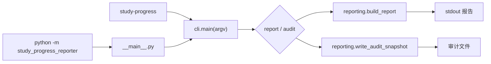

# Python 包结构、可安装入口与 CLI

<div class="be-tutor-mount" data-tutor-lesson="python-core-06" aria-hidden="true"></div>

> **任务先行：** 把只能依赖当前目录运行的多模块报告器迁移为可安装包，并用同一业务函数同时支持 `study-progress` 和 `python -m study_progress_reporter`。先在项目目录外看到报告，再解释包、分发项目、入口和参数边界。

## 任务路线

<div class="be-task-route" role="list" aria-label="本课六步任务"><span role="listitem">1 锁定基线</span><span role="listitem">2 src 包</span><span role="listitem">3 安装入口</span><span role="listitem">4 CLI</span><span role="listitem">5 导入失败</span><span role="listitem">6 迁移验收</span></div>

<section id="step-1" class="be-task-step" data-step-id="step-1" markdown="1">

## 第一步：锁定 16 项测试和报告基线

从旧结构的 Python 子目录运行 unittest、mypy 和 `main.py`，保存 16 项测试与 `总体进度：87.1%`。**当前任务：** 明确迁移只改变运行边界。**成功证据：** 默认报告文本、`build_report()` 和 `write_audit_snapshot()` 行为在迁移前后不变。

</section>

<section id="step-2" class="be-task-step" data-step-id="step-2" markdown="1">

## 第二步：迁移为 src 布局常规包

把可导入代码放入 `src/study_progress_reporter/`，增加 `__init__.py`，并改用包内绝对导入。**最少知识：** 导入包名与发布名不是同一个概念。**主动修改：** 从包根导出一个稳定业务接口。**成功证据：** 测试从安装后的包导入，不再向 `sys.path` 塞路径。

</section>

<section id="step-3" class="be-task-step" data-step-id="step-3" markdown="1">

## 第三步：建立 pyproject 和两个安装入口

用 `pyproject.toml` 声明 Python 3.11、`src` 包发现和 `[project.scripts]`，再执行 editable install。**可观察结果：** 在阶段作品目录之外运行 `study-progress report` 与 `python -m study_progress_reporter report` 都得到相同报告。

</section>

<section id="step-4" class="be-task-step" data-step-id="step-4" markdown="1">

## 第四步：用 argparse 建立 report 和 audit 子命令

入口只解析参数、选择数据并调用业务函数；`report --tag` 提供主动变化，`audit --output` 显式决定写入位置。**成功证据：** `--help` 自动列出子命令，默认报告无回归，筛选不会修改样例记录。

</section>

<section id="step-5" class="be-task-step" data-step-id="step-5" markdown="1">

## 第五步：安全复现直接运行包内文件的失败

在临时副本或只读观察中直接执行 `src/study_progress_reporter/cli.py`，记录包导入失败；随后恢复为模块入口或安装后的控制台入口。**恢复标准：** 不修改 `sys.path`，不退回裸同目录导入，两个正式入口重新通过。

</section>

<section id="step-6" class="be-task-step" data-step-id="step-6" markdown="1">

## 第六步：完成参数迁移验收

在不提供完整实现的前提下新增一种报告选择参数，并保持默认报告、审计和 C++ 对照契约。**验收：** 新参数有帮助文本、成功路径、空结果或边界测试；命令入口与模块入口行为一致。

</section>

## 课程信息

| 项目 | 内容 |
| --- | --- |
| 适合人群 | 已完成装饰器与资源边界，希望把多模块程序变成可稳定调用工具的学习者 |
| 前置知识 | 模块、导入、虚拟环境、函数接口、unittest、mypy、上下文管理器 |
| 可观察产出 | `src` 布局包、`pyproject.toml`、模块入口、控制台脚本、两个 CLI 子命令 |
| 环境 | Python 3.11+；运行只用标准库；构建与类型检查属于开发依赖 |
| 阶段作品 | [双语言学习进度报告器](../../../exercises/programming-languages/study-progress-reporters/README.md) |
| 事实核查 | Python 3.11.15 与 PyPA 文档，2026-07-15 核查 |

## 学习目标

- 区分模块、导入包、分发项目、命令入口和正在运行的 `__main__`。
- 解释 `src` 布局为何要求先安装，并识别“从源码目录碰巧可导入”的假成功。
- 使用 `pyproject.toml` 声明包发现、Python 版本和控制台脚本。
- 使用 `argparse` 设计子命令、帮助文本和可测试的 `main(argv)`。
- 保持 CLI 层、业务层和文件副作用边界，不在导入时解析参数或退出进程。
- 用项目目录外运行、自动测试和报告对照证明工具可安装、可调用。

## 从脚本到命令发生了什么



两条入口只在最外层不同，最终都调用 `cli.main()`。业务模块不知道控制台脚本名称，也不在导入时读取 `sys.argv`。

## 1. 保存可回归基线

迁移前从旧 Python 子目录运行：

```bash
python -m unittest discover -s tests -v
python -m mypy --strict .
python main.py
```

当时应有 16 项测试。迁移完成后的仓库有更多 CLI 与配置测试，但以下默认输出仍必须存在：

```text
学习进度报告
总计划：35.0 小时
总完成：30.5 小时
总体进度：87.1%
```

基线不是“程序能启动”一句话，而是业务接口、报告文本、审计成功/失败和 C++ 对照共同组成的回归证据。

## 2. 组织常规包与 src 布局

迁移后的关键结构：

```text
python/
├── pyproject.toml
├── config.example.toml
├── src/
│   └── study_progress_reporter/
│       ├── __init__.py
│       ├── __main__.py
│       ├── cli.py
│       ├── config.py
│       ├── logging_setup.py
│       └── ...业务模块
└── tests/
```

三个名称解决不同问题：

| 名称 | 本课值 | 用途 |
| --- | --- | --- |
| 分发项目名 | `study-progress-reporter` | 安装器和项目元数据使用，可含连字符 |
| 导入包名 | `study_progress_reporter` | Python `import` 使用，采用合法标识符 |
| 控制台命令 | `study-progress` | 学习者在终端调用 |

包内导入写完整名称：

```python
from study_progress_reporter.reporting import build_report
```

本课不使用 `sys.path.append()` 修补导入。那会把运行位置和机器状态藏进源码，测试通过也无法证明安装后的使用者能导入。

## 3. 声明安装与入口

`pyproject.toml` 的最小边界：

```toml
[build-system]
requires = ["setuptools>=68"]
build-backend = "setuptools.build_meta"

[project]
name = "study-progress-reporter"
version = "0.1.0"
requires-python = ">=3.11"
dependencies = []

[project.scripts]
study-progress = "study_progress_reporter.cli:main"

[tool.setuptools.packages.find]
where = ["src"]
```

从 Python 阶段作品目录执行：

```bash
python -m pip install -e ".[dev]"
study-progress report
python -m study_progress_reporter report
```

editable install 让源码修改在下一次进程启动时可见，适合开发；常规 wheel 安装用于验证发布物是否真的包含包。两者都不是上传 PyPI。

`__main__.py` 保持很薄：

```python
from study_progress_reporter.cli import main

if __name__ == "__main__":
    raise SystemExit(main())
```

## 4. 让 argparse 只管理调用边界

解析器定义两个子命令：

```text
study-progress report [--tag TAG]
study-progress audit [--output PATH]
```

观察帮助而不是猜参数：

```bash
study-progress --help
study-progress report --help
study-progress audit --help
```

`main(argv)` 接收可选参数序列，使单元测试不必修改全局 `sys.argv`：

```python
def main(argv: Sequence[str] | None = None) -> int:
    arguments = build_parser().parse_args(argv)
    ...
```

主动修改：

```bash
study-progress report --tag 工程
```

应只出现“工程复盘”；再次运行默认报告时，四条记录全部恢复，证明筛选没有修改共享样例。

## 5. 观察导入上下文失败

下面命令只作为受控失败实验：

```bash
python src/study_progress_reporter/cli.py
```

包内文件被当成普通脚本直接执行时，解释器不会自动把 `src` 当作已安装包根，绝对包导入可能出现 `ModuleNotFoundError`。不要把导入改回 `from reporting import ...`，也不要写机器路径。

恢复并验证：

```bash
python -m study_progress_reporter report
study-progress report
python -c "import study_progress_reporter; print(study_progress_reporter.__file__)"
```

这三条命令分别证明模块入口、控制台入口和已安装导入边界。

## 6. 迁移任务与完整验收

独立新增 `--status`、`--min-progress` 或另一种只读筛选参数，要求：

- 不改变无参数默认报告。
- 不修改 `sample_records()` 返回的原始对象。
- 在 `--help` 中有可理解描述。
- 覆盖正常、无匹配和非法输入中的适用场景。
- `study-progress` 与 `python -m` 结果一致。

验证命令：

```bash
python -m mypy --strict src tests
python -m unittest discover -s tests -v
python -m build
```

在干净临时虚拟环境安装 `dist/*.whl` 后，从项目目录外运行 `study-progress report`。这一步能捕获源码目录中“碰巧可导入”、但 wheel 漏包的问题。

## AI 协作任务

AI 可以提出目录迁移和 parser 结构候选，学习者必须检查：

- 是否把分发名、导入包名和控制台命令混为一谈。
- 是否在 `__init__.py` 执行 CLI、写文件或配置日志。
- 是否通过 `sys.path`、当前目录或未安装源码获得假成功。
- 是否让 `argparse` 代码进入业务模块，导致导入时退出。
- 是否改变默认报告、审计函数或 C++ 对照输出。

## 常见错误与排查

| 现象 | 可能原因 | 恢复顺序 |
| --- | --- | --- |
| `ModuleNotFoundError` | 尚未安装、用了错误解释器或直接运行包内文件 | 检查 `python -m pip --version`，执行 editable install，再用正式入口 |
| 命令找不到 | 虚拟环境未激活或脚本安装到另一环境 | 检查 `python` 与 `study-progress` 路径 |
| wheel 安装后缺少模块 | 包发现未指向 `src` | 检查 `[tool.setuptools.packages.find]` 并重建 wheel |
| 导入包就打印报告 | 顶层执行了 CLI | 入口逻辑只留在 `main()` 和 `__main__.py` |
| 测试只能在源码目录通过 | 仍依赖当前目录导入 | 从安装包导入，并在项目目录外做 smoke test |
| `--help` 没有子命令 | subparser 未注册或未设为必需 | 检查 parser 构建函数和帮助测试 |

## 完成证据

- `src/study_progress_reporter` 可作为常规包导入，顶层导入无输出和文件副作用。
- editable install 与 wheel install 后，两个入口都能在项目目录外运行。
- 默认报告保留 `87.1%` 和完整文本，Python/C++ 输出一致。
- `report --tag` 与 `audit --output` 有自动测试，筛选不修改输入。
- 参数语法错误由 argparse 输出帮助并返回 2；业务失败留给下一课形成完整诊断契约。

## 来源与版本

| 来源 | 用于核查 | 日期 |
| --- | --- | --- |
| [Python 模块与包](https://docs.python.org/3.11/tutorial/modules.html) | `__main__`、包、搜索路径和包内引用 | 2026-07-15 |
| [Python 命令行 `-m`](https://docs.python.org/3.11/using/cmdline.html#cmdoption-m) | 包的 `__main__.py` 执行语义 | 2026-07-15 |
| [argparse](https://docs.python.org/3.11/library/argparse.html) | 参数、子命令、帮助与语法失败 | 2026-07-15 |
| [PyPA src 布局说明](https://packaging.python.org/en/latest/discussions/src-layout-vs-flat-layout/) | src/flat 差异、editable 安装边界 | 2026-07-15 |
| [编写 pyproject.toml](https://packaging.python.org/en/latest/guides/writing-pyproject-toml/) | 项目元数据与 `[project.scripts]` | 2026-07-15 |

本地素材库的模块与包章节用于识别 `__name__`、导入方式和包概念等新手卡点；其中旧式发布步骤没有进入课程，现代安装与入口事实由 PyPA 官方资料和实际 wheel 测试重新建立。

## 下一步

进入 [TOML 配置、日志与可诊断执行契约](07-toml-configuration-logging-diagnostics.md)。下一课保持包和 CLI 入口稳定，让学习者能够显式提供配置、区分业务输出与诊断，并用退出码判断成功或失败。

