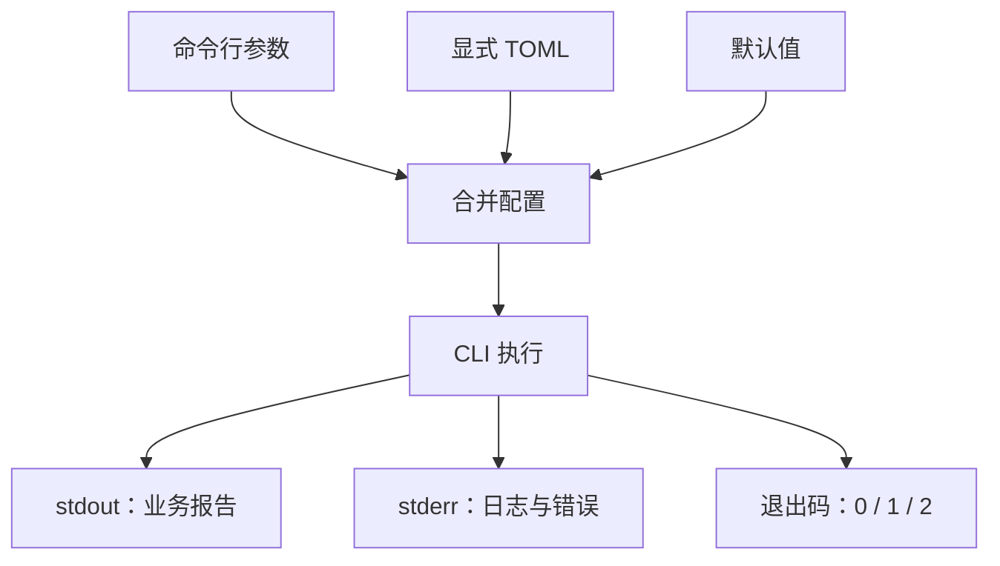

# Python TOML 配置、日志与可诊断执行契约

<div class="be-tutor-mount" data-tutor-lesson="python-core-07" aria-hidden="true"></div>

> **任务先行：** 给上一课的 CLI 增加显式 TOML 配置与命名日志。先观察同一个命令的 `stdout`、`stderr` 和退出码，再解释配置优先级、类型校验、日志级别与失败恢复。

## 任务路线

<div class="be-task-route" role="list" aria-label="本课六步任务"><span role="listitem">1 CLI 基线</span><span role="listitem">2 读取 TOML</span><span role="listitem">3 校验优先级</span><span role="listitem">4 日志分流</span><span role="listitem">5 失败实验</span><span role="listitem">6 迁移验收</span></div>

<section id="step-1" class="be-task-step" data-step-id="step-1" markdown="1">

## 第一步：运行 CLI 与标准流基线

运行默认报告、审计成功和缺少输出路径三条命令。**当前任务：** 分别记录 stdout、stderr 和退出码。**成功证据：** 默认报告只在 stdout，成功为 0，尚未满足的审计请求为 1。

</section>

<section id="step-2" class="be-task-step" data-step-id="step-2" markdown="1">

## 第二步：用 tomllib 读取显式 TOML

只在用户提供 `--config PATH` 时以二进制方式读取 TOML，并映射到不可变 `AppConfig`。**主动修改：** 用配置选择标签或审计路径。**成功证据：** 不传配置时行为完全保持默认，配置不会从用户目录或环境变量偷偷进入。

</section>

<section id="step-3" class="be-task-step" data-step-id="step-3" markdown="1">

## 第三步：校验结构并实现固定优先级

仅允许 `[report].tag`、`[audit].output`、`[logging].level`，拒绝未知表、未知字段、错误类型和空字符串。**优先级：** 命令行 > 显式 TOML > 默认值。**成功证据：** 同时提供配置和参数时，测试证明参数胜出。

</section>

<section id="step-4" class="be-task-step" data-step-id="step-4" markdown="1">

## 第四步：用命名 logger 分离业务输出与诊断

建立 `study_progress_reporter` logger，默认 WARNING；报告只 `print()` 到 stdout，日志只进入 stderr。**主动修改：** 使用 INFO 观察命令与审计成功事件。**成功证据：** 开启日志不改变报告文本，默认成功运行仍安静。

</section>

<section id="step-5" class="be-task-step" data-step-id="step-5" markdown="1">

## 第五步：安全观察坏 TOML 与不可写路径

在临时目录使用语法错误 TOML、未知字段和缺失父目录。**恢复标准：** 配置或 I/O 失败返回 1、错误进入 stderr、stdout 为空；已有审计文件不变且没有 `.tmp` 残留。

</section>

<section id="step-6" class="be-task-step" data-step-id="step-6" markdown="1">

## 第六步：完成新配置项迁移验收

独立增加一个只读、无秘密的配置项，并补默认值、配置值、命令行覆盖、错误类型和输出流测试。**约束：** 不增加自动配置搜索，不记录原始数据或参数秘密，不改变退出码 0/1/2 的含义。

</section>

## 课程信息

| 项目 | 内容 |
| --- | --- |
| 适合人群 | 已完成可安装 CLI，需要建立配置、诊断与失败契约的学习者 |
| 前置知识 | dataclass、Path、异常、上下文管理、argparse、包安装、unittest |
| 可观察产出 | 显式 TOML、不可变配置、优先级、命名日志、stdout/stderr 与退出码测试 |
| 环境 | Python 3.11+，运行只用 `tomllib`、`logging` 等标准库 |
| 阶段作品 | [双语言学习进度报告器](../../../exercises/programming-languages/study-progress-reporters/README.md) |
| 事实核查 | Python 3.11.15 官方文档，2026-07-15 核查 |

## 学习目标

- 使用 `tomllib` 读取 TOML，并理解它只负责解析、不负责业务校验或写回。
- 把外部字典校验成明确的 `AppConfig`，拒绝未知字段和宽松隐式转换。
- 实现并测试“命令行 > 显式配置 > 默认值”的单一优先级。
- 区分报告、诊断和进程状态，维护 stdout、stderr、退出码三种契约。
- 使用命名 logger、级别和参数化消息，不在库模块调用 `basicConfig()`。
- 设计不会破坏旧审计、不会留下半成品的配置与 I/O 失败路径。

## 三种输出回答三个问题



- stdout 回答“业务结果是什么”，可以被管道或文件重定向。
- stderr 回答“程序怎样运行、为什么失败”，不会污染报告。
- 退出码回答“调用方是否应继续”，无需解析中文错误文本。

## 1. 先观察而不是混写

```bash
study-progress report >report.txt 2>diagnostics.txt
echo $?
study-progress audit
echo $?
```

默认报告成功时 `report.txt` 包含报告、`diagnostics.txt` 为空、退出码为 0。审计缺少路径时 stdout 为空，stderr 说明需要 `--output` 或配置，退出码为 1。

参数语法错误由 argparse 负责：

```bash
study-progress unknown
```

它打印 usage 到 stderr 并退出 2。业务失败不要伪装成参数语法错误。

## 2. 只读取显式 TOML

公开示例：

```toml
[report]
tag = "基础"

[audit]
output = "audit.txt"

[logging]
level = "INFO"
```

调用时明确给出：

```bash
study-progress --config config.example.toml report
```

读取 TOML 文件必须使用二进制模式：

```python
with path.open("rb") as config_file:
    raw = tomllib.load(config_file)
```

`tomllib` 返回普通字典并在语法错误时抛出 `TOMLDecodeError`。它不会判断 `tag = 3` 是否符合本应用，也不会写回 TOML。因此解析之后仍要做结构与类型校验。

不自动读取当前目录、用户家目录或环境变量，可以让同一命令的输入来源可见。未来真实产品如需自动搜索，必须另行定义优先级和安全边界。

## 3. 从不可信字典进入 AppConfig

本课只允许：

```text
report.tag      -> 非空字符串或缺省
audit.output    -> 非空字符串，随后转为 Path，或缺省
logging.level   -> DEBUG/INFO/WARNING/ERROR/CRITICAL
```

使用冻结数据类保存通过校验的结果：

```python
@dataclass(frozen=True)
class AppConfig:
    report_tag: str | None = None
    audit_output: Path | None = None
    log_level: str = "WARNING"
```

拒绝而不是猜测：

- `tag = 3` 不转换为字符串。
- `[report] colour = "blue"` 不静默忽略。
- `level = "TRACE"` 不映射到最接近级别。
- `[network]` 即使语法合法也不属于本课配置。

固定优先级示例：

```bash
study-progress --config config.example.toml --log-level WARNING report --tag 工程
```

若配置是 `tag = "基础"`、`level = "INFO"`，最终使用命令行的“工程”和 WARNING。测试应直接断言合并后的配置和可观察输出。

## 4. 日志属于应用边界

库模块通过名称取得 logger 或把事件交给调用者，但不在导入时配置全局 root logger。应用入口安装一个 stderr handler：

```python
logger = logging.getLogger("study_progress_reporter")
logger.handlers.clear()
handler = logging.StreamHandler()
logger.addHandler(handler)
logger.setLevel(level)
logger.propagate = False
```

使用参数化消息：

```python
logger.info("执行命令：%s", command)
```

不要记录完整记录对象、密钥、环境变量或未知配置原文。当前配置没有秘密字段，但保持最小日志仍是后续项目的安全基线。

观察日志分流：

```bash
study-progress --log-level INFO report >report.txt 2>diagnostics.txt
```

`report.txt` 与默认报告完全一致；`diagnostics.txt` 包含命令事件。关闭 INFO 后诊断为空，不需要改代码。

## 5. 失败实验与恢复证据

### 坏 TOML

在临时文件写入：

```toml
[report
tag = "基础"
```

运行后应返回 1，stderr 以“错误：无法读取配置”开头，stdout 为空。

### 未知字段

```toml
[report]
colour = "blue"
```

语法正确仍应被业务校验拒绝。这样拼写错误不会悄悄回退默认值。

### 审计路径失败

```bash
study-progress audit --output missing/audit.txt
```

本课不自动创建父目录，命令返回 1，stderr 记录失败。若已有正式审计文件，先写临时文件的资源边界会保证它在失败时不被覆盖。

恢复顺序：修复 TOML 或显式建立允许写入的父目录，再重新运行；不要扩大权限、吞掉异常或把失败返回成 0。

## 6. 迁移验收

从以下候选中选择一项：报告标题、默认筛选标签的别名、日志格式选择。不得照抄完整实现，并满足：

1. 缺省时旧行为完全不变。
2. TOML 有合法值和错误类型测试。
3. CLI 有覆盖配置值的参数与测试。
4. 未知字段仍失败，不增加“随便接受”的 `dict[str, object]` 漏洞。
5. stdout、stderr 和退出码分别断言。
6. 日志不包含记录内容、配置全文或私人路径以外的不必要数据。

## AI 协作任务

AI 可以生成 schema 候选和测试矩阵，学习者必须检查：

- 是否把 TOML 解析成功误当作配置合法。
- 是否对整数、布尔值和空字符串做了宽松转换。
- 是否存在两个互相矛盾的优先级实现。
- 是否使用 root logger、重复添加 handler 或把日志写到 stdout。
- 是否把异常吞掉并返回 0，或在失败前覆盖正式审计。
- 是否自动读取用户目录、环境变量或真实秘密。

## 常见错误与排查

| 现象 | 可能原因 | 检查与恢复 |
| --- | --- | --- |
| 合法 TOML 仍运行出错 | 解析后未做字段类型校验 | 在构造 `AppConfig` 前逐字段验证 |
| 参数没有覆盖配置 | 合并顺序反了或 argparse 默认值遮住缺省 | CLI 可选值先保持 `None`，最后覆盖配置 |
| 默认报告混入 INFO | handler 指向 stdout 或默认级别太低 | handler 保持 stderr，默认 WARNING |
| 多次测试重复日志 | 每次配置都追加 handler | 配置前清理本应用 logger 的 handlers |
| 错误命令返回 0 | 只打印错误，没有把失败映射为返回值 | `main()` 明确返回 1，最外层 `SystemExit` |
| 坏配置后旧审计消失 | 校验或写入顺序错误 | 配置全部通过后再执行，审计继续分阶段提交 |

## 完成证据

- 不传 `--config` 时默认报告与上一课一致，程序不自动搜索配置。
- 三个公开 TOML 表及其字段均有合法、缺省、未知和错误类型测试。
- 命令行覆盖配置，配置覆盖默认值，只有一套合并函数。
- 默认成功无 stderr；INFO 诊断只进 stderr，不改变 stdout。
- 成功、配置/I/O 失败、参数语法错误分别返回 0、1、2。
- 坏 TOML、未知字段、无输出路径和缺失父目录都不会留下半成品或破坏旧审计。

## 来源与版本

| 来源 | 用于核查 | 日期 |
| --- | --- | --- |
| [tomllib](https://docs.python.org/3.11/library/tomllib.html) | 二进制读取、返回类型、解析异常与只读能力 | 2026-07-15 |
| [Logging HOWTO](https://docs.python.org/3.11/howto/logging.html) | 级别、消息参数、应用与库边界 | 2026-07-15 |
| [logging 库参考](https://docs.python.org/3.11/library/logging.html) | logger、handler、formatter 和传播 | 2026-07-15 |
| [sys.exit](https://docs.python.org/3.11/library/sys.html#sys.exit) | 0 与非零进程状态 | 2026-07-15 |
| [argparse](https://docs.python.org/3.11/library/argparse.html) | 参数语法错误和帮助输出 | 2026-07-15 |

本地素材库的 logging 章节用于整理日志级别、logger/handler/formatter 和配置常见问题；旧式全局配置和大段示例未直接复用。本课以 Python 3.11 官方语义、独立重写和自动测试为事实基线。

## 下一步

Python 核心的类型、接口、容器、对象、资源、包装、包、CLI、配置、日志和测试已形成最小工程化闭环。下一课进入 [CS：序列接口、数组表示与安全边界](../../cs-core/01-sequence-interface-array-representation-boundaries.md)；网络、并发、数据库、Web 与真实发布留在达到对应前置后的课程和项目里程碑。
