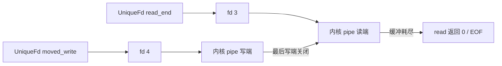

<div class="be-tutor-mount" data-tutor-lesson="systems-engineering-01" aria-hidden="true"></div>

<section id="overview-fd-partial-io" class="be-page-hero be-lesson-hero" data-learning-context="overview-fd-partial-io" data-context-type="overview" markdown="1">

<span class="be-page-eyebrow">系统工程 · 第 1 / 6 课 · 可诊断系统服务 v0.1</span>

# 文件描述符、部分 I/O 与所有权

## 一次 `write` 不承诺交付完整消息

本课用真实 POSIX pipe 传递 11 字节：

```text
payload_bytes=11
write_calls=4 read_calls=4
roundtrip=pass
move_source=empty move_target=closed-after-write
read_end_before_close=open
read_end_after_close=closed
all_descriptors=closed
```

程序故意把每次写请求限制为最多 3 字节、每次读请求限制为最多 4 字节，迫使循环处理进度；`UniqueFd` 则让描述符只能有一个所有者，并在析构或显式 `reset()` 时关闭。

</section>

<div class="be-lesson-overview">
  <div><span>课程位置</span><strong>系统工程 · 1 / 6</strong></div>
  <div><span>前置</span><strong>C++ 核心 + CS 系统基础</strong></div>
  <div><span>环境</span><strong>C++20、macOS/Linux POSIX</strong></div>
  <div><span>完成后留下</span><strong>真实 pipe、完整传输循环与描述符所有权证据</strong></div>
</div>

## 开始前

- 你已经理解 C++ 对象生命周期、移动语义和 RAII。
- 你已经观察过 Python 文件对象与进程退出状态。
- 本课不兼容 Windows 原生句柄 API，也不把 POSIX 描述符等同于标准 C++ 流对象。

## 学习目标

- 区分整数描述符、内核打开对象和 C++ 所有者对象。
- 正确处理短读、短写、EOF 与 `EINTR`。
- 用移动专属 RAII 类型防止复制所有权和重复关闭。
- 解释为什么关闭写端后读端才能观察 pipe EOF。
- 保存真实关闭前后状态与完整回环证据。

<section id="concept-fd-ownership-layers" data-learning-context="concept-fd-ownership-layers" data-context-type="concept" markdown="1">

## 三层对象不能混成一个概念

| 层次 | 本课对象 | 生命周期问题 |
| --- | --- | --- |
| 进程描述符表 | `int fd` | 数字可被复用，不能仅凭数值判断还是原资源 |
| 内核打开对象 | pipe 读端或写端 | 引用它的描述符全部关闭后才释放对应端 |
| C++ 所有者 | `UniqueFd` | 必须明确谁负责调用 `close` |



`UniqueFd` 禁止复制，只允许移动。移动后源对象保存 `-1`，目标对象成为唯一关闭责任人。这个模式借用了标准 C++ RAII，但 `pipe`、`read`、`write`、`close` 和 `fcntl` 都是 POSIX 接口。

</section>

<section id="example-write-all-read-eof" data-learning-context="example-write-all-read-eof" data-context-type="example" markdown="1">

## 完整传输是循环，不是一行系统调用

写循环维护 `offset`：

```cpp
while (offset < payload.size()) {
  const std::size_t request =
      std::min<std::size_t>(3, payload.size() - offset);
  const ssize_t written =
      ::write(fd, payload.data() + offset, request);
  if (written == -1 && errno == EINTR) {
    continue;
  }
  if (written <= 0) {
    throw std::runtime_error("write failed");
  }
  offset += static_cast<std::size_t>(written);
}
```

3 字节上限是教学注入点，用于稳定复现多次写，并不声称操作系统在这个 pipe 上自然每次只写 3 字节。真实系统调用仍然执行，返回值仍决定实际进度。

读循环每次最多接收 4 字节。写端关闭后，缓冲数据读尽，`read` 返回 0 表示 EOF。若写端仍有所有者，读端可能继续等待，不能把“暂时没数据”当成流结束。

</section>

<section id="reproduce-fd-pipeline-v01" data-learning-context="reproduce-fd-pipeline-v01" data-context-type="reproduce" markdown="1">

## 编译并运行真实 pipe

从仓库根目录执行：

```bash
cd site-src/examples/systems-engineering/diagnostic-service-v01
../../../../.venv/bin/python -m unittest -v test_fd_pipeline.py
```

测试会找到本机 `c++`，以 C++20 和 `-Wall -Wextra -Werror` 编译，再运行临时目录中的二进制。4 项测试覆盖：

1. 11 字节通过真实 pipe 完整回环。
2. 写 4 次、读 3 次数据加 1 次 EOF。
3. 移动后源所有者为空。
4. `fcntl(F_GETFD)` 在显式关闭前可用、关闭后得到 `EBADF`。

编译产物位于临时目录，不进入仓库。测试不联网，也不访问仓库外的用户数据。

</section>

<section id="concept-eintr-eof-errors" data-learning-context="concept-eintr-eof-errors" data-context-type="concept" markdown="1">

## `-1`、`0` 和正数必须分开解释

| `read` 结果 | 含义 | 动作 |
| ---: | --- | --- |
| `> 0` | 本次收到的字节数 | 追加并继续 |
| `0` | 流到达 EOF | 正常结束读取 |
| `-1, errno=EINTR` | 被信号中断，尚未完成 | 重试 |
| `-1, 其他 errno` | 真实错误 | 保留诊断并停止 |

`write` 返回正数也可能小于请求数，因此只推进实际写入的部分。对本课阻塞 pipe，返回 0 不是正常进展，按失败处理。

不要在抛异常前丢掉 `errno` 上下文；生产代码通常会把系统错误转换成带操作名与错误码的诊断。本课先固定控制流，下一课再把信号和停止状态接进服务生命周期。

</section>

<section id="modify-fd-failure-paths" data-learning-context="modify-fd-failure-paths" data-context-type="modify" markdown="1">

## 主动破坏所有权和进度

复制源文件为 `fd_pipeline.local.cpp`，每次只做一项：

1. 把每次写上限从 3 改为 2，预测并验证写调用数从 4 变为 6。
2. 删除写端 `reset()`，观察读循环为何无法得到 EOF；用外层进程超时终止实验。
3. 把 `offset += written` 错改为 `offset += request`，再设计一个写函数只接受部分请求，证明数据可能丢失。
4. 尝试复制 `UniqueFd`，确认编译器因复制构造被删除而拒绝。

无限等待实验必须放在带超时的测试进程中，不能让 CI 永久挂住。恢复后重新运行 4 项测试，并保存编译错误或超时作为受控失败证据。

</section>

<section id="troubleshoot-fd-pipeline" data-learning-context="troubleshoot-fd-pipeline" data-context-type="troubleshoot" markdown="1">

## 描述符错误常常发生在所有权变化之后

| 现象 | 优先检查 | 恢复 |
| --- | --- | --- |
| `read` 一直等待 | 是否仍有写端未关闭 | 列出每个 `UniqueFd` 所有者并关闭最后写端 |
| `EBADF` | 描述符是否已关闭或移动 | 不再使用移动源，检查关闭顺序 |
| 数据尾部缺失 | 是否按请求数而非返回值推进 | 只累加实际 `written` |
| 偶发中断 | 是否区分 `EINTR` | 对中断重试，其他错误停止 |
| 重复关闭另一个资源 | fd 数字关闭后被系统复用 | 单一所有权，关闭后立即置为 `-1` |
| 测试只在 Linux 通过 | 混入 Linux 专属接口 | 标注平台边界或使用 POSIX 共同子集 |
| 调用数变化 | 修改了教学分块大小 | 固定注入上限，别断言内核自然分块 |

关闭后的 fd 数值未来可能被重新分配。测试立即调用 `fcntl` 只验证本次受控程序的关闭点，不能成为跨线程长期判断资源身份的通用方法。

</section>

<section id="project-diagnostic-service-v01" data-learning-context="project-diagnostic-service-v01" data-context-type="project" markdown="1">

## 可诊断系统服务 v0.1

- 系统边界：真实 pipe、read、write、close 与 fcntl。
- C++ 边界：移动专属 `UniqueFd`，析构和显式 reset 共用关闭路径。
- 正确性证据：11 字节完整回环、固定教学调用数、移动源为空、关闭后不可用。
- 平台边界：macOS/Linux POSIX；不是 Windows 句柄课程。
- 下一版本：把信号通知转换成普通控制流，监督子进程并完成优雅停止。

示例没有把原始 fd 交给多个无所有权约定的组件，也没有在信号处理器中执行复杂 I/O。后续服务会继续保持“信号只通知、主循环负责清理”的边界。

</section>

## 四类学习者入口

- 零基础兴趣：系统工程不是默认起点；先复现固定输出并画出两个 pipe 端的所有者。
- 有基础兴趣：直接审查移动赋值与 `EINTR` 路径，补一个移动覆盖已有 fd 的测试。
- 零基础求职：能解释短写、EOF、EBADF 和重复关闭风险，并演示一次受控挂起恢复。
- 有基础求职：比较本实现与 `std::unique_ptr` 的 deleter 模式，说明系统资源为何需要专属类型。

<section id="career-fd-ownership-review" data-learning-context="career-fd-ownership-review" data-context-type="career" markdown="1">

## 求职加练：偶发丢尾部，停止时还会挂住

原创追问：一个日志转发进程假设每次 `write` 都写完完整缓冲，关闭时读端偶尔永久等待。你如何用最小实验分别验证部分写入和写端泄漏，并怎样设计所有权类型让修复可由编译器与测试共同检查？

回答至少包含返回值进度、EOF 条件、唯一所有者和受控超时。公开参考只提供 RAII、移动与可复现证据能力信号，不代表任何企业的真实问题或评价标准。

</section>

## 完成检查

- 4 项测试通过，真实 pipe 完整传递 11 字节。
- 能解释为什么固定分块是教学注入，不是内核自然行为声明。
- `UniqueFd` 禁止复制，移动后源为空，关闭后置为无效值。
- 写循环按实际返回值推进，读循环区分数据、EOF、EINTR 和错误。
- 主动复现一次缺少 EOF 的挂起，并由外层超时安全终止。
- 能说明 POSIX 与标准 C++、Windows 句柄的边界。
- 不把关闭后即时 `fcntl` 检查外推为跨线程资源身份方案。

## 来源与版本

- 适用 C++20 与 macOS/Linux POSIX；核查日期 2026-07-23。
- [POSIX `read`](https://pubs.opengroup.org/onlinepubs/9699919799/functions/read.html)：返回值、EOF 与错误。
- [POSIX `write`](https://pubs.opengroup.org/onlinepubs/9699919799/functions/write.html)：实际写入字节数与错误。
- [POSIX `close`](https://pubs.opengroup.org/onlinepubs/9699919799/functions/close.html)：描述符关闭语义。
- [C++ move constructors](https://en.cppreference.com/w/cpp/language/move_constructor.html)：移动专属所有权。

## 下一步

进入第 2 课《信号、进程监督与优雅停止》：将停止请求从异步信号边界传给普通主循环，回收子进程并保存退出原因。
