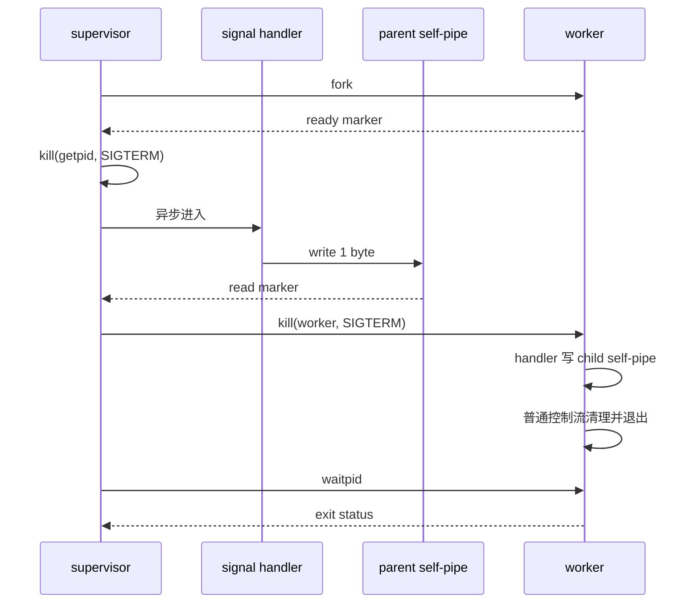

<div class="be-tutor-mount" data-tutor-lesson="systems-engineering-02" aria-hidden="true"></div>

<section id="overview-signal-supervision" class="be-page-hero be-lesson-hero" data-learning-context="overview-signal-supervision" data-context-type="overview" markdown="1">

<span class="be-page-eyebrow">系统工程 · 第 2 / 6 课 · 可诊断系统服务 v0.2</span>

# 信号、进程监督与优雅停止

## 信号处理器只负责叫醒主循环

本课真实发送 SIGTERM，通过 self-pipe 把异步通知转换成普通控制流，再停止并回收 worker：

```text
signal_handler=notification-only
supervisor_event=SIGTERM
worker_stop=requested
worker_cleanup=confirmed-by-exit
worker_exit=0
worker_reaped=yes
self_pipe=closed
supervision_result=pass
```

信号处理器不分配内存、不写 iostream、不等待子进程，也不做业务清理。复杂工作回到正常执行上下文后完成。

</section>

<div class="be-lesson-overview">
  <div><span>课程位置</span><strong>系统工程 · 2 / 6</strong></div>
  <div><span>前置</span><strong>描述符所有权与完整 I/O 循环</strong></div>
  <div><span>环境</span><strong>C++20、macOS/Linux POSIX</strong></div>
  <div><span>完成后留下</span><strong>self-pipe、真实 SIGTERM、子进程退出与回收证据</strong></div>
</div>

## 开始前

- 你能解释 fd 所有权、EOF、EINTR 与关闭顺序。
- 你理解进程退出码与信号终止不是同一个结果。
- 本课是单 worker 教学监督器，不是完整 init 系统或生产进程管理器。

## 学习目标

- 解释异步信号上下文为什么限制可调用操作。
- 用 self-pipe 把 SIGTERM 变成主循环可读取事件。
- 在子进程安装处理器后再由父进程发信号。
- 使用 `waitpid` 回收子进程并保留退出码。
- 区分正常停止、子进程失败和监督器配置错误。

<section id="concept-async-signal-boundary" data-learning-context="concept-async-signal-boundary" data-context-type="concept" markdown="1">

## 信号可能打断任意一行普通代码

信号处理器运行时，主程序可能正持有库内部锁或修改共享状态。调用不是 async-signal-safe 的函数，可能死锁或破坏状态。

本课处理器只做三件事：

```cpp
extern "C" void notify_signal(int signo) {
  const int saved_errno = errno;
  signal_number = signo;
  const unsigned char marker = 1;
  if (signal_event_write_fd >= 0) {
    (void)::write(signal_event_write_fd, &marker, sizeof(marker));
  }
  errno = saved_errno;
}
```

- 保存并恢复 `errno`。
- 把信号号写入 `volatile sig_atomic_t`。
- 向预先创建、非阻塞的 pipe 写一个字节。

`write` 在 POSIX async-signal-safe 列表中。pipe 满时写入可能失败，因此主循环还保留信号号作为状态；本课只发一次信号，不讨论信号计数队列。

</section>

<section id="example-self-pipe-sequence" data-learning-context="example-self-pipe-sequence" data-context-type="example" markdown="1">

## 从异步通知回到普通清理



ready pipe 消除“父进程发信号时子进程还没装好处理器”的竞态。父、子进程各有自己的 self-pipe；fork 后关闭不属于自己的端点，避免资源泄漏和错误 EOF。

</section>

<section id="reproduce-signal-supervisor-v02" data-learning-context="reproduce-signal-supervisor-v02" data-context-type="reproduce" markdown="1">

## 运行真实信号与子进程

从仓库根目录执行：

```bash
cd site-src/examples/systems-engineering/diagnostic-service-v02
../../../../.venv/bin/python -m unittest -v test_signal_supervisor.py
```

5 项测试覆盖：

1. SIGTERM 转换为主循环通知。
2. worker 完成清理、退出 0 并被回收。
3. `--child-exit 7` 让监督器返回 1 并保留失败。
4. 非法退出码配置返回 2。
5. 回收后 self-pipe 全部关闭。

测试使用真实 `fork`、`kill`、`sigaction`、pipe 和 `waitpid`，每次子进程运行都有 5 秒外层超时。

</section>

<section id="concept-supervision-states" data-learning-context="concept-supervision-states" data-context-type="concept" markdown="1">

## 监督器不能把所有退出都写成“已停止”

| 状态 | 证据 | 监督器退出 |
| --- | --- | ---: |
| 正常停止 | worker 收到请求、清理、exit 0、已 wait | 0 |
| 子进程失败 | worker 已回收但 exit 非 0 | 1 |
| 配置/监督错误 | 参数非法、pipe/fork/kill/wait 失败 | 2 |
| 强制升级 | 宽限期后仍未退出，发送 SIGKILL | 本课未实现 |

`worker_reaped=yes` 证明父进程调用 waitpid 收走退出状态，避免僵尸进程。它不证明 worker 内所有业务数据都已持久化；本课用退出 0 作为教学清理确认，生产服务还需要更具体的提交与关闭证据。

</section>

<section id="modify-signal-failures" data-learning-context="modify-signal-failures" data-context-type="modify" markdown="1">

## 主动制造三个监督失败

复制源文件后逐项实验：

1. 删除 ready marker 等待，重复运行，说明为什么存在安装处理器竞态。
2. 将 worker 退出码改为 7，确认监督器不是仍返回 0。
3. 暂时删除 `waitpid`，用 `ps` 观察父进程存活期间的子进程状态，再恢复回收。

不要故意向工作区外进程发送信号。所有 `kill` 目标必须来自本次程序的 `getpid()` 或 `fork()` 返回值。实验进程由外层测试超时兜底。

</section>

<section id="troubleshoot-signal-supervisor" data-learning-context="troubleshoot-signal-supervisor" data-context-type="troubleshoot" markdown="1">

## 优雅停止失败通常是状态机缺口

| 现象 | 可能原因 | 恢复 |
| --- | --- | --- |
| worker 被 SIGTERM 直接终止 | 处理器尚未安装 | 增加 ready 握手 |
| 主循环一直阻塞 | 处理器没有写通知 fd | 检查全局写端与关闭顺序 |
| 偶发死锁 | 处理器调用了锁、iostream 或分配 | 只保留 signal-safe 通知 |
| 退出看似成功但有僵尸 | 未调用 wait/waitpid | 循环处理 EINTR 并回收 |
| worker exit 7 仍显示成功 | 父进程丢弃退出状态 | 映射并传播非零结果 |
| pipe 偶发写满 | 通知端阻塞或消费不及时 | 设非阻塞并保留状态标志 |
| 重复信号丢计数 | 单字节通知只表示“有事件” | 明确合并语义或使用专门队列 |

本课只承诺一次停止通知。若要精确记录多次信号及顺序，需要重新设计协议，不能从单个 `sig_atomic_t` 外推。

</section>

<section id="project-diagnostic-service-v02" data-learning-context="project-diagnostic-service-v02" data-context-type="project" markdown="1">

## 可诊断系统服务 v0.2

- v0.1：描述符所有权、完整读写和关闭。
- v0.2：父子各自 self-pipe、ready 握手、真实 SIGTERM、退出码传播和 waitpid 回收。
- 固定通过输出：通知-only 处理器、worker exit 0、reaped、pipe closed。
- 固定失败证据：worker exit 7 → `supervision_result=child-failure`。
- 未覆盖：宽限期、SIGKILL 升级、多 worker 重启与持久化提交。

下一版把 worker 从单循环扩展为生产者—消费者服务，重点处理条件变量谓词、队列容量和关闭时剩余任务。

</section>

## 四类学习者入口

- 零基础兴趣：先画父、子进程和三组 pipe，只复现正常停止。
- 有基础兴趣：审查处理器调用集合和 `errno` 保存，补充两次 SIGTERM 的合并语义实验。
- 零基础求职：演示 exit 0、exit 7 和参数错误三种监督结果。
- 有基础求职：设计有宽限期的 TERM→KILL 升级，但明确哪些工作可能丢失。

<section id="career-graceful-shutdown-review" data-learning-context="career-graceful-shutdown-review" data-context-type="career" markdown="1">

## 求职加练：服务收到 SIGTERM 后偶发卡死

原创追问：服务在信号处理器里直接写日志、关闭数据库并等待 worker，压力下偶发死锁。你如何缩短信号处理器、把清理移回主循环，并证明子进程既退出又被回收？

回答至少包含 async-signal-safe 边界、self-pipe 或等价唤醒机制、ready 竞态、退出码和 waitpid。参考信号不代表任何企业的真实题目。

</section>

## 完成检查

- 5 项测试通过，使用真实 SIGTERM、fork 与 waitpid。
- 信号处理器只保存状态并写非阻塞 self-pipe。
- ready marker 保证 worker 处理器安装完成后才发信号。
- 正常停止、worker 失败和配置错误返回不同退出码。
- worker 退出后由父进程回收，self-pipe 全部关闭。
- 能说明一次通知与多信号精确计数的边界。
- 不向本次程序之外的进程发送测试信号。

## 来源与版本

- 适用 C++20 与 macOS/Linux POSIX；核查日期 2026-07-23。
- [POSIX Signal Concepts](https://pubs.opengroup.org/onlinepubs/9699919799/basedefs/V1_chap02.html#tag_02_04)：信号与 async-signal-safe 约束。
- [POSIX `sigaction`](https://pubs.opengroup.org/onlinepubs/9699919799/functions/sigaction.html)：信号动作。
- [POSIX `waitpid`](https://pubs.opengroup.org/onlinepubs/9699919799/functions/wait.html)：子进程状态回收。
- [POSIX `kill`](https://pubs.opengroup.org/onlinepubs/9699919799/functions/kill.html)：向明确 PID 发送信号。

## 下一步

进入第 3 课《条件变量、有界队列与关闭协议》：让多个线程在有容量上限的队列上协作，并保证关闭时不丢已接受任务。
