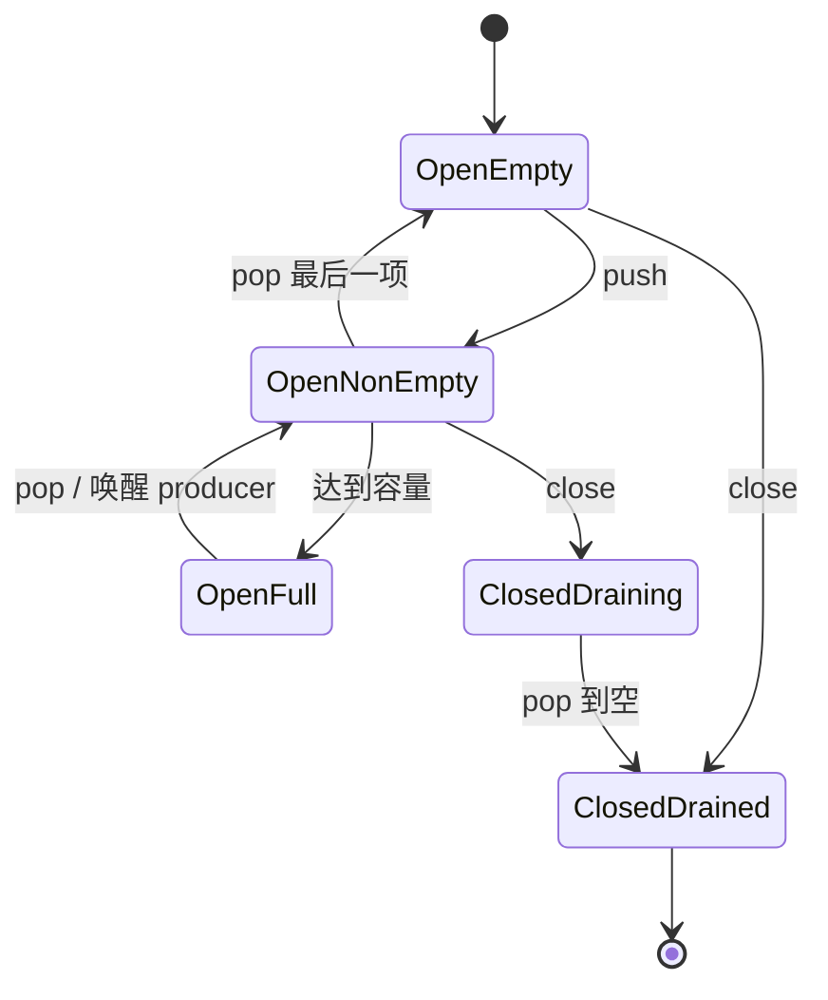

<div class="be-tutor-mount" data-tutor-lesson="systems-engineering-03" aria-hidden="true"></div>

<section id="overview-bounded-queue" class="be-page-hero be-lesson-hero" data-learning-context="overview-bounded-queue" data-context-type="overview" markdown="1">

<span class="be-page-eyebrow">系统工程 · 第 3 / 6 课 · 可诊断系统服务 v0.3</span>

# 条件变量、有界队列与关闭协议

## 服务不能无限接收，也不能关闭后悄悄丢任务

本课把 worker 扩展为生产者—消费者队列：

```text
capacity=1
backpressure=observed waiting_producers=1
accepted=3 processed=3
order=1,2,3
push_after_close=rejected
pop_after_drain=closed
invariant=accepted-equals-processed
```

容量 1 让第二次 push 确定性阻塞；测试等待 `waiting_producers=1` 后才启动消费者，不依赖 sleep 或调度运气。关闭后拒绝新任务，但已经接受的三项继续按 FIFO 排空。

</section>

<div class="be-lesson-overview">
  <div><span>课程位置</span><strong>系统工程 · 3 / 6</strong></div>
  <div><span>前置</span><strong>描述符所有权 + 信号与优雅停止</strong></div>
  <div><span>环境</span><strong>C++20 mutex / condition_variable</strong></div>
  <div><span>完成后留下</span><strong>确定性背压、排空关闭与不变量证据</strong></div>
</div>

## 开始前

- 你能解释互斥锁保护的是哪一组共享状态。
- 你知道线程被唤醒不等于等待条件已经成立。
- 本课只处理单生产者、单消费者示例，但队列协议不依赖固定线程 ID。

## 学习目标

- 用容量上限把过载从无限内存增长变成可观察等待。
- 用谓词形式等待，正确处理虚假唤醒。
- 区分“停止接收新任务”和“丢弃已接受任务”。
- 唤醒关闭时等待在空队列或满队列上的线程。
- 维护 `accepted == processed + queued` 不变量。

<section id="concept-queue-state" data-learning-context="concept-queue-state" data-context-type="concept" markdown="1">

## 队列状态必须在同一把锁下变化

共享状态包括：

- `items_`：已经接受但尚未弹出的任务。
- `closed_`：是否停止接受新任务。
- `waiting_producers_`：教学观测字段。



close 之后：

- push 必须返回 false。
- pop 在还有元素时继续返回任务。
- pop 在队列已空时返回 `nullopt`。

这就是排空关闭，不是立即清空。

</section>

<section id="example-condition-predicates" data-learning-context="example-condition-predicates" data-context-type="example" markdown="1">

## 等待的是谓词，不是通知次数

生产者等待：

```cpp
not_full_.wait(lock, [this] {
  return items_.size() < capacity_ || closed_;
});
```

消费者等待：

```cpp
not_empty_.wait(lock, [this] {
  return !items_.empty() || closed_;
});
```

条件变量可能虚假唤醒，通知也可能发生在某个线程真正进入等待之前。谓词在持锁状态重新检查共享事实，因此正确性不依赖“一次 notify 对应一次 wake”。

close 同时 `notify_all` 两组条件变量：满队列上的生产者要醒来并拒绝提交，空队列上的消费者要醒来并结束。

</section>

<section id="reproduce-bounded-queue-v03" data-learning-context="reproduce-bounded-queue-v03" data-context-type="reproduce" markdown="1">

## 运行确定性背压实验

```bash
cd site-src/examples/systems-engineering/diagnostic-service-v03
../../../../.venv/bin/python -m unittest -v test_bounded_queue.py
```

测试以 `-pthread -Wall -Wextra -Werror` 编译 C++20 程序。5 项覆盖：

1. 容量 1 时生产者确定性进入等待。
2. 三项已接受任务全部被处理。
3. FIFO 顺序保持为 `1,2,3`。
4. close 后 push 被拒绝。
5. close 且排空后 pop 返回终止状态。

主线程调用 `wait_for_blocked_producer()` 等待内部状态变化，再启动消费者。没有固定毫秒 sleep，也没有用偶发调度证明背压。

</section>

<section id="concept-close-invariant" data-learning-context="concept-close-invariant" data-context-type="concept" markdown="1">

## 接受边界决定谁对任务负责

push 返回 true 的瞬间，服务承担处理或明确持久化交接的责任。本课没有持久化队列，因此关闭门槛是：

```text
accepted = processed + queued
closed and queued = 0
therefore accepted = processed
```

若 close 直接清空 deque，`accepted=3 processed=2` 就暴露任务丢失。若 close 不唤醒等待线程，程序可能永远无法到达排空状态。

生产系统还要定义失败任务、重试和幂等；本课只保证内存队列中已接受任务由单个消费者取出一次。

</section>

<section id="modify-queue-shutdown" data-learning-context="modify-queue-shutdown" data-context-type="modify" markdown="1">

## 主动破坏关闭协议

每次只改一处：

1. 删除 push 的 `closed_` 检查，确认 close 后仍可能接受任务。
2. 删除 close 中的 `not_full_.notify_all()`，构造满队列生产者并用外层超时观察挂起。
3. 把消费者等待从谓词版本改成单次 wait，解释虚假唤醒后的风险。
4. 将容量从 1 改为 2，预测首次阻塞发生在第几项。

挂起实验必须由测试进程超时终止。恢复后重新运行五项测试，固定输出必须回到 `accepted-equals-processed`。

</section>

<section id="troubleshoot-bounded-queue" data-learning-context="troubleshoot-bounded-queue" data-context-type="troubleshoot" markdown="1">

## 并发问题先核对谓词和所有权

| 现象 | 优先检查 | 恢复 |
| --- | --- | --- |
| close 后永久挂起 | 是否唤醒 not_empty 与 not_full | close 持锁改状态后 notify_all |
| 队列超过容量 | size 检查是否与 push 同锁 | 谓词和写入共用 mutex |
| 偶发空队列访问 | 是否用 if 包住裸 wait | 使用带谓词 wait |
| 已接受数大于处理数 | close 是否清空队列或过早停消费者 | 先停止接收，再排空 |
| 重复处理 | 多消费者是否共享一次 pop | 在锁内移除后再交给消费者 |
| 测试偶发失败 | 是否依赖 sleep | 等待明确状态或使用 barrier |
| 吞吐变低 | 容量过小或临界区过大 | 测量等待与处理，不先猜容量 |

增加队列容量只会推迟背压，不会消除下游慢于上游的事实。

</section>

<section id="project-diagnostic-service-v03" data-learning-context="project-diagnostic-service-v03" data-context-type="project" markdown="1">

## 可诊断系统服务 v0.3

- v0.1：描述符、部分 I/O 与关闭。
- v0.2：信号通知、worker 停止与进程回收。
- v0.3：容量 1 的有界队列、确定性生产者等待、FIFO 排空与关闭拒绝。
- 固定不变量：3 项接受、3 项处理、关闭后拒绝、排空后终止。
- 下一版本：把容量边界扩展到非阻塞 socket 的读写就绪与发送背压。

</section>

## 四类学习者入口

- 零基础兴趣：画状态机并复现容量 1 的等待。
- 有基础兴趣：补多生产者测试，核对唯一接受计数。
- 零基础求职：演示 close 后拒绝与已接受任务排空的区别。
- 有基础求职：讨论持久化队列、重试和幂等怎样改变接受边界。

<section id="career-queue-shutdown-review" data-learning-context="career-queue-shutdown-review" data-context-type="career" markdown="1">

## 求职加练：停止时偶发丢最后几项任务

原创追问：服务收到停止请求后立即设置 worker 退出标志并清空队列，结果监控显示 accepted 高于 processed。你如何重新定义接受边界、关闭顺序和条件变量谓词，并用什么确定性实验证明生产者真的遇到背压？

回答至少包含容量、谓词、notify_all、排空不变量和不依赖 sleep 的同步证据。

</section>

## 完成检查

- 5 项测试通过，真实 C++20 线程完成生产与消费。
- 容量 1 的背压由状态等待确定性触发。
- 条件变量等待都包含队列或关闭谓词。
- close 拒绝新 push，同时允许已接受任务排空。
- 空且关闭的队列向消费者返回明确终止状态。
- 固定输出满足 accepted 等于 processed。
- 能解释为什么增加容量不能消除持续过载。

## 来源与版本

- 适用 C++20；核查日期 2026-07-23。
- [C++ `condition_variable`](https://en.cppreference.com/w/cpp/thread/condition_variable.html)：谓词等待与通知。
- [C++ `mutex`](https://en.cppreference.com/w/cpp/thread/mutex.html)：共享状态互斥。
- [C++ `unique_lock`](https://en.cppreference.com/w/cpp/thread/unique_lock.html)：等待期间释放与重新获得锁。

## 下一步

进入第 4 课《非阻塞网络、事件循环与背压》，把队列容量思想迁移到 socket 发送缓冲与写就绪事件。
