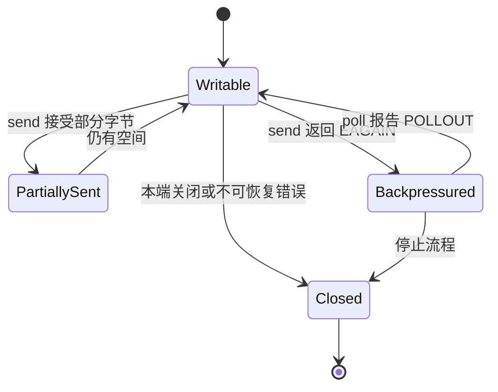

<div class="be-tutor-mount" data-tutor-lesson="systems-engineering-04" aria-hidden="true"></div>

<section id="overview-nonblocking-io" class="be-page-hero be-lesson-hero" data-learning-context="overview-nonblocking-io" data-context-type="overview" markdown="1">

<span class="be-page-eyebrow">系统工程 · 第 4 / 6 课 · 可诊断系统服务 v0.4</span>

# 非阻塞网络、事件循环与背压

## socket 可写，不等于这次发送永远不会等待

本课用真实本机 `socketpair` 观察发送缓冲区从可写到满、再被对端排空的状态变化：

```text
transport=unix-socketpair
writer=nonblocking
backpressure=EAGAIN-observed
poll_while_full=not-writable
peer_drain=performed
poll_after_drain=writable
resume_send=pass
reader_event=readable
socketpair=closed-by-raii
```

固定输出不包含缓冲区字节数、循环次数或等待耗时，因为这些会随内核和机器变化。实验只断言稳定语义：写满后收到 `EAGAIN`，排空后重新获得写就绪。

</section>

<div class="be-lesson-overview">
  <div><span>课程位置</span><strong>系统工程 · 4 / 6</strong></div>
  <div><span>前置</span><strong>描述符所有权 + 有界队列背压</strong></div>
  <div><span>环境</span><strong>C++20 + POSIX socketpair / fcntl / poll</strong></div>
  <div><span>完成后留下</span><strong>真实 EAGAIN、就绪事件与恢复发送证据</strong></div>
</div>

## 开始前

- 你知道文件描述符必须有唯一、明确的关闭责任。
- 你能解释容量有限时生产者为什么需要等待或拒绝。
- 本课使用 `AF_UNIX` 本机字节流，不解析 HTTP，也不访问外网。

## 学习目标

- 用 `O_NONBLOCK` 把“可能无限等待”变成可处理的返回状态。
- 区分“操作现在会阻塞”与“连接已经失败”。
- 用 `poll` 只在需要时订阅读写就绪。
- 对部分发送、`EAGAIN` 和关闭建立明确状态机。
- 用有界循环和稳定快照验证真实内核行为。

<section id="concept-nonblocking-state" data-learning-context="concept-nonblocking-state" data-context-type="concept" markdown="1">

## 非阻塞 I/O 改变的是等待方式，不是容量事实

阻塞 socket 在缓冲区无空间时可能让调用线程停在 `send`。设置 `O_NONBLOCK` 后，同一状态通常表现为：

```cpp
ssize_t sent = send(fd, data, size, MSG_NOSIGNAL);
if (sent < 0 && (errno == EAGAIN || errno == EWOULDBLOCK)) {
  // 数据没有在这次调用中被接受，等待下一次写就绪。
}
```

`EAGAIN` 不是连接必然损坏，也不是可以丢弃待发数据的许可。调用方要保留尚未发送的部分，并在写就绪后继续。



</section>

<section id="example-poll-interest" data-learning-context="example-poll-interest" data-context-type="example" markdown="1">

## 事件循环订阅的是兴趣集合

`pollfd.events` 表示调用方当前关心什么：

- 待读数据时订阅 `POLLIN`。
- 有未发送数据且刚遇到 `EAGAIN` 时订阅 `POLLOUT`。
- 没有待发数据时不应持续订阅 `POLLOUT`，否则可写 socket 会反复唤醒循环，形成 busy loop。
- `POLLERR`、`POLLHUP` 与 `POLLNVAL` 由 `revents` 报告，不能只检查理想事件。

本课先写到 `EAGAIN`，立即 `poll(..., POLLOUT, 0)` 验证满时不可写；对端排空后再以有界超时等待 `POLLOUT`。超时只是防止测试挂死，不作为性能结论。

</section>

<section id="reproduce-nonblocking-v04" data-learning-context="reproduce-nonblocking-v04" data-context-type="reproduce" markdown="1">

## 运行真实本机 socket 实验

```bash
cd site-src/examples/systems-engineering/diagnostic-service-v04
../../../../.venv/bin/python -m unittest -v test_nonblocking_socket.py
```

测试以 `-Wall -Wextra -Werror` 编译 C++20 程序。5 项覆盖：

1. `socketpair` 两端真实存在，写端设置为非阻塞。
2. 有界写入循环确定性观察到 `EAGAIN`。
3. 缓冲区满时 `poll` 不报告写就绪。
4. 对端排空后写就绪恢复，恢复消息完整可读。
5. 正常与异常路径均由 RAII 关闭描述符。

实验不创建公网连接、不绑定端口，也不使用 Mock 伪造 `EAGAIN`。

</section>

<section id="concept-partial-io" data-learning-context="concept-partial-io" data-context-type="concept" markdown="1">

## 一次 send 成功也可能只接受一部分

对长度为 `N` 的消息，`send` 返回 `k` 且 `0 < k < N` 表示前 `k` 字节已交给内核，剩余 `N-k` 字节仍归应用负责。正确的待发状态至少包含：

```text
buffer = 原始消息
offset = 已接受字节数
remaining = buffer.size - offset
```

恢复写就绪后从 `offset` 继续，不能从头重发，也不能把正返回值误认为整条消息完成。字节流 socket 不保留应用消息边界，接收方也必须累计并按协议解析。

</section>

<section id="modify-event-loop" data-learning-context="modify-event-loop" data-context-type="modify" markdown="1">

## 主动修改兴趣集合

每次只改一处并保留外层超时：

1. 删除 `O_NONBLOCK`，观察写满路径为什么可能卡住整个线程。
2. 遇到 `EAGAIN` 后立即丢弃剩余数据，给输出增加已请求与已接收计数并找出差额。
3. 始终订阅 `POLLOUT`，统计空闲循环的唤醒次数。
4. 把恢复消息扩大到超过单次发送能力，实现 `offset` 驱动的部分发送循环。

恢复代码后重新运行 5 项测试；固定输出必须重新出现 `resume_send=pass` 与 `reader_event=readable`。

</section>

<section id="troubleshoot-event-loop" data-learning-context="troubleshoot-event-loop" data-context-type="troubleshoot" markdown="1">

## 先区分就绪、进度和连接状态

| 现象 | 优先检查 | 恢复 |
| --- | --- | --- |
| 单连接阻塞全部处理 | fd 是否仍为阻塞模式 | 用 `fcntl` 设置并核对 `O_NONBLOCK` |
| CPU 空闲时仍满载 | 是否一直订阅 `POLLOUT` | 仅有待发数据时订阅 |
| 响应尾部缺失 | 是否忽略部分 send 或 EAGAIN | 保存 buffer 与 offset |
| 数据重复 | 恢复发送是否又从 offset 0 开始 | 从未发送位置继续 |
| 对端关闭后反复唤醒 | 是否处理 HUP、ERR 和 recv=0 | 转入关闭并释放资源 |
| 测试偶发超时 | 是否用时间猜测缓冲区已满 | 写到真实 EAGAIN，再观察事件 |
| 不同机器快照变化 | 是否记录缓冲区大小和写次数 | 固定输出只记录状态 |

“poll 报告可写”只表示某次非阻塞写有机会取得进度，不保证任意大小的数据一次发完。

</section>

<section id="project-diagnostic-service-v04" data-learning-context="project-diagnostic-service-v04" data-context-type="project" markdown="1">

## 可诊断系统服务 v0.4

- v0.1：描述符、部分 I/O 与关闭。
- v0.2：信号通知、worker 停止与进程回收。
- v0.3：有界队列、生产者背压与排空关闭。
- v0.4：真实非阻塞 socket、`EAGAIN`、`poll` 兴趣集合、对端排空与恢复发送。
- 固定边界：不记录内核容量和耗时；循环有上限；不访问外网。
- 下一版本：对采集到的操作延迟建立分布、百分位和性能预算。

</section>

## 四类学习者入口

- 零基础兴趣：先画“可写—背压—恢复”三态图，再运行固定快照。
- 有基础兴趣：实现带 offset 的大消息部分发送。
- 零基础求职：演示 `EAGAIN` 与连接失败的差别。
- 有基础求职：解释边缘触发、水平触发和兴趣集合管理的风险，但不把本课 `poll` 外推为所有事件库实现。

<section id="career-network-backpressure" data-learning-context="career-network-backpressure" data-context-type="career" markdown="1">

## 求职加练：慢客户端拖住诊断服务

原创追问：诊断服务向多个客户端推送结果，一个客户端停止读取后，服务线程卡在 `send`，其他客户端也不再响应。你怎样改造 fd 模式、待发缓冲、事件兴趣集合和关闭边界？如何用真实本机实验证明背压发生过、解除后发送可恢复，同时避免把机器相关字节数写进断言？

回答至少包含非阻塞、部分发送、`EAGAIN`、`POLLOUT`、每连接容量策略和描述符回收。

</section>

## 完成检查

- 5 项测试通过，使用真实 POSIX `socketpair` 与内核发送缓冲区。
- 写端启用 `O_NONBLOCK`，有界循环观察到 `EAGAIN`。
- 缓冲区满时不可写，对端排空后重新获得 `POLLOUT`。
- 恢复消息完整到达，测试不依赖外网或 Mock。
- 能说明部分发送时 buffer 与 offset 的所有权。
- 只在有待发数据时订阅写就绪，避免空转。
- 两端描述符在退出路径由 RAII 关闭。

## 来源与版本

- 适用 C++20 与 POSIX socket；在 macOS、Linux 上运行，核查日期 2026-07-23。
- [POSIX `socketpair`](https://pubs.opengroup.org/onlinepubs/9699919799/functions/socketpair.html)：创建已连接的本机 socket 对。
- [POSIX `fcntl`](https://pubs.opengroup.org/onlinepubs/9699919799/functions/fcntl.html)：设置文件状态标志。
- [POSIX `poll`](https://pubs.opengroup.org/onlinepubs/9699919799/functions/poll.html)：等待描述符事件。
- [POSIX `send`](https://pubs.opengroup.org/onlinepubs/9699919799/functions/send.html)：发送结果、错误与非阻塞语义。

## 下一步

进入第 5 课《延迟分布、采样分析与性能预算》，把“是否取得进度”扩展为“进度有多快、尾部有多慢、预算是否守住”。
