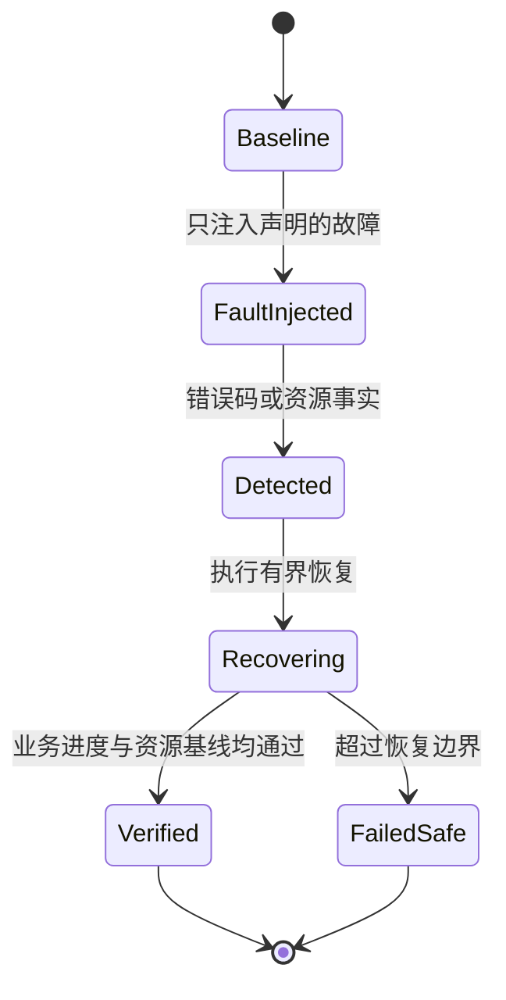

<div class="be-tutor-mount" data-tutor-lesson="systems-engineering-06" aria-hidden="true"></div>

<section id="overview-recovery-acceptance" class="be-page-hero be-lesson-hero" data-learning-context="overview-recovery-acceptance" data-context-type="overview" markdown="1">

<span class="be-page-eyebrow">系统工程 · 第 6 / 6 课 · 可诊断系统服务 v0.6</span>

# 故障注入、资源泄漏与恢复验收

## 恢复不是“没有报错”，而是状态和资源回到可接受基线

本课主动制造四类真实本机故障，再核对恢复动作：

```text
fault=descriptor-leak injected=1
detector=fd-still-open
fd_recovery=explicit-close
fd_after_recovery=closed
child_fault=exit-7
child_recovery=reaped
transport_fault=EPIPE-observed
transport_recovery=reconnected
temporary_artifact=removed
resource_baseline=restored
```

输出中的每个状态都有系统调用返回值支撑：`fcntl` 检查 fd、`waitpid` 回收子进程、断开 socket 的 `send` 返回 `EPIPE`、`access` 确认临时路径已删除。

</section>

<div class="be-lesson-overview">
  <div><span>课程位置</span><strong>系统工程 · 6 / 6</strong></div>
  <div><span>前置</span><strong>所有权、停止、背压、网络、性能证据</strong></div>
  <div><span>环境</span><strong>C++20 + POSIX pipe / fork / socketpair / tempfile</strong></div>
  <div><span>完成后留下</span><strong>故障计划、恢复断言与资源基线</strong></div>
</div>

## 开始前

- 你能指出进程、描述符、任务和临时文件分别由谁回收。
- 你知道错误码、日志和恢复后的事实是三种不同证据。
- 实验只操作自己创建的资源，不扫描或关闭其他进程描述符。

## 学习目标

- 把故障点、预期错误、恢复动作和验收事实写成计划。
- 用真实系统调用制造可控故障，不靠随机压力碰运气。
- 区分检测到泄漏与已经修复泄漏。
- 保留子进程失败状态，同时避免僵尸进程。
- 在恢复后重新验证业务进度和资源基线。

<section id="concept-fault-plan" data-learning-context="concept-fault-plan" data-context-type="concept" markdown="1">

## 故障注入先定义作用域和停止条件

```text
故障点 → 可观察错误 → 恢复动作 → 恢复后断言
fd 暂留 → fcntl 仍有效 → close → fcntl 返回 EBADF
child exit 7 → wait status=7 → waitpid → child 已回收
peer close → send 返回 EPIPE → 重建连接 → 消息完整到达
临时文件 → 路径存在 → close + unlink → 路径不存在
```



没有最大尝试次数、所有权边界或退出条件的“自动恢复”，可能演化为无限重试和故障放大。

</section>

<section id="example-resource-baseline" data-learning-context="example-resource-baseline" data-context-type="example" markdown="1">

## 基线应围绕本进程拥有的资源

本课知道被注入的 pipe fd，因此用 `fcntl(fd, F_GETFD)` 检查它是否仍有效。恢复后同一 fd 必须返回 `EBADF`。这比扫描系统所有描述符更安全，也避免误把运行器、测试框架或其他线程拥有的 fd 当作泄漏。

资源基线不只有计数：

- fd 应关闭，且不再被事件循环订阅。
- 子进程应被 `waitpid` 回收，退出码仍可解释。
- 队列应停止接收并排空已接受任务。
- 临时文件应先关闭再删除。
- 恢复连接应能重新取得业务进度。

</section>

<section id="reproduce-recovery-v06" data-learning-context="reproduce-recovery-v06" data-context-type="reproduce" markdown="1">

## 运行故障与恢复实验

```bash
cd site-src/examples/systems-engineering/diagnostic-service-v06
../../../../.venv/bin/python -m unittest -v test_recovery_lab.py
```

5 项测试覆盖：

1. 真实 pipe fd 被暂留、检测并显式关闭。
2. 子进程真实返回 7，父进程通过 `waitpid` 保留状态并回收。
3. 对端关闭后真实收到 `EPIPE`，重建 socket 后消息完整到达。
4. 临时文件完成 close、unlink 与不存在检查。
5. 所有恢复断言通过，程序在外层超时内结束。

</section>

<section id="concept-recovery-invariants" data-learning-context="concept-recovery-invariants" data-context-type="concept" markdown="1">

## 日志说恢复成功不等于系统已恢复

恢复验收至少包含两层：

1. 资源层：fd 关闭、进程回收、队列排空、临时文件删除。
2. 服务层：新连接能传输消息、后续任务仍可被接受或明确拒绝、延迟预算没有被无限重试拖垮。

若只看到“reconnected”日志而没有发送和接收同一条消息，连接可能创建了但服务没有恢复进度。若业务恢复却遗留旧 fd，长期运行仍会耗尽资源。

</section>

<section id="modify-recovery-plan" data-learning-context="modify-recovery-plan" data-context-type="modify" markdown="1">

## 主动破坏恢复动作

1. 注释掉泄漏 fd 的 close，确认 `fd_after_recovery=closed` 无法成立。
2. 删除 `waitpid`，用外层测试超时和进程状态观察回收缺口，再恢复代码。
3. 遇到 `EPIPE` 后无限重试旧 fd，确认为什么恢复必须重建状态且有上限。
4. 在 unlink 前不关闭临时 fd，说明 Unix 可删除路径但资源仍可能由打开描述符持有。

实验只修改自己创建的临时资源；不要为了“清理”执行广泛 kill、递归删除或关闭未知 fd。

</section>

<section id="troubleshoot-recovery" data-learning-context="troubleshoot-recovery" data-context-type="troubleshoot" markdown="1">

## 恢复失败沿证据链定位

| 现象 | 优先检查 | 恢复 |
| --- | --- | --- |
| fd 数持续增长 | 接受、错误和取消路径是否都关闭 | 为每次获得建立唯一所有者 |
| 子进程退出后仍占表项 | 是否只记录退出而未 wait | 由监督者统一 waitpid |
| EPIPE 后 CPU 满载 | 是否无上限重试旧连接 | 停止写旧 fd，有界重连 |
| 日志显示重连但无数据 | 是否验证恢复后业务进度 | 发送并接收探针消息 |
| 临时目录越积越多 | 异常路径是否跳过 unlink | 关闭与清理放入作用域守卫 |
| 清理误伤其他工作 | 是否扫描并关闭未知资源 | 只管理明确拥有的句柄 |
| 恢复后尾延迟恶化 | 是否发生重试风暴 | 记录重试量并复核 p95/p99 |

</section>

<section id="project-diagnostic-service-v06" data-learning-context="project-diagnostic-service-v06" data-context-type="project" markdown="1">

## 可诊断系统服务 v0.6

- v0.1：描述符、部分 I/O 与所有权。
- v0.2：信号、worker 状态与子进程回收。
- v0.3：有界队列、确定性背压与排空关闭。
- v0.4：非阻塞 socket、EAGAIN 与事件就绪。
- v0.5：延迟分布、采样阶段与性能预算。
- v0.6：描述符泄漏、子进程失败、断链与临时资源的故障注入／恢复验收。

六个版本共同形成“观察事实—解释边界—主动破坏—恢复—固定证据”的系统工程闭环。

</section>

## 四类学习者入口

- 零基础兴趣：按四列表逐项指出故障、检测、恢复和验收。
- 有基础兴趣：为队列关闭补一项故障注入，验证 accepted 等于 processed。
- 零基础求职：演示“记录错误”与“资源已回收”的区别。
- 有基础求职：设计有限重试、退避、熔断与降级，但明确它们不属于本课已实现范围。

<section id="career-recovery-review" data-learning-context="career-recovery-review" data-context-type="career" markdown="1">

## 求职加练：服务自动恢复后仍逐日耗尽 fd

原创追问：网络断开后服务能自动重连，业务看似恢复，但 fd 数每天增加。你如何证明旧连接的所有权路径、构造确定性断链、核对恢复后业务进度与资源基线，并阻止无限重连放大故障？

回答至少包含 `EPIPE`、旧 fd 关闭、新连接探针、有限重试、资源基线和长期回归证据。

</section>

## 完成检查

- 5 项测试通过，四类故障由真实 POSIX 调用产生。
- 描述符从仍打开被检测到显式关闭，并以 `EBADF` 验收。
- 子进程退出 7 的状态被保留且完成回收。
- 断链返回 `EPIPE`，新 socket 恢复消息传输。
- 临时文件关闭并删除，路径确认不存在。
- 恢复同时验证资源层和服务进度。
- 整组六课完成组级页面与真实运行验收后才标记开放。

## 来源与版本

- 适用 C++20 与 POSIX；在 macOS、Linux 上运行，核查日期 2026-07-23。
- [POSIX `fcntl`](https://pubs.opengroup.org/onlinepubs/9699919799/functions/fcntl.html)：描述符状态检查。
- [POSIX `waitpid`](https://pubs.opengroup.org/onlinepubs/9699919799/functions/waitpid.html)：子进程状态与回收。
- [POSIX `send`](https://pubs.opengroup.org/onlinepubs/9699919799/functions/send.html)：断开连接的发送错误。
- [POSIX `unlink`](https://pubs.opengroup.org/onlinepubs/9699919799/functions/unlink.html)：目录项删除语义。

## 下一步

完成六课组级验收，再按课程地图进入下一个前置已经满足的课程组；不会因为本课完成而自动开放尚无正文的下游模块。
