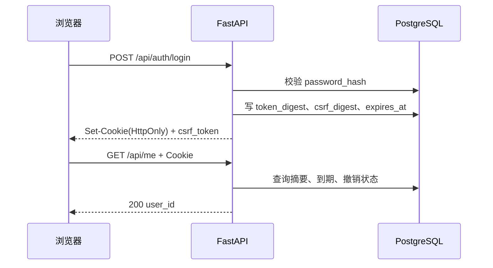

<div class="be-tutor-mount" data-tutor-lesson="web-engineering-02" aria-hidden="true"></div>

# 密码哈希、Cookie 会话与 CSRF 防护

<section data-context-type="overview" data-learning-context="overview-session-boundary" id="overview-session-boundary">
## 身份不是把密码或 JWT 放进浏览器
Web v0.10 使用合成账号、Argon2id 密码哈希和短期不透明会话；服务端只保存令牌摘要。

一次成功登录会同时产生两样随机值：浏览器自动携带的会话 Cookie，以及前端在内存中保存的 CSRF 值。原始密码只在登录请求中短暂出现，数据库保存的是 Argon2id 哈希，不保存可还原的密码。


</section>
<section data-context-type="concept" data-learning-context="concept-cookie-session" id="concept-cookie-session">
## 会话的三份责任
Cookie 只携带 HttpOnly 会话值；数据库保存摘要、到期和撤销；CSRF 值仅在前端内存和服务端摘要中出现。

| 信息 | 浏览器 | 服务端持久层 | 日志 |
| --- | --- | --- | --- |
| 密码 | 登录请求瞬时存在 | 只保存 Argon2id 哈希 | 不记录 |
| 会话原文 | HttpOnly Cookie | 不保存 | 不记录 |
| 会话摘要 | 不需要 | `token_digest` | 不记录 |
| CSRF 原文 | 仅内存 | 不保存 | 不记录 |
| CSRF 摘要 | 不需要 | `csrf_digest` | 不记录 |
| 到期、撤销 | 不作为可信判断 | 保存并由服务端判断 | 可记结果，不记凭据 |

不透明令牌没有让服务器“无需状态”，它恰恰依赖服务端会话记录。好处是可以单独撤销、集中控制到期，并且数据库泄露时不会直接得到仍可使用的 Cookie 原文。
</section>
<section data-context-type="example" data-learning-context="example-auth-status" id="example-auth-status">
## 401、403 不是同一个错误
缺少或无效身份返回 401 和 `WWW-Authenticate`；有身份但 CSRF 缺失的状态变更返回 403。

| 请求 | 条件 | 状态 | 客户端下一步 |
| --- | --- | ---: | --- |
| `POST /api/auth/login` | 用户或密码错误 | 401 | 显示统一错误，不泄露账号是否存在 |
| `GET /api/me` | Cookie 缺失、到期或撤销 | 401 | 回到登录页 |
| `POST /api/auth/logout` | 身份有效，CSRF 缺失或错误 | 403 | 重新取得当前会话状态，不自动重放 |
| `POST /api/auth/logout` | Cookie 与 CSRF 均有效 | 204 | 清空前端身份状态 |

这里的 403 只说明当前身份不能完成这次状态改变。下一课还会加入角色与资源所有权，届时权限不足也会返回 403，但判断原因不同。
</section>
<section data-context-type="reproduce" data-learning-context="reproduce-dashboard-v10" id="reproduce-dashboard-v10">
## 运行会话实验
```bash
cd site-src/examples/web-engineering/learning-dashboard-v10
../../../../.venv/bin/python -m unittest -v test_auth_lab.py
../../../../.venv/bin/uvicorn app:app --port 8781
```
登录响应给 CSRF 值，浏览器 Cookie 含 `HttpOnly; SameSite=Lax`。

九项测试覆盖错误密码统一响应、令牌摘要、CSRF、到期、撤销、Cookie 属性、`/api/me` 和退出。可以再用本机 HTTP 手工观察：

```bash
curl -i -c /tmp/dashboard-cookie.txt \
  -H 'Content-Type: application/json' \
  -d '{"username":"learner","password":"learning-only-password"}' \
  http://127.0.0.1:8781/api/auth/login
curl -i -b /tmp/dashboard-cookie.txt http://127.0.0.1:8781/api/me
```

你应看到登录返回 200、`Set-Cookie` 含 `HttpOnly` 和 `SameSite=Lax`，随后 `/api/me` 返回 `{"user_id":"u-learner"}`。示例使用本机明文 HTTP，因此没有把 `Secure` 设为真；生产环境必须使用 TLS 并启用 Secure Cookie。
</section>
<section data-context-type="modify" data-learning-context="modify-session-expiry" id="modify-session-expiry">
## 主动修改：缩短会话时间
把教学会话改为一分钟，新增到期测试；不要把原始令牌写进日志、URL 或 localStorage。

不要真的等待一分钟。测试应注入时钟或把记录的 `expires_at` 调到过去，然后验证：原 Cookie 再访问 `/api/me` 得到 401，重新登录得到新会话，旧会话不会恢复。再新增一项断言，确保退出只是标记 `revoked_at`，不是依赖浏览器“自觉删除”来完成撤销。
</section>
<section data-context-type="troubleshoot" data-learning-context="troubleshoot-csrf" id="troubleshoot-csrf">
## POST 为什么是 403
先确认 Cookie 是否仍有效，再确认 `X-CSRF-Token` 是当前会话签发的值；不要以关闭 CSRF 检查修复问题。

排查顺序：

1. 对 `/api/me` 发 GET，确认会话是不是已经 401。
2. 检查前端是否在页面刷新后重新建立了 CSRF 内存状态。
3. 检查请求头名是否为 `X-CSRF-Token`，值是否属于同一会话。
4. 确认反向代理没有删除自定义请求头。
5. 查看安全日志中的主体和结果，但不要打印 Cookie 或头原文。

如果登录成功但 Cookie 没有随请求发送，检查域、路径、SameSite、Secure 与跨源设置。不要把 Cookie 改成 JavaScript 可读来规避配置问题。
</section>
<section data-context-type="project" data-learning-context="project-dashboard-v10" id="project-dashboard-v10">
## 学习进度报告器 Web v0.10
新增 `/api/auth/login`、`/api/auth/logout`、`/api/me`，没有注册、邮件、MFA、JWT 或 OAuth。

- 上一版：PostgreSQL 与 Alembic 已经提供 `users`、`auth_sessions` 表。
- 这一版：加入密码验证、不透明令牌、摘要存储、到期、撤销与 CSRF。
- 关键文件：`auth_lab.py`、`app.py`、`test_auth_lab.py`，结构来自 `0002_auth_sessions.py`。
- 应保存的记录：统一登录错误、Cookie 属性、到期与撤销、CSRF 缺失和错误。
- 下一版：把角色和 `owner_user_id` 加入每一次资源访问判断。
</section>

## 四类学习者入口

- 零基础兴趣：先用浏览器观察 Cookie 属性和 401/403。
- 有基础兴趣：从摘要存储、到期、撤销三个状态检查会话模型。
- 零基础求职：保留错误密码、CSRF 缺失和退出后的响应证据。
- 有基础求职：补充会话固定、令牌泄露和撤销延迟的边界分析。

<section data-context-type="career" data-learning-context="career-session-incident" id="career-session-incident">
## 求职加练：日志中发现疑似会话值
原创追问：如何判断影响范围、立即失效相关会话，并证明修复后的日志不再包含 Cookie、Authorization 或 CSRF 原文？
</section>

## 完成检查
- 错误密码、会话撤销、缺失与错误 CSRF 都能被测试覆盖。
- 能解释为何数据库只应保存令牌摘要。
- 能画出登录、恢复身份和退出的请求顺序。
- 能说明本机 `Secure=False` 为什么不能照搬到生产环境。
## 来源与版本
适用 `pwdlib[argon2]` 0.3.0；核查日期 2026-07-22。参考 [FastAPI 密码哈希](https://fastapi.tiangolo.com/tutorial/security/oauth2-jwt/) 与 [OWASP Session Management](https://cheatsheetseries.owasp.org/cheatsheets/Session_Management_Cheat_Sheet.html)。
## 下一步
继续进入 [资源所有权、角色授权与审计日志](03-resource-ownership-authorization-audit.md)。
