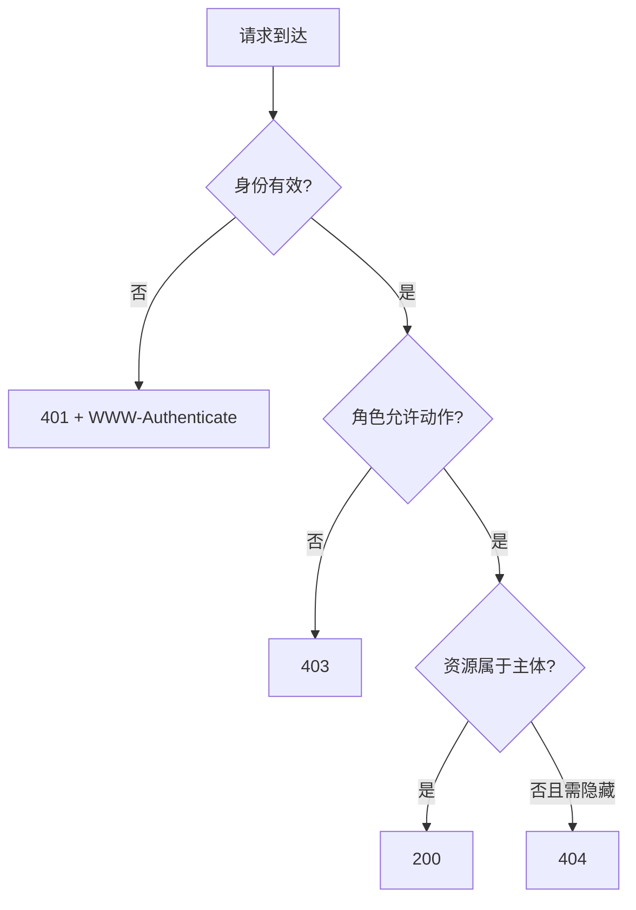

<div class="be-tutor-mount" data-tutor-lesson="web-engineering-03" aria-hidden="true"></div>

# 资源所有权、角色授权与审计日志

<section data-context-type="overview" data-learning-context="overview-resource-authorization" id="overview-resource-authorization" markdown="1">

## 一条学习记录属于谁

Web v0.11 用 `owner_user_id` 把学习记录绑定到主体。角色只说明一组允许动作，不能替代资源所有权判断，也不是万能钥匙。

同一个 `GET /api/learners/{id}`，可能得到三个不同结果：匿名请求没有身份，返回 401；学习者读取自己的资源，返回 200；学习者猜到别人的资源 ID，返回不可见的 404。操作员虽然已登录，但没有读取学习数据的动作权限，因此返回 403。


</section>

<section data-context-type="concept" data-learning-context="concept-default-deny" id="concept-default-deny" markdown="1">

## 默认拒绝，逐项放行

代码只声明确定需要的动作。没有出现在矩阵里的角色、动作或组合一律拒绝：

| 角色 | `status:read` | `session:write` | `diagnostic:run` |
| --- | --- | --- | --- |
| `learner` | 仅本人资源 | 仅本人资源 | 拒绝 |
| `operator` | 拒绝 | 拒绝 | 允许 |
| 未知角色 | 拒绝 | 拒绝 | 拒绝 |

认证回答“你是谁”，角色授权回答“这个角色能做什么”，资源授权回答“你能否操作这一条记录”。三个判断缺一不可。把 `is_authenticated` 当成授权，会让任何已登录账号得到所有受保护能力。

`0003_ownership_audit.py` 给 `learners` 增加可索引的 `owner_user_id` 外键，并创建 `audit_events`。外键负责引用完整性，应用仍要在查询条件中同时带上资源 ID 和主体 ID，不能先查出资源再靠页面隐藏。
</section>

<section data-context-type="example" data-learning-context="example-401-403-404" id="example-401-403-404" markdown="1">

## 401、403、404 的资源语义

用主体 `u1`、他人主体 `u2` 和操作员 `op` 预测请求结果：

| 主体 | 动作 | 资源所有者 | 结果 | 原因 |
| --- | --- | --- | ---: | --- |
| 匿名 | `status:read` | `u1` | 401 | 没有有效身份 |
| `u1` / learner | `status:read` | `u1` | 200 | 动作与所有权都满足 |
| `u2` / learner | `status:read` | `u1` | 404 | 不透露资源是否存在 |
| `u1` / learner | `diagnostic:run` | 无 | 403 | 角色没有动作权限 |
| `op` / operator | `diagnostic:run` | 无 | 200 | 明确授权的诊断动作 |
| `op` / operator | `status:read` | `op` | 403 | 操作员不自动获得数据读取权 |

404 是这套资源接口的隐匿策略，不是所有授权失败都必须返回 404。对已经可见的功能入口，如果身份有效但角色不足，403 更能准确表达拒绝原因。
</section>

<section data-context-type="reproduce" data-learning-context="reproduce-dashboard-v11" id="reproduce-dashboard-v11" markdown="1">

## 运行所有权实验

```bash
cd site-src/examples/web-engineering/learning-dashboard-v11
../../../../.venv/bin/python -m unittest -v test_authorization_lab.py
```

八项测试固定覆盖匿名 401、本人 200、他人资源 404、学习者越权 403、操作员诊断 200、未知角色默认拒绝、操作员不能读学习数据，以及审计字段脱敏。

`safe_log()` 只输出主体、动作、资源、结果和 request ID。下面是允许出现的形状：

```json
{
  "subject": "u1",
  "action": "status:read",
  "resource": "learner:r2",
  "result": "allowed",
  "request_id": "req-safe"
}
```

密码、Cookie、Authorization、会话令牌和 CSRF 原文都不属于审计事件。request ID 用来串联一次请求的应用日志与审计结果，本身不是身份凭据。
</section>

<section data-context-type="modify" data-learning-context="modify-permission-matrix" id="modify-permission-matrix" markdown="1">

## 主动修改：新增动作

新增 `report:export`，只允许学习者导出自己的记录。先修改测试，不要先改实现：

1. `learner + 本人资源` 预期 200。
2. `learner + 他人资源` 预期 404。
3. `operator` 预期 403。
4. 未知角色预期 403。
5. 四条路径都必须写审计结果与 request ID。

测试先红后，再把动作加入 learner 的允许集合，并把它放进需要所有权判断的动作集合。这样可以证明新增能力没有意外扩大 operator 权限。
</section>

<section data-context-type="troubleshoot" data-learning-context="troubleshoot-audit-redaction" id="troubleshoot-audit-redaction" markdown="1">

## 审计日志出现敏感值怎么办

先停止继续记录，再按字段来源定位，而不是在日志平台里做字符串替换：

| 现象 | 常见原因 | 修复 |
| --- | --- | --- |
| 出现完整 Cookie | 记录了全部请求头 | 改成显式字段白名单 |
| 出现 CSRF 值 | 把表单或请求头整体序列化 | 只记录校验结果 |
| 403 没有主体 | 授权前没有建立身份上下文 | 在认证成功后传入主体 ID |
| 他人资源返回 403 | 先判断角色，未执行隐匿查询 | 用 `resource_id + owner_user_id` 查询 |
| 未知动作返回 200 | 使用“非拒绝即允许”分支 | 改成允许集合并默认拒绝 |

如果敏感值已经落盘，要按事件响应处理：确定日志保留范围、限制访问、使相关会话失效，再补自动化脱敏测试。不要在复盘文档中再次粘贴泄露原文。
</section>

<section data-context-type="project" data-learning-context="project-dashboard-v11" id="project-dashboard-v11" markdown="1">

## 学习进度报告器 Web v0.11

- 上一版：用户可以登录，服务端会话可到期与撤销。
- 这一版：`owner_user_id`、角色动作矩阵、默认拒绝与 `audit_events` 进入系统。
- 关键文件：`authorization_lab.py`、`test_authorization_lab.py`、`0003_ownership_audit.py`。
- 应保存的记录：权限矩阵、六种响应对照、脱敏审计样本和新增动作的拒绝测试。
- 下一版：前端根据 401、403 和成功结果进入不同状态，并交给浏览器 E2E 验证。

本实验使用合成身份，不包含真实用户数据，也不实现“超级管理员”。需要增加管理动作时，仍要逐项写进矩阵并补资源范围。
</section>

## 四类学习者入口

- 零基础兴趣：先按权限矩阵手算六个请求结果，再运行测试核对。
- 有基础兴趣：检查所有权过滤是否与动作授权同时存在。
- 零基础求职：保存 401、403、404 和审计事件对照。
- 有基础求职：补充批量接口、后台任务和默认拒绝的评审清单。

<section data-context-type="career" data-learning-context="career-authorization-review" id="career-authorization-review" markdown="1">

## 求职加练：操作员误读学习者数据

原创追问：新诊断接口错误复用了“已登录即可”的依赖，你如何修复权限矩阵、资源查询和审计，并证明没有扩大 operator 权限？回答至少给出一条默认拒绝测试、一条他人资源隐匿测试和一条日志脱敏测试。
</section>

## 完成检查

- 能从矩阵推导出 401、403 与不可见 404。
- 能解释身份、角色动作和资源所有权三个判断的顺序。
- 未知角色、未知动作和 operator 数据读取都默认拒绝。
- 审计事件不含凭据原文，且能用 request ID 定位请求。

## 来源与版本

适用 Python 3.11 与 Web v0.11；核查日期 2026-07-23。参考 [RFC 9110](https://www.rfc-editor.org/rfc/rfc9110.html) 与 [OWASP Authorization Cheat Sheet](https://cheatsheetseries.owasp.org/cheatsheets/Authorization_Cheat_Sheet.html)。本课的 404 隐匿是本项目资源策略，不外推为所有 API 的唯一做法。

## 下一步

继续进入 [会话前端、端到端测试与持续集成](04-session-frontend-e2e-ci.md)。
