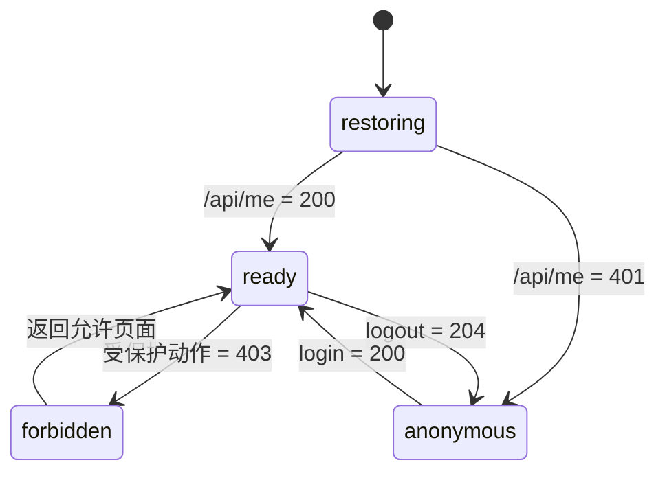

<div class="be-tutor-mount" data-tutor-lesson="web-engineering-04" aria-hidden="true"></div>

# 会话前端、端到端测试与持续集成

<section data-context-type="overview" data-learning-context="overview-session-frontend" id="overview-session-frontend" markdown="1">

## 刷新以后，身份从服务端恢复

Web v0.12 保持原生 TypeScript。页面刷新会清空 JavaScript 内存，但浏览器仍可自动携带 HttpOnly Cookie，因此前端启动后的第一件事是请求 `/api/me`，而不是从 `localStorage` 读取一个自称“已登录”的对象。



这条状态机让身份来源保持单一：服务端会话是事实，前端只负责展示当前结果。手工改浏览器内存最多改变界面，不能绕过服务端授权。
</section>

<section data-context-type="concept" data-learning-context="concept-memory-csrf" id="concept-memory-csrf" markdown="1">

## 前端只短暂保存 CSRF

会话 Cookie 为 HttpOnly，JavaScript 读不到；登录响应中的 CSRF 值只保存在内存状态，退出时与主体信息一起清空。

| 状态 | `userId` | CSRF | 页面 |
| --- | --- | --- | --- |
| `restoring` | 未知 | 空 | 加载提示 |
| `anonymous` | 空 | 空 | 登录视图 |
| `ready` | 有 | 当前会话值 | 学习看板 |
| `forbidden` | 有 | 保留或重新确认 | 权限说明 |

刷新后 `/api/me` 可以恢复身份，却不能从 HttpOnly Cookie 还原 CSRF 原文。可采用一个专门的同源接口重新签发或返回当前会话的 CSRF 值；不要为了“方便恢复”把原值写入 `localStorage`、URL 或非 HttpOnly Cookie。

`src/session.ts` 把 401 映射到 `anonymous`、403 映射到 `forbidden`，其他成功响应映射到 `ready`。状态转换是纯函数，适合先用 Node 测试，再让浏览器测试验证真实页面。
</section>

<section data-context-type="example" data-learning-context="example-route-status" id="example-route-status" markdown="1">

## 状态码驱动恢复路径

| API 结果 | 页面反应 | 不能做的事 |
| ---: | --- | --- |
| 200 | 更新主体并进入看板 | 不把响应缓存成永久身份 |
| 204 | 退出成功，清空身份状态 | 不继续显示旧学习数据 |
| 401 | 回登录页并保留统一说明 | 不自动重复提交密码 |
| 403 | 展示权限解释与返回入口 | 不把它伪装成“网络失败” |
| 5xx/网络失败 | 显示可重试故障状态 | 不擅自判定会话失效 |

401 与网络失败必须分开。前者是服务端明确拒绝当前身份，后者可能只是结果未知；对写请求盲目重试会造成重复提交，应继续沿用 v0.8 的幂等键。
</section>

<section data-context-type="reproduce" data-learning-context="reproduce-dashboard-v12" id="reproduce-dashboard-v12" markdown="1">

## 运行状态测试和浏览器检查

```bash
cd site-src/examples/web-engineering/learning-dashboard-v12
npm ci
npm test
npx playwright test
```

Node 测试固定输出：

```json
{"login_checked":true,"refresh_me_checked":true,"forbidden_checked":true,"logout_clears_memory":true,"assertions":7}
```

Playwright 配置先完成 TypeScript 构建，再从本机启动 MkDocs 与连接 PostgreSQL 的 FastAPI 应用，避免构建产物触发预览服务重载。六节 Web 工程化课程、共同基座方向选择课和三节算法求职加练在桌面浅色、390px 深色与减少动画、禁用 JavaScript 三种环境下仍能阅读；键盘路径在桌面项目验证一次。登录、刷新、写入、越权和退出在桌面与移动项目各走一遍。当前套件为 33 项通过、6 项按项目条件跳过，结果写到 `/private/tmp`。

交互式应用的浏览器场景应串联登录、刷新恢复、本人写入、越权、退出；CI 先完成 Alembic 迁移并连接真实 PostgreSQL，再启动 API 与浏览器。课程页面可读性检查与应用业务 E2E 是两组不同测试，不能互相替代。
</section>

<section data-context-type="modify" data-learning-context="modify-accessible-login" id="modify-accessible-login" markdown="1">

## 主动修改：让登录错误可用键盘处理

给登录失败说明加上可聚焦的状态区域。提交错误密码后，焦点移动到错误标题；用户按 Shift+Tab 能回到密码框，修正后再次提交。不要只用红色边框表达失败，也不要在错误文本中区分“用户不存在”和“密码错误”。

随后补两个浏览器断言：错误区域获得焦点，窄屏下没有水平滚动。开启 `reducedMotion` 时取消非必要过渡，但保留状态变化本身。
</section>

<section data-context-type="troubleshoot" data-learning-context="troubleshoot-frontend-session" id="troubleshoot-frontend-session" markdown="1">

## 刷新后回到匿名状态

按请求链逐层排查：

1. 浏览器是否向 `/api/me` 发送了 Cookie。
2. Cookie 的域、路径、SameSite、Secure 是否与当前地址匹配。
3. `/api/me` 是 401、5xx，还是根本没有发出请求。
4. API 是否连接了正确的数据库和当前会话记录。
5. 前端是否让较晚返回的旧请求覆盖了较新的登录状态。

| CI 现象 | 优先检查 |
| --- | --- |
| `ERR_CONNECTION_REFUSED` | webServer/数据库是否就绪 |
| 偶发找不到元素 | 是否等待了可感知状态、选择器是否基于角色 |
| 单独通过、全量失败 | 数据是否隔离、会话是否在用例间泄露 |
| 只在移动端失败 | 视口、遮挡、滚动与焦点顺序 |
| 禁用 JS 后空白 | 正文是否依赖客户端渲染 |

不要用固定的长 `sleep` 掩盖竞争。等待具体的 HTTP 状态、可访问名称或数据库就绪信号，失败时保留 trace。
</section>

<section data-context-type="project" data-learning-context="project-dashboard-v12" id="project-dashboard-v12" markdown="1">

## 学习进度报告器 Web v0.12

- 上一版：服务端完成身份、动作权限、所有权与审计。
- 这一版：前端拆分登录、看板、会话状态和 URL 路由，并建立 Node 与 Playwright 两层检查。
- 关键文件：`src/session.ts`、`test_session.mjs`、`playwright.config.ts`、`tests/`。
- 应保存的记录：四种状态转换、桌面与 390px 结果、键盘路径、禁用 JavaScript 页面。
- 下一版：把应用和 PostgreSQL 放进可重复启动的非 root 容器拓扑。
</section>

## 四类学习者入口

- 零基础兴趣：先运行状态机测试，再用键盘走登录和退出。
- 有基础兴趣：直接验证刷新恢复、旧响应和错误路由。
- 零基础求职：保存桌面与 390px 的成功、401、403 截图。
- 有基础求职：补充 Playwright trace 和 CI 数据库诊断记录。

<section data-context-type="career" data-learning-context="career-e2e-failure" id="career-e2e-failure" markdown="1">

## 求职加练：E2E 只在 CI 偶发失败

原创追问：如何区分服务未就绪、数据库污染、选择器脆弱和动画时序，并把修复变成确定性检查？回答要给出失败时保留的 trace、等待条件以及防止跨用例会话污染的方法。
</section>

## 完成检查

- 401、403、退出和网络失败分别触发可预测的界面状态。
- 刷新通过服务端恢复身份，不读取浏览器持久身份副本。
- CSRF 原文不进入 URL、日志或 `localStorage`。
- 桌面、390px、深浅色、键盘、减少动画和禁用 JavaScript 路径都有检查。
- 应用业务 E2E 使用真实服务和 PostgreSQL，不以课程页面检查替代。

## 来源与版本

适用 Node 24、TypeScript 7 与 Playwright 1.55.1；核查日期 2026-07-23。参考 [Playwright webServer](https://playwright.dev/docs/test-webserver) 与 [Playwright 可访问性定位器](https://playwright.dev/docs/locators#locate-by-role)。

## 下一步

继续进入 [容器、配置、健康检查与优雅停止](05-containers-config-health-graceful-shutdown.md)。
