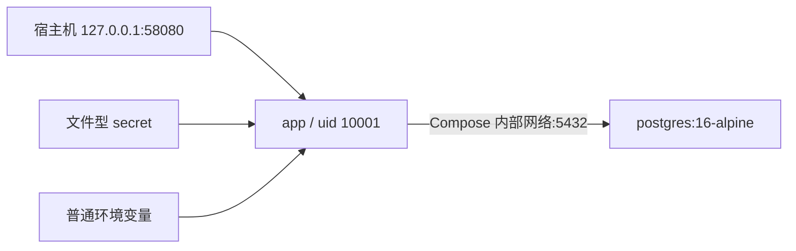
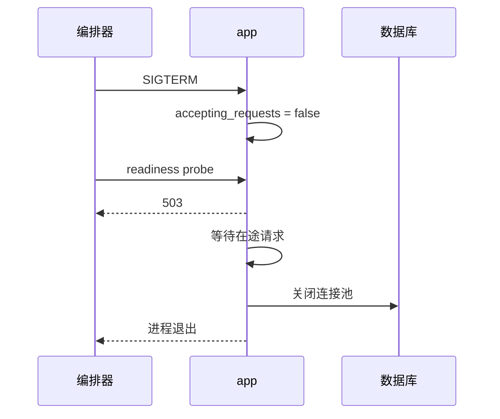

<div class="be-tutor-mount" data-tutor-lesson="web-engineering-05" aria-hidden="true"></div>

# 容器、配置、健康检查与优雅停止

<section data-context-type="overview" data-learning-context="overview-container-topology" id="overview-container-topology" markdown="1">

## 容器启动不等于服务就绪

Web v0.13 有 `app` 与 PostgreSQL 两个服务。应用镜像以非 root 用户运行，宿主机端口只绑定 `127.0.0.1`；数据库没有映射到外部网卡。



Compose 显示 `Up` 只说明容器进程仍在。应用能不能接受流量，还要看必需配置是否存在、秘密文件能否读取、数据库能否建立连接。
</section>

<section data-context-type="concept" data-learning-context="concept-live-ready" id="concept-live-ready" markdown="1">

## 存活与就绪分开回答

`/health/live` 回答进程是否活着；`/health/ready` 回答此刻能否处理依赖数据库的请求。两者不能共用同一个“永远 200”的实现。

| 应用状态 | live | ready | 是否接流量 |
| --- | ---: | ---: | --- |
| 进程运行，配置齐全，数据库可查询 | 200 | 200 | 是 |
| 进程运行，缺 `DATABASE_URL` | 200 | 503 | 否 |
| 进程运行，数据库连接失败 | 200 | 503 | 否 |
| 正在优雅停止 | 200 或即将终止 | 503 | 否 |
| 进程已退出 | 无响应 | 无响应 | 否 |

readiness 的数据库检查执行一个轻量 `SELECT 1`，并设定短超时。它不应运行大查询，也不应把连接错误、密码或完整 URL返回给客户端。
</section>

<section data-context-type="example" data-learning-context="example-secret-file" id="example-secret-file" markdown="1">

## 普通配置与文件秘密分界

| 配置 | 形式 | 是否可提交 |
| --- | --- | --- |
| `APP_ENV=production` | 环境变量 | 可以 |
| 数据库主机与库名 | 环境变量 | 可以，不含密码 |
| PostgreSQL 密码 | 文件型 secret | 只提交示例占位值 |
| 真实 Cookie 签名材料 | 文件型 secret | 不提交 |
| 日志级别 | 环境变量 | 可以 |

应用读取 `DATABASE_PASSWORD_FILE` 指向的文件，再把内容注入连接 URL。生产模式缺少必需值时必须拒绝就绪，不能悄悄回退到教学密码或开发数据库。

多阶段 Dockerfile 在构建阶段安装依赖，在运行阶段只复制运行需要的文件；最后使用固定的非 root UID。这样既缩小镜像内容，也让运行身份可自动检查。
</section>

<section data-context-type="reproduce" data-learning-context="reproduce-dashboard-v13" id="reproduce-dashboard-v13" markdown="1">

## 启动并检查 Compose 拓扑

```bash
cd site-src/examples/web-engineering/learning-dashboard-v13
docker compose config
docker compose up -d --build
curl -sS http://127.0.0.1:58080/health/live
curl -sS http://127.0.0.1:58080/health/ready
docker compose exec -T app id
```

实际运行的响应形状是：

```text
{"status":"live"}
{"status":"ready"}
uid=10001(appuser) gid=10001(appuser) groups=10001(appuser)
```

`depends_on.condition: service_healthy` 让 app 等数据库健康后启动，但应用仍保留自己的 readiness。编排顺序减少启动竞争，不能替代运行期依赖检查。

结束实验执行 `docker compose stop`。这会停止进程但保留容器与命名卷；只有明确不再需要教学数据时，才考虑删除资源。
</section>

<section data-context-type="modify" data-learning-context="modify-readiness" id="modify-readiness" markdown="1">

## 主动修改：模拟数据库未就绪

先运行 Python 测试，它用不可达的本机端口验证连接失败：

```bash
../../../../.venv/bin/python -m unittest -v test_app.py
```

四项测试确认 live 不依赖数据库、缺配置返回 503、数据库不可达返回 503，以及 TestClient 生命周期结束后应用停止接新请求。

然后把 Compose 中的数据库健康命令临时改错，观察 app 不会被标成可用；恢复配置，再看到 readiness 从 503 变回 200。修改完要还原教学文件，不提交故障值。
</section>

<section data-context-type="troubleshoot" data-learning-context="troubleshoot-graceful-stop" id="troubleshoot-graceful-stop" markdown="1">

## 停止时不要丢在途请求

一次合理的停止顺序是：收到 SIGTERM，立即把 readiness 改成 503，停止接收新业务请求，等待短时间内的在途请求完成，关闭数据库连接池，最后退出进程。



| 现象 | 检查 |
| --- | --- |
| 容器 Up，ready 503 | 配置、secret 文件、数据库 DNS 与健康 |
| ready 200，但请求失败 | readiness 是否只返回常量 |
| SIGTERM 后立刻断开 | 服务器优雅超时和应用 lifespan |
| 连接池仍有连接 | shutdown 是否调用关闭方法 |
| 只有宿主机外部能访问 | 端口是否误绑定 `0.0.0.0` |

不要用强制杀进程证明“优雅停止”。强制终止只能作为超时后的最后手段，测试要先证明正常信号路径完成了状态切换和资源关闭。
</section>

<section data-context-type="project" data-learning-context="project-dashboard-v13" id="project-dashboard-v13" markdown="1">

## 学习进度报告器 Web v0.13

- 上一版：API、TypeScript 状态与浏览器检查可以在宿主机运行。
- 这一版：加入多阶段非 root Dockerfile、`app + postgres` Compose、配置门禁、live/ready 和停止生命周期。
- 关键文件：`Dockerfile`、`compose.yaml`、`app.py`、`test_app.py`、`secrets/postgres_password.example`。
- 应保存的记录：镜像构建、两个健康响应、运行 UID、缺配置和数据库不可达结果。
- 下一版：在这个可运行拓扑上增加日志、指标、备份恢复和发布回滚门禁。

本课只在本机回环地址提供明文 HTTP，不包含公网 TLS、域名或云平台配置。示例 secret 不是生产凭据。
</section>

## 四类学习者入口

- 零基础兴趣：先看 app、db 两个服务和端口映射。
- 有基础兴趣：检查镜像层、运行用户、secret 与健康依赖。
- 零基础求职：保存缺配置拒绝就绪与 ready 503 结果。
- 有基础求职：补充 SIGTERM、在途请求和连接池关闭时序。

<section data-context-type="career" data-learning-context="career-readiness-incident" id="career-readiness-incident" markdown="1">

## 求职加练：容器是 Up 但请求全失败

原创追问：如何用 live、ready、数据库健康和配置来源定位故障，并避免编排器持续把流量发给坏实例？回答需要给出一个不会泄露数据库密码的诊断顺序，以及 SIGTERM 后的停止时序。
</section>

## 完成检查

- 镜像运行身份是 `uid=10001(appuser)`，不是 root。
- 应用端口只绑定宿主机 `127.0.0.1`。
- 数据库未就绪或配置缺失时 readiness 返回 503，live 仍能反映进程状态。
- 停止阶段先拒绝新流量，再关闭连接池并退出。
- 能说明示例 secret、本机 HTTP 与生产部署之间的差距。

## 来源与版本

适用 Docker Engine 29、Compose 5、Python 3.11/3.12、PostgreSQL 16；核查日期 2026-07-23。参考 [Docker Compose 启动顺序](https://docs.docker.com/compose/how-tos/startup-order/) 与 [Dockerfile USER](https://docs.docker.com/reference/dockerfile/#user)。

## 下一步

继续进入 [指标、备份、发布与回滚演练](06-observability-backup-release-rollback.md)。
