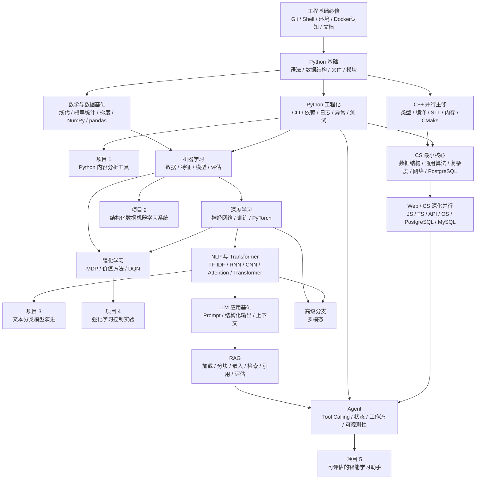

# Python、AI 与 LLM 能力依赖图

这张图是 Python、AI 与 LLM 专项关系图，不定义全仓库学习顺序。完整顺序以[小白统一学习路线](../learning-paths/beginner-roadmap.md)为准。

## 核心依赖

## 学习原则

- **完整前置**：Git、Shell、Docker最小认知、Python 基础、必要数学和对应模型原理需要先形成连续课程。
- **算法分层**：CS 先学通用算法与复杂度；AI 再学机器学习、深度学习、NLP/Transformer 和强化学习等模型算法。
- **项目回链**：进入项目后，每个里程碑继续链接基础课，说明这里实际使用了哪些知识。
- **不强行串联**：机器学习项目、强化学习实验和 Agent 项目不共享同一业务背景。
- **不按框架建项目**：LangChain、LangGraph、Dify、Coze 等是实现方案或对照实验。
- **先评估再扩展**：微调、多模态和复杂 Agent 只有在现有方案评估不足时才进入。

## 项目顺序

这些项目按统一路线阶段解锁，不要求学习者在开始时同时查看：

- Python起步后：[Python 内容分析工具](../projects/python-content-analysis/README.md)。
- AI阶段：[结构化数据机器学习系统](../projects/structured-data-ml-system/README.md)和[文本分类模型演进](../projects/text-classification-evolution/README.md)。
- AI独立分支：[强化学习控制实验](../projects/reinforcement-learning-control-lab/README.md)。
- LLM/Agent阶段：[可评估的智能学习助手](../projects/intelligent-learning-assistant/README.md)。

## 来源状态与加工进度

当前外部来源已经登记，但公开课程按统一顺序逐阶段加工：

- 工程、C++、CS和Web可从[CS自学指南目录](../content-inbox/external-source-catalog.md)按需筛选。
- Python类型和Web API可从FastAPI官方文档按需核查。
- AI与LLM候选内容来自已审计的大模型笔记，但仍需逐单元加工。
- “已登记来源”不等于“公开课程已完成”。
