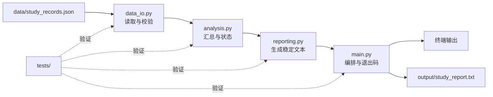

# 阶段作品：学习进度报告器

<div class="be-sample-tutor-mount" data-tutor-context-lesson="sample-study-progress-reporter" aria-hidden="true"></div>

<section id="overview-product" class="be-sample-hero" data-learning-context="overview-product" data-context-type="overview" markdown="1">

<span class="be-sample-kicker">项目整合样板 · Python 起步 v1.0</span>

## 七节课，不是七个互不相关的练习

你从三行学习档案开始，逐步得到一个能读取 JSON、校验数据、汇总进度、生成报告并通过 14 项测试的小型程序。每一版都能运行，每一课只增加一个可解释的能力。

```text
学习进度报告
总计划：19 小时
总完成：18 小时
课程状态：
- Python 函数: 100%，已完成
- 常用数据结构: 62%，还需 3 小时
- 文件与 JSON: 100%，已完成
```

<div class="be-sample-actions" markdown="1">
[沿版本线查看](#concept-version-line){ .md-button .md-button--primary }
[查看正式作品代码](../../../exercises/python-basics/study-progress-reporter/README.md){ .md-button }
</div>

</section>

<section id="concept-version-line" class="be-sample-learning-unit" data-learning-context="concept-version-line" data-context-type="concept" markdown="1">

## 版本线：每一课都回答“这次增加了什么”

<div class="be-version-line" role="list" aria-label="学习进度报告器从 v0.1 到 v1.0 的七个里程碑">
  <article role="listitem"><b>v0.1</b><span>变量与输出</span><small>一条学习档案</small></article>
  <article role="listitem"><b>v0.2</b><span>条件与循环</span><small>状态和重复处理</small></article>
  <article role="listitem"><b>v0.3</b><span>函数</span><small>可复用报告逻辑</small></article>
  <article role="listitem"><b>v0.4</b><span>容器</span><small>多条学习记录</small></article>
  <article role="listitem"><b>v0.5</b><span>文件与 JSON</span><small>数据和代码分离</small></article>
  <article role="listitem"><b>v0.6</b><span>模块与环境</span><small>职责拆分</small></article>
  <article role="listitem"><b>v1.0</b><span>异常与测试</span><small>稳定失败和回归证据</small></article>
</div>

这条线不是说第一课就要理解最终架构，而是让学习者始终知道：当前版本能做什么、限制在哪里、下一课为什么值得学。

</section>

<section id="example-milestones" class="be-sample-learning-unit" data-learning-context="example-milestones" data-context-type="example" markdown="1">

## 三个可运行快照：亲眼看见程序长大

=== "v0.1：只有变量"

    ```python
    --8<-- "reviews/course-content/batch-a/examples/study-reporter/v0.1/main.py"
    ```

    ```bash
    python3 reviews/course-content/batch-a/examples/study-reporter/v0.1/main.py
    ```

=== "v0.3：逻辑进入函数"

    ```python
    --8<-- "reviews/course-content/batch-a/examples/study-reporter/v0.3/main.py"
    ```

    ```bash
    python3 reviews/course-content/batch-a/examples/study-reporter/v0.3/main.py
    ```

=== "v0.5：数据来自 JSON"

    ```python
    --8<-- "reviews/course-content/batch-a/examples/study-reporter/v0.5/main.py"
    ```

    ```bash
    python3 reviews/course-content/batch-a/examples/study-reporter/v0.5/main.py
    ```

比较时不要只数代码行。请回答：数据放在哪里、计算放在哪里、改变一条记录要修改代码还是数据文件。

</section>

<section id="reproduce-final" class="be-sample-learning-unit" data-learning-context="reproduce-final" data-context-type="reproduce" markdown="1">

## 复现最终版本：运行结果与测试证据

正式作品仍位于既有目录，本样板不复制或修改它：

```bash
cd exercises/python-basics/study-progress-reporter
python3 main.py
python3 -m unittest discover -s tests -v
```

成功证据：

- 主程序返回退出码 `0`。
- 终端打印汇总，并生成 `output/study_report.txt`。
- 14 项测试全部显示 `ok`。
- 输入文件运行前后保持一致。

<div class="be-sample-check" role="status">
  <strong>不要只保存“测试通过”四个字</strong>
  <span>保留命令、测试数量、关键输出和本次运行日期，别人才能复现。</span>
</div>

</section>

<section id="concept-architecture" class="be-sample-learning-unit" data-learning-context="concept-architecture" data-context-type="concept" markdown="1">

## 最终结构：每个模块只有一个主要理由会发生变化



这不是为了“文件越多越专业”。拆分的价值是：读取格式变化时主要检查 `data_io.py`，报告文字变化时主要检查 `reporting.py`，每部分都能独立测试。

</section>

<section id="troubleshoot-evidence" class="be-sample-learning-unit" data-learning-context="troubleshoot-evidence" data-context-type="troubleshoot" markdown="1">

## 失败不是附录：它是项目可信度的一部分

在临时副本中任选一个实验，不要破坏固定样例：

| 受控变化 | 预期现象 | 恢复后必须证明 |
| --- | --- | --- |
| 暂时改名输入文件 | 标准错误说明找不到文件，返回非零退出码 | 恢复文件名后主程序重新成功 |
| 删除 JSON 中一个逗号 | 报告 JSON 解析位置 | 恢复语法后 14 项测试通过 |
| 把 `target_hours` 改成 0 | 结构校验拒绝非法范围 | 改回正数后报告内容正确 |
| 故意改错测试期望 | 测试先失败并显示差异 | 恢复期望后回归全绿 |

失败记录至少包括：触发条件、实际错误、定位依据、最小修复和回归结果。

</section>

<section id="modify-project" class="be-sample-learning-unit" data-learning-context="modify-project" data-context-type="modify" markdown="1">

## 迁移修改：增加一个状态，但保持旧契约

在临时副本中为学习记录增加 `paused` 布尔字段：

- `paused` 为 `true` 时，课程状态显示“已暂停”。
- 未提供该字段时保持现有行为。
- 汇总总计划和总完成的规则不改变。
- 至少新增一个测试，并先看到它在功能实现前失败。

这里不提供完整实现。验收重点不是写出一个 `if`，而是你能否说明数据契约放在哪里校验、报告逻辑放在哪里、哪些旧测试证明没有破坏既有功能。

</section>

<section id="career-story" class="be-sample-learning-unit" data-learning-context="career-story" data-context-type="career" markdown="1">

## 求职叙事：用证据说清一个小项目

<div class="be-story-chain" aria-label="项目表达从问题到改进的五段链条">
  <span><b>问题</b>学习记录散落，无法稳定汇总</span>
  <span><b>设计</b>JSON 数据、分层模块、稳定文本契约</span>
  <span><b>失败</b>缺失文件、坏 JSON、非法字段</span>
  <span><b>验证</b>退出码、标准错误、14 项回归测试</span>
  <span><b>改进</b>下一阶段加入 CLI、日志、配置与 CI</span>
</div>

面试时不要夸大为“生产级平台”。更可信的表达是：这是一个学习阶段作品，你能解释数据流、模块边界、失败策略、测试证据和下一步工程化方向。

</section>

<section id="project-next" class="be-sample-project-panel" data-learning-context="project-next" data-context-type="project" markdown="1">

## 项目出口：完成不是停止，而是获得选择权

| 方向 | 可以怎样继续演进 |
| --- | --- |
| Python 工程化 | 类型检查、可安装 CLI、配置、日志和 CI |
| Web 应用 | API、数据库和可视化学习工作台 |
| C++ / 系统 | 用相同数据与输出契约实现双语言版本 |
| 算法与 CS | 为查找、排序和汇总建立可追踪实验 |
| AI / Agent | 在可靠数据和评估基础上增加智能分析与工具调用 |

阶段作品的真正价值，是把多节课的知识变成一份能运行、能解释、能失败、能验证、还能继续演进的共同对象。

</section>

??? info "新手补给：先演示哪三件事"
    先运行主程序，再展示一个失败场景，最后运行全部测试。不要一开始逐文件讲代码。

??? note "深入理解：测试不是为了追求数量"
    14 项只是当前覆盖。判断质量要看正常、边界、失败和副作用是否被验证，以及失败信息能否定位问题。

??? success "求职训练：项目追问自检"
    准备回答：为什么用 JSON、为什么拆模块、为什么不捕获所有异常、怎样证明输入没被修改、需求变化时先改哪个测试。

## 完成检查

- [ ] 能沿版本线说明每一课给项目增加了什么。
- [ ] 能运行三个小型快照和正式 `v1.0`。
- [ ] 能画出或复述最终数据流与模块职责。
- [ ] 完成一次失败实验并保留回归证据。
- [ ] 能用“问题—设计—失败—验证—改进”讲清项目，不夸大经历。

[回到批次 A 评审说明](README.md){ .md-button .md-button--primary }

