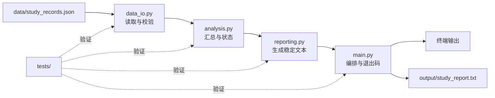

# 阶段作品：学习进度报告器

<div class="be-sample-tutor-mount" data-tutor-context-lesson="sample-study-progress-reporter" aria-hidden="true"></div>

<section id="overview-product" class="be-sample-hero" data-learning-context="overview-product" data-context-type="overview" markdown="1">

<span class="be-sample-kicker">项目整合样板 · Python 起步 v1.0</span>

## 从三行输出，长成一个完整的小程序

第一课的程序只会打印昵称、课程和计划时间。七节课以后，它已经能读取 JSON、检查数据、汇总进度、生成报告，并通过 14 项测试。中间没有突然跳到“最终答案”，每一版都能单独运行。

```text
学习进度报告
总计划：19 小时
总完成：18 小时
课程状态：
- Python 函数: 100%，已完成
- 常用数据结构: 62%，还需 3 小时
- 文件与 JSON: 100%，已完成
```

<div class="be-sample-actions" markdown="1">
[沿版本线查看](#concept-version-line){ .md-button .md-button--primary }
[查看正式作品代码](../../../exercises/python-basics/study-progress-reporter/README.md){ .md-button }
</div>

</section>

<section id="concept-version-line" class="be-sample-learning-unit" data-learning-context="concept-version-line" data-context-type="concept" markdown="1">

## 看看它每一版多会了什么

<div class="be-version-line" role="list" aria-label="学习进度报告器从 v0.1 到 v1.0 的七个里程碑">
  <article role="listitem"><b>v0.1</b><span>变量与输出</span><small>一条学习档案</small></article>
  <article role="listitem"><b>v0.2</b><span>条件与循环</span><small>状态和重复处理</small></article>
  <article role="listitem"><b>v0.3</b><span>函数</span><small>可复用报告逻辑</small></article>
  <article role="listitem"><b>v0.4</b><span>容器</span><small>多条学习记录</small></article>
  <article role="listitem"><b>v0.5</b><span>文件与 JSON</span><small>数据和代码分离</small></article>
  <article role="listitem"><b>v0.6</b><span>模块与环境</span><small>职责拆分</small></article>
  <article role="listitem"><b>v1.0</b><span>异常与测试</span><small>错误能说明白，修改后能回归</small></article>
</div>

第一课当然不需要理解最终的模块结构。版本线只是帮你随时回答三个问题：现在能做什么，还缺什么，下一课为什么要学。

</section>

<section id="example-milestones" class="be-sample-learning-unit" data-learning-context="example-milestones" data-context-type="example" markdown="1">

## 跑三个版本，看看程序怎么长大

=== "v0.1：只有变量"

    ```python
    --8<-- "reviews/course-content/batch-a/examples/study-reporter/v0.1/main.py"
    ```

    ```bash
    python3 reviews/course-content/batch-a/examples/study-reporter/v0.1/main.py
    ```

=== "v0.3：逻辑进入函数"

    ```python
    --8<-- "reviews/course-content/batch-a/examples/study-reporter/v0.3/main.py"
    ```

    ```bash
    python3 reviews/course-content/batch-a/examples/study-reporter/v0.3/main.py
    ```

=== "v0.5：数据来自 JSON"

    ```python
    --8<-- "reviews/course-content/batch-a/examples/study-reporter/v0.5/main.py"
    ```

    ```bash
    python3 reviews/course-content/batch-a/examples/study-reporter/v0.5/main.py
    ```

运行以后，别只比较代码变长了多少。看看数据放在哪里、计算放在哪里，以及修改一条学习记录时还需不需要改代码。

</section>

<section id="reproduce-final" class="be-sample-learning-unit" data-learning-context="reproduce-final" data-context-type="reproduce" markdown="1">

## 把最终版本跑起来

正式作品就在原来的练习目录里。进入目录后依次运行主程序和测试：

```bash
cd exercises/python-basics/study-progress-reporter
python3 main.py
python3 -m unittest discover -s tests -v
```

正常情况下，你会看到：

- 主程序返回退出码 `0`。
- 终端打印汇总，并生成 `output/study_report.txt`。
- 14 项测试全部显示 `ok`。
- 输入文件运行前后保持一致。

<div class="be-sample-check" role="status">
  <strong>把这次运行记完整</strong>
  <span>留下命令、测试数量、关键输出和运行日期。以后自己回看，或者让别人复现，都会轻松很多。</span>
</div>

</section>

<section id="concept-architecture" class="be-sample-learning-unit" data-learning-context="concept-architecture" data-context-type="concept" markdown="1">

## 四个模块，各管一件事



文件拆开以后，修改会更有方向：输入格式变了，先看 `data_io.py`；报告文字要调整，先看 `reporting.py`。拆模块是为了让变化落在该去的地方，不是为了显得项目更大。

</section>

<section id="troubleshoot-evidence" class="be-sample-learning-unit" data-learning-context="troubleshoot-evidence" data-context-type="troubleshoot" markdown="1">

## 故意弄错一次，再把它修回来

复制一份项目，从下面任选一个实验。别直接改坏固定样例：

| 故意怎么改 | 应该出现什么 | 修好后再检查什么 |
| --- | --- | --- |
| 暂时改名输入文件 | 标准错误说明找不到文件，返回非零退出码 | 恢复文件名后主程序重新成功 |
| 删除 JSON 中一个逗号 | 报告 JSON 解析位置 | 恢复语法后 14 项测试通过 |
| 把 `target_hours` 改成 0 | 结构校验拒绝非法范围 | 改回正数后报告内容正确 |
| 故意改错测试期望 | 测试先失败并显示差异 | 恢复期望后回归全绿 |

记录不必写成长报告，五项就够：你改了什么、实际报了什么错、靠什么找到原因、最小修复是什么、测试是否重新通过。

</section>

<section id="modify-project" class="be-sample-learning-unit" data-learning-context="modify-project" data-context-type="modify" markdown="1">

## 再加一个“已暂停”状态

在临时副本中为学习记录增加 `paused` 布尔字段：

- `paused` 为 `true` 时，课程状态显示“已暂停”。
- 未提供该字段时保持现有行为。
- 汇总总计划和总完成的规则不改变。
- 至少新增一个测试，并先看到它在功能实现前失败。

这里故意不放完整答案。动手前先想清楚：字段应该在哪里检查，状态应该在哪里计算，报告文字又属于哪个模块。改完以后，旧测试仍然要全部通过。

</section>

<section id="career-story" class="be-sample-learning-unit" data-learning-context="career-story" data-context-type="career" markdown="1">

## 面试时，怎样把这个小项目讲清楚

<div class="be-story-chain" aria-label="项目表达从问题到改进的五段链条">
  <span><b>问题</b>学习记录散落，无法稳定汇总</span>
  <span><b>设计</b>JSON 数据、分层模块、稳定文本契约</span>
  <span><b>失败</b>缺失文件、坏 JSON、非法字段</span>
  <span><b>验证</b>退出码、错误输出、14 项自动化测试</span>
  <span><b>改进</b>下一阶段加入 CLI、日志、配置与 CI</span>
</div>

我不建议把它包装成“生产级平台”，那样反而经不起追问。就诚实地说这是一个持续迭代的学习项目，然后拿代码说明数据怎样流动、模块为什么这样拆、错误怎样处理、测试怎样保护修改。

</section>

<section id="project-next" class="be-sample-project-panel" data-learning-context="project-next" data-context-type="project" markdown="1">

## 这个项目还能往哪里走

| 方向 | 可以怎样继续演进 |
| --- | --- |
| Python 工程化 | 类型检查、可安装 CLI、配置、日志和 CI |
| Web 应用 | API、数据库和可视化学习工作台 |
| C++ / 系统 | 用相同数据与输出契约实现双语言版本 |
| 算法与 CS | 为查找、排序和汇总建立可追踪实验 |
| AI / Agent | 在可靠数据和评估基础上增加智能分析与工具调用 |

做到 `v1.0` 以后，你手里已经有了一个可以继续改的程序。接下来无论走 Web、系统、算法还是 AI，都可以沿用这份数据和已经建立的测试习惯，不必重新从空文件开始。

</section>

??? info "新手补给：先演示哪三件事"
    先运行主程序，再展示一个失败场景，最后运行全部测试。不要一开始逐文件讲代码。

??? note "深入理解：测试不是为了追求数量"
    14 只是当前的测试数量，数量本身不代表质量。更值得看的是：正常情况、边界情况和失败情况有没有覆盖，测试失败时能不能看出哪里出了问题。

??? success "求职训练：项目追问自检"
    准备回答：为什么用 JSON、为什么拆模块、为什么不捕获所有异常、怎样证明输入没被修改、需求变化时先改哪个测试。

## 完成检查

- [ ] 能沿版本线说明每一课给项目增加了什么。
- [ ] 能运行三个小型快照和正式 `v1.0`。
- [ ] 能画出或复述最终数据流与模块职责。
- [ ] 故意制造一次错误，修复后重新跑过全部测试。
- [ ] 能用“问题—设计—失败—验证—改进”讲清项目，不夸大经历。

[回到批次 A 评审说明](README.md){ .md-button .md-button--primary }
